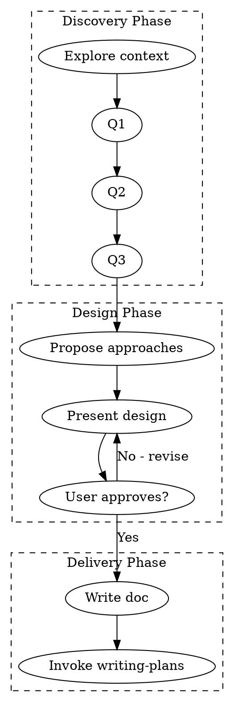

# Brainstorming Pro - Advanced Design Exploration

## Overview

Enhanced version of brainstorming with structured templates, explicit exit criteria, and robust edge case handling. Turns ideas into fully-formed designs through efficient collaborative dialogue.

<HARD-GATE>
Do NOT invoke any implementation skill, write any code, scaffold any project, or take any implementation action until you have presented a design and the user has approved it. This applies to EVERY project regardless of perceived simplicity.
</HARD-GATE>

## Anti-Patterns

| Anti-Pattern | Solution |
|--------------|----------|
| "This is too simple to need a design" | ALL projects need design. Scale it, don't skip it. |
| Asking 5 questions at once | One question per message. Always. |
| Assuming without verifying | Explicitly confirm every assumption. |
| Endless questioning | Max 5 questions unless user is elaborating. |
| Vague design approval | Get explicit "yes, proceed" before coding. |

## Checklist

Complete in order. Each item is a task:

1. **Explore project context** — Check files, docs, recent commits (5 min max)
2. **Ask clarifying questions** — One at a time, max 5 questions (or until saturation)
3. **Propose 2-3 approaches** — With trade-offs, costs, and recommendation
4. **Present design** — Section by section, validate each
5. **Handle objections** — Revise based on feedback, re-present
6. **Write design doc** — Save to `docs/plans/YYYY-MM-DD-<topic>-design.md`
7. **Transition** — Invoke `writing-plans` skill

## Process Flow



---

## Phase 1: Discovery (Max 10 minutes)

### 1.1 Context Exploration

Before asking questions, spend max 5 minutes understanding:

```markdown
## Quick Context Scan
- [ ] README.md exists and is recent?
- [ ] Main tech stack identified?
- [ ] Recent commits show active development?
- [ ] Existing similar features present?
```

### 1.2 Clarifying Questions

**Exit Criteria:** Stop asking when ANY of these is true:
- You've asked 5 questions
- User's answers are detailed enough to infer the rest
- User says "just pick the best approach"
- Additional questions would be about implementation details (save for later)

**Question Templates** (adapt to context):

```
## Purpose & Goal
- "What problem does this solve for users?"
- "What does success look like? How will you measure it?"
- "Is this a one-off tool or a long-term feature?"

## Constraints
- "Any tech stack preferences or restrictions?"
- "Timeline: need this ASAP or can we do it right?"
- "Budget/scope: minimal viable or full-featured?"

## Edge Cases
- "What should happen when [common edge case] occurs?"
- "Should this handle [X] or assume it won't happen?"
- "Any compliance/security requirements?"

## Integration
- "Does this need to work with existing [X system]?"
- "Should this be standalone or integrated into [Y]?"
- "Who are the users? Technical or non-technical?"
```

**Example Dialogue:**
```
You: "What problem does this solve for users?"
User: "I need to quickly generate thumbnails from videos."
You: "Got it. Timeline: need this ASAP or can we do it properly with error handling?"
User: "ASAP, but basic error handling would be good."
You: "Understood. Should this be a CLI tool, library, or UI component?"
```

---

## Phase 2: Design Exploration

### 2.1 Propose 2-3 Approaches

Present options in this format:

```markdown
## Approach Options

### Option A: [Name] — RECOMMENDED
**What:** Brief description
**Pros:** 2-3 key advantages
**Cons:** 1-2 trade-offs
**Effort:** Low/Medium/High
**Best for:** When [condition]

### Option B: [Name]
**What:** Brief description  
**Pros:** 2-3 key advantages
**Cons:** 1-2 trade-offs
**Effort:** Low/Medium/High
**Best for:** When [condition]

### Option C: [Name] (if applicable)
...

**My recommendation:** Option A because [specific reason tied to user's goals].
```

### 2.2 Present Design Sections

Scale each section to complexity:

| Section | Simple (sentences) | Complex (paragraphs) |
|---------|-------------------|---------------------|
| Architecture | 1-2 | 3-5 |
| Components | 1-2 | 3-5 |
| Data Flow | 1-2 | 3-5 |
| Error Handling | 1 | 2-3 |
| Testing Strategy | 1-2 | 3-4 |

**Validation Pattern:**
```
After each section: "Does this align with your expectations, or should I adjust anything?"
```

---

## Phase 3: Delivery

### 3.1 Design Document Template

Save to `docs/plans/YYYY-MM-DD-<topic>-design.md`:

```markdown
# [Feature Name] - Design Document

**Date:** YYYY-MM-DD
**Author:** [Your name]
**Status:** Draft → Approved → Implemented

## 1. Overview
One paragraph: what we're building and why.

## 2. Requirements

### Functional
- [ ] Requirement 1
- [ ] Requirement 2

### Non-Functional
- [ ] Performance: ...
- [ ] Security: ...
- [ ] Accessibility: ...

## 3. Architecture

### Chosen Approach
[Description with diagram if helpful]

### Alternatives Considered
| Option | Why Not Chosen |
|--------|---------------|
| X | Reason |
| Y | Reason |

## 4. Components

| Component | Responsibility | Dependencies |
|-----------|---------------|--------------|
| X | ... | ... |

## 5. Data Flow
[Sequence diagram or description]

## 6. Error Handling
- Expected failures and recovery
- Logging strategy
- User-facing messages

## 7. Testing Strategy
- Unit tests: what to cover
- Integration tests: key scenarios
- Manual testing: edge cases

## 8. Out of Scope
Explicitly list what we're NOT building (YAGNI).

## 9. Open Questions
Any unresolved decisions.

## 10. Approval
- [ ] Design approved by user: [Date]
- [ ] Ready for implementation
```

### 3.2 Success Metrics

Before transitioning, verify:

```markdown
## Success Checklist
- [ ] All functional requirements defined
- [ ] All assumptions explicitly stated and confirmed
- [ ] Edge cases addressed or explicitly excluded
- [ ] User approved each design section
- [ ] Design doc committed to git
- [ ] Zero "we assumed X but user wanted Y" risks
```

### 3.3 Transition

**ONLY** invoke `writing-plans` after:
1. Design doc is written and committed
2. User explicitly approved the design
3. Success checklist is complete

```
"Design is complete and documented. I'll now invoke writing-plans to create the implementation plan."
→ Invoke: writing-plans
```

---

## Edge Case Handling

| Situation | Response |
|-----------|----------|
| User is vague/unclear | Offer concrete examples: "Do you mean X or Y?" |
| Requirement changes mid-session | Acknowledge, update notes, re-validate affected sections |
| User says "surprise me" | Present 3 distinct options with clear trade-offs, pick middle ground |
| User stops responding | Wait 2 exchanges, then propose best-guess design with explicit "correct me if wrong" |
| Scope creep detected | "That sounds like a separate feature. Should we add it to Phase 2 or keep this focused?" |
| User insists on bad approach | "I understand you want X. My concern is [risk]. If you accept that risk, we can proceed." |

---

## Key Principles

| Principle | Application |
|-----------|-------------|
| **One question at a time** | Never batch questions. Wait for answer. |
| **Max 5 questions** | If you need more, you're digging too deep. |
| **Multiple choice > open-ended** | "X or Y?" is easier than "What do you want?" |
| **YAGNI ruthlessly** | Every feature must justify its existence. |
| **Explicit > implicit** | State assumptions, get confirmation. |
| **Document as you go** | Capture decisions in real-time. |
| **Validate incrementally** | Each section gets approval before moving on. |

---

## Comparison: Brainstorming vs Brainstorming-Pro

| Feature | Brainstorming | Brainstorming-Pro |
|---------|--------------|-------------------|
| Question templates | ❌ | ✅ |
| Exit criteria | ❌ | ✅ (5 questions max) |
| Edge case handling | ❌ | ✅ (7 scenarios) |
| Design doc template | ❌ | ✅ (full structure) |
| Success metrics | ❌ | ✅ (checklist) |
| Example dialogues | ❌ | ✅ |
| Anti-patterns table | ❌ | ✅ |
| Process flow | Basic | Enhanced with phases |

**Use `brainstorming-pro` when:**
- Complex feature with multiple stakeholders
- High-risk or high-visibility project
- User has unclear/vague requirements
- You anticipate scope creep

**Use `brainstorming` when:**
- Simple, well-understood task
- You need faster turnaround
- User prefers minimal process
