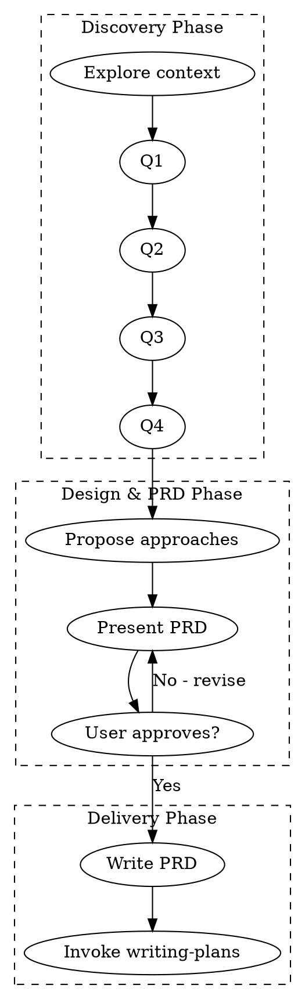

# Brainstorming Pro - Advanced Design Exploration with MCP & PRD

## Overview

Enhanced version of brainstorming with:
- **MCP Integration** for deep research & learning
- **Context7 MCP** for up-to-date library documentation
- **Task/Agent MCP** for complex technical analysis
- Structured templates for adaptive questioning (8-15+ questions)
- UI/UX design exploration
- Integrated PRD generation with detailed tech specs

Turns ideas into fully-formed, production-ready requirements through efficient collaborative dialogue and MCP-powered research.

<HARD-GATE>
Do NOT invoke any implementation skill, write any code, scaffold any project, or take any implementation action until you have presented a design/PRD and the user has approved it. This applies to EVERY project regardless of perceived simplicity.
</HARD-GATE>

## MCP Integration Points

### When to Use MCP Tools

| Phase | MCP Tool | Purpose |
|-------|----------|---------|
| **Discovery** | `mcp__context7__resolve-library-id` | Resolve library IDs for tech stack research |
| **Discovery** | `mcp__context7__query-docs` | Fetch latest docs for chosen libraries/frameworks |
| **Tech Spec** | `task` (general-purpose agent) | Deep dive into complex technical requirements |
| **Tech Spec** | `web_search` | Research best practices, benchmarks, comparisons |
| **Tech Spec** | `web_fetch` | Fetch specific documentation pages or RFCs |

### MCP-Powered Research Flow

```
1. User confirms tech stack (Q5-Q6)
        ↓
2. Use MCP Context7 to fetch latest docs
   - resolve-library-id → Get library ID
   - query-docs → Fetch architecture patterns, best practices
        ↓
3. Use Task Agent for complex analysis
   - Deep dive into scalability patterns
   - Research security considerations
   - Analyze trade-offs
        ↓
4. Use Web Search for benchmarks
   - Performance comparisons
   - Real-world case studies
   - Community feedback
        ↓
5. Synthesize into Tech Spec
   - Architecture diagram
   - Data model
   - Security rules
   - Performance optimizations
```

## Anti-Patterns

| Anti-Pattern | Solution |
|--------------|----------|
| "This is too simple to need a design" | ALL projects need design. Scale it, don't skip it. |
| Asking multiple questions at once | **ONE question per message. ALWAYS.** Wait for answer before next question. |
| Assuming without verifying | Explicitly confirm every assumption. |
| Fixed question count for complex projects | Adaptive: 8-15+ questions based on complexity |
| Ignoring UI/UX until implementation | Ask design preference early (Q3-Q4) |
| Vague design approval | Get explicit "yes, proceed" before coding. |
| Generic questions | Use categorized, context-aware question templates |
| Rushing through questions | Give user time to think. One. Question. At. A. Time. |
| **Not using MCP for research** | **ALWAYS use MCP Context7 for tech stack research. Never rely on outdated knowledge.** |
| **Writing tech spec without MCP validation** | **Validate architecture patterns, data models, security rules via MCP before presenting.** |

## Checklist

Complete in order. Each item is a task:

1. **Explore project context** — Check files, docs, recent commits (5 min max)
2. **Ask clarifying questions** — Adaptive 8-15+ questions (or until saturation)
   - **CRITICAL: ONE QUESTION PER MESSAGE. ALWAYS.** Wait for user's answer before asking next question.
   - Q1-2: Problem & Users (Always)
   - Q3-4: UI/UX Design (Always)
   - Q5-6: Tech Stack & Scope (Always)
   - Q7-10: Platform & Features (Conditional)
   - Q11-12: Monetization & Analytics (Conditional)
   - Q13-15+: Edge Cases, Security, Integrations (Conditional)
3. **MCP Research** — After tech stack confirmed
   - Use `mcp__context7__resolve-library-id` for each library
   - Use `mcp__context7__query-docs` for architecture patterns & best practices
   - Use `task` agent for complex technical deep-dives
   - Use `web_search` for benchmarks & real-world case studies
4. **Propose 2-3 approaches** — With trade-offs, costs, recommendation, **MCP-validated**
5. **Present PRD sections** — Section by section, validate each
6. **Handle objections** — Revise based on feedback, re-present
7. **Write PRD doc** — Save to `docs/plans/YYYY-MM-DD-<topic>-prd.md` with **MCP-researched tech specs**
8. **Transition** — Invoke `writing-plans` skill

## Process Flow



---

## Phase 1: Discovery (Max 30 minutes)

### 1.1 Context Exploration

Before asking questions, spend max 5 minutes understanding:

```markdown
## Quick Context Scan
- [ ] README.md exists and is recent?
- [ ] Main tech stack identified?
- [ ] Recent commits show active development?
- [ ] Existing similar features present?
- [ ] Design system or UI components already in use?
```

### 1.2 Clarifying Questions

**CRITICAL RULE: ONE QUESTION PER MESSAGE. ALWAYS.**

- Ask ONE question
- Wait for user's answer
- Acknowledge the answer
- Ask the NEXT question

**NEVER** batch multiple questions in one message. Example:

❌ **WRONG:**
```
Q1. Apa masalah utama yang ingin diselesaikan?
Q2. Siapa target pengguna utama?
Q3. Untuk UI/UX, ada preferensi design system?
```

✅ **CORRECT:**
```
Q1. Apa masalah utama yang ingin diselesaikan?
      A) [Option A]
      B) [Option B]
      C) [Option C]
      D) Lainnya (sebutkan)

[Wait for user answer, acknowledge, then ask Q2 in next message]
```

### Real-time Summary (Every 3-4 Questions)

After every 3-4 questions, provide a quick summary to confirm understanding:

```markdown
## Summary So Far (Q1-Q3)

✅ **Q1 - Problem:** [User's answer]
✅ **Q2 - Users:** [User's answer]
✅ **Q3 - UI/UX:** [User's answer]

Lanjut ke Q4? [or ask if user wants to add/clarify anything]
```

This ensures:
- User knows you're listening
- Misunderstandings caught early
- User can clarify before moving forward
- Builds trust through active listening

**Exit Criteria:** Stop asking when ANY of these is true:
- You've asked 15 questions
- User's answers are detailed enough to infer the rest
- User says "just pick the best approach" or "udah cukup"
- Additional questions would be about implementation details (save for later)
- User explicitly asks you to proceed

---

## Phase 1.5: MCP-Powered Research (Max 20 minutes)

**TRIGGER:** After user confirms tech stack (Q5-Q6) and before approach proposal.

### Step 1: Resolve Library IDs

For each confirmed technology, use `mcp__context7__resolve-library-id`:

```markdown
**Example: Flutter + Firebase + Riverpod**

You: [Internal tool call]
→ mcp__context7__resolve-library-id(
    libraryName: "flutter",
    query: "cross-platform mobile development best practices"
  )

Result: /flutter/flutter

You: [Internal tool call]
→ mcp__context7__resolve-library-id(
    libraryName: "firebase",
    query: "firebase flutter integration authentication firestore"
  )

Result: /firebase/flutterfire

You: [Internal tool call]
→ mcp__context7__resolve-library-id(
    libraryName: "riverpod",
    query: "flutter state management riverpod architecture"
  )

Result: /rrousselGit/riverpod
```

### Step 2: Query Documentation

For each resolved library, fetch relevant docs:

```markdown
**Example: Architecture Patterns**

You: [Internal tool call]
→ mcp__context7__query-docs(
    libraryId: "/flutter/flutter",
    query: "clean architecture folder structure best practices mobile app"
  )

Result: [Latest architecture patterns from Flutter docs]

You: [Internal tool call]
→ mcp__context7__query-docs(
    libraryId: "/firebase/flutterfire",
    query: "firestore security rules authentication authorization best practices"
  )

Result: [Latest Firestore security rules examples]

You: [Internal tool call]
→ mcp__context7__query-docs(
    libraryId: "/rrousselGit/riverpod",
    query: "riverpod provider architecture state management patterns"
  )

Result: [Latest Riverpod provider patterns]
```

### Step 3: Deep Technical Analysis (Task Agent)

For complex requirements, delegate to task agent:

```markdown
**Example: Scalability & Performance**

You: [Internal tool call]
→ task(
    description: "Research Firebase scalability",
    subagent_type: "general-purpose",
    prompt: """
    Research and analyze Firebase free tier scalability for a ticketing app 
    with 1000+ concurrent users. Include:
    
    1. Firestore quota limits (reads, writes, storage, bandwidth)
    2. Estimated usage for 1000 users (browse, purchase, check-in flows)
    3. Optimization strategies (caching, batching, offline persistence)
    4. When to upgrade to Blaze plan (cost breakdown)
    5. Alternative: Supabase/Custom backend comparison
    
    Return detailed analysis with calculations and recommendations.
    """
  )

Result: [Detailed scalability analysis with numbers]
```

### Step 4: Web Research (Benchmarks & Case Studies)

```markdown
**Example: Performance Benchmarks**

You: [Internal tool call]
→ web_search(
    query: "Firebase vs Supabase performance comparison 2025 2026 ticketing app"
  )

Result: [Latest benchmarks from tech blogs, Reddit, Stack Overflow]

You: [Internal tool call]
→ web_search(
    query: "Flutter Riverpod state management performance benchmarks"
  )

Result: [Performance comparisons and real-world feedback]
```

### Step 5: Synthesize Research

Combine all MCP research into structured insights:

```markdown
## MCP Research Summary

### Tech Stack Validated
| Library | Version | Docs Status | Key Patterns |
|---------|---------|-------------|--------------|
| Flutter | 3.x (latest) | ✅ Verified | Clean Architecture, Feature-first |
| Firebase | Latest | ✅ Verified | Firestore offline persistence, Security Rules v2 |
| Riverpod | 2.x (latest) | ✅ Verified | AsyncNotifier, AutoDispose providers |

### Architecture Decision (MCP-Validated)
- **Pattern:** Clean Architecture with feature modules
- **State:** Riverpod AsyncNotifier for async operations
- **Database:** Firestore with composite indexes for queries
- **Security:** Firestore Rules with custom claims for roles

### Performance Insights (from MCP research)
- Firestore reads: 50K/day free → 1000 users × 10 reads = 10K (20% of limit) ✅
- Flutter + Riverpod: 60fps with proper provider scoping ✅
- Offline persistence: Built-in, auto-sync when online ✅

### Risks Identified
- Cold start Cloud Functions: 2-5s → Use minimum instances (cost: $6/month)
- Firestore quota spike: Monitor daily, add alerts at 70% usage
```

---

## Question Framework

### Category 1: Problem & Goal (Always Ask - Q1-Q2)

```markdown
Q1. "Apa masalah utama yang ingin diselesaikan? Atau goal apa yang ingin dicapai?"

    Options:
    A) [Context-specific option 1]
    B) [Context-specific option 2]
    C) [Context-specific option 3]
    D) Kombinasi semuanya
    E) Lainnya (sebutkan)

    → Exit: 1-3 concrete goals identified

**Ask this FIRST. Wait for answer. Acknowledge. Then ask Q2.**
```

```markdown
Q2. "Siapa target pengguna utama?"

    Options:
    A) Admin/Organizer (yang manage/control)
    B) User/Customer (yang consume service)
    C) Multi-role (keduanya dalam 1 app)
    D) Technical users (developers, IT staff)
    E) Non-technical users (general public)
    F) Lainnya (sebutkan)

    → Exit: User persona jelas

**Ask this SECOND. Wait for answer. Acknowledge. Then ask Q3.**
```

---

### Category 2: UI/UX & Design (Always Ask - Q3-Q4)

```markdown
Q3. "Untuk UI/UX, ada preferensi design system atau style guide?"

    Options:
    A) Material Design (Android-style, Google) — RECOMMENDED untuk Flutter
    B) Cupertino (iOS-style, Apple)
    C) Custom design (punya brand guideline sendiri)
    D) Minimalis & clean (fokus konten, sedikit dekorasi)
    E) Modern & vibrant (gradient, shadow, bold colors)
    F) Bebas / you choose (modern & clean)
    G) Ada referensi app lain yang disuka? (sebutkan nama app)

    Follow-up (if needed, in NEXT message):
    - "Ada warna brand atau color palette yang harus dipakai?"
    - "Ada typography preference (font family, size)?"

    → Exit: Design direction jelas

**Ask this THIRD. Wait for answer. Acknowledge. Then ask Q4.**
```

```markdown
Q4. "Untuk kompleksitas UI & interaksi, mana yang lebih cocok?"

    Options:
    A) Simple & minimal (fokus fungsi, sedikit animasi/dekorasi)
    B) Moderate (balance antara fungsi & estetika, subtle animations)
    C) Rich & polished (banyak micro-interaction, high polish)
    D) Animated & playful (fun transitions, engaging interactions)
    E) Tergantung konteks fitur (critical = simple, secondary = rich)

    Follow-up (if needed, in NEXT message):
    - "Perlu wireframe/mockup visual dalam design doc?"
    - "Ada referensi screen flow yang ingin diikuti?"

    → Exit: UI complexity & expectation jelas

**Ask this FOURTH. Wait for answer. Acknowledge. Then ask Q5.**
```

---

### Category 3: Tech Stack & Constraints (Always Ask - Q5-Q6)

```markdown
Q5. "Ada preferensi tech stack atau batasan tertentu?"

    Context-aware options (adapt based on project type):

    For Mobile Apps:
    A) Flutter (cross-platform, single codebase) — RECOMMENDED
    B) React Native (JavaScript ecosystem)
    C) Native (Swift/Kotlin, best performance)
    D) Already have existing framework

    For Web Apps:
    A) React + Next.js — RECOMMENDED
    B) Vue + Nuxt
    C) Svelte + SvelteKit
    D) Angular

    For Backend:
    A) Firebase (fast setup, auto-scale) — RECOMMENDED for MVP
    B) Supabase (open-source, PostgreSQL)
    C) Custom backend (Node.js/Go/Python + PostgreSQL)
    D) Already have existing backend

    For AI/ML:
    A) Python + LangChain
    B) TensorFlow/PyTorch
    C) Pre-trained APIs (OpenAI, Anthropic, etc.)

    → Exit: Stack identified atau user bilang "bebas/you choose"

**Ask this FIFTH. Wait for answer. Acknowledge. Then ask Q6.**
```

```markdown
Q6. "Timeline & scope prioritas?"

    Options:
    A) MVP dulu (core features, 2-3 minggu) — RECOMMENDED
    B) Full-featured (semua fitur, 6-8 minggu)
    C) Iterative (MVP → iterate based on feedback)
    D) Tergantung kompleksitas nanti
    E) Ada deadline spesifik? (sebutkan)

    → Exit: Scope boundary jelas

**Ask this SIXTH. Wait for answer. Acknowledge. Then ask Q7.**
```

---

### Category 4: Platform & Deployment (Conditional - Q7-Q8)

```markdown
Q7. "Platform target untuk aplikasi ini?"

    Ask if: Mobile app, cross-platform consideration

    Options:
    A) Android saja dulu (market share terbesar di Indonesia)
    B) iOS saja (premium users, international)
    C) Cross-platform (Android + iOS, single codebase) — RECOMMENDED
    D) Web app (browser-based, no install)
    E) Desktop (Windows/Mac/Linux)
    F) Multi-platform (semua platform)

    → Exit: Platform target jelas

**Ask this SEVENTH (if relevant). Wait for answer. Acknowledge. Then ask Q8.**
```

```markdown
Q8. "Bagaimana dengan deployment & distribution?"

    Ask if: Mobile app, web app

    Options:
    A) Google Play Store (Android)
    B) Apple App Store (iOS)
    C) Both (Play Store + App Store)
    D) Web hosting (Vercel, Netlify, Firebase Hosting)
    E) Self-hosted (VPS, Cloud Run, EC2)
    F) Belum tahu, rekomendasikan saja

    → Exit: Distribution channel jelas

**Ask this EIGHTH (if relevant). Wait for answer. Acknowledge. Then ask Q9.**
```

---

### Category 5: Features & Functionality (Conditional - Q9-Q11)

```markdown
Q9. "Fitur utama yang harus ada di MVP?"

    Ask if: Feature-rich app, multiple use cases

    Options (adapt based on context):
    A) Core feature 1 (e.g., browse & search)
    B) Core feature 2 (e.g., booking & payment)
    C) Core feature 3 (e.g., user dashboard)
    D) Admin panel (manage content/users)
    E) Kombinasi semuanya
    F) Rekomendasikan saja berdasarkan use case

    Follow-up (if needed, in NEXT message):
    - "Ada fitur yang bisa ditunda ke Phase 2?"
    - "Fitur apa yang paling critical untuk user?"

    → Exit: MVP features prioritized

**Ask this NINTH (if relevant). Wait for answer. Acknowledge. Then ask Q10.**
```

```markdown
Q10. "Bagaimana dengan user authentication & authorization?"

    Ask if: User-specific data, multi-role app

    Options:
    A) Email + Password (traditional)
    B) Social login (Google, Facebook, Apple) — RECOMMENDED
    C) Phone number + OTP (SMS/WhatsApp)
    D) Guest mode (no login required)
    E) Multi-role (different permissions per user type)
    F) Kombinasi beberapa metode

    → Exit: Auth method jelas

**Ask this TENTH (if relevant). Wait for answer. Acknowledge. Then ask Q11.**
```

```markdown
Q11. "Perlu fitur notification & communication?"

    Ask if: User engagement, time-sensitive updates

    Options:
    A) Push notification (FCM/APNS) — RECOMMENDED
    B) Email notification (transactional)
    C) SMS notification (urgent alerts)
    D) In-app notification (inbox style)
    E) Belum perlu untuk MVP
    F) Kombinasi beberapa channel

    → Exit: Notification strategy jelas

**Ask this ELEVENTH (if relevant). Wait for answer. Acknowledge. Then ask Q12.**
```

---

### Category 6: Monetization & Analytics (Conditional - Q12-Q13)

```markdown
Q12. "Ada model monetisasi untuk aplikasi ini?"

    Ask if: Commercial product, business app

    Options:
    A) Free (no monetization, branding/informational)
    B) Freemium (basic free, premium features paid)
    C) Subscription (monthly/yearly)
    D) One-time purchase (paid app/pro version)
    E) Transaction fee (commission per sale)
    F) Ads (Google AdMob, Facebook Audience Network)
    G) Belum tahu / belum perlu untuk MVP

    → Exit: Monetization model jelas

**Ask this TWELFTH (if relevant). Wait for answer. Acknowledge. Then ask Q13.**
```

```markdown
Q13. "Perlu analytics & tracking untuk measure user behavior?"

    Ask if: Product growth, data-driven decisions

    Options:
    A) Firebase Analytics (free, terintegrasi) — RECOMMENDED
    B) Google Analytics 4 (web-focused)
    C) Mixpanel (event-based, advanced)
    D) Amplitude (product analytics)
    E) Custom analytics (self-built dashboard)
    F) Belum perlu untuk MVP

    → Exit: Analytics stack jelas

**Ask this THIRTEENTH (if relevant). Wait for answer. Acknowledge. Then ask Q14.**
```

---

### Category 7: Edge Cases, Security & Integrations (Conditional - Q14-Q15+)

```markdown
Q14. "Ada edge case spesifik yang perlu di-handle?"

    Ask if: Transaction/critical flow, complex business logic

    Examples (adapt based on context):
    A) Offline mode & sync
    B) Payment failure & retry
    C) High concurrency (1000+ users)
    D) Data loss prevention
    E) Error recovery flow
    F) Rate limiting & throttling
    G) Belum perlu dulu, MVP saja

    → Exit: Critical edge cases identified or explicitly excluded

**Ask this FOURTEENTH (if relevant). Wait for answer. Acknowledge. Then ask Q15.**
```

```markdown
Q15. "Ada requirement security atau compliance khusus?"

    Ask if: User data sensitive, enterprise app, regulated industry

    Options:
    A) Standard security (Firebase default) — RECOMMENDED untuk MVP
    B) Data encryption at rest & in transit
    C) Role-based access control (RBAC)
    D) Audit logging (track all user actions)
    E) Compliance (GDPR, HIPAA, PCI-DSS)
    F) 2FA (Two-factor authentication)
    G) Belum perlu dulu, MVP saja

    → Exit: Security requirements defined or explicitly not needed

**Ask this FIFTEENTH (if relevant). Wait for answer. Acknowledge. Then proceed or ask follow-up.**
```

```markdown
Q16+. "Perlu integrasi dengan sistem existing?"

    Ask if: Enterprise context, legacy system, third-party services

    Examples (adapt based on context):
    A) Existing API endpoints
    B) Database migration
    C) Payment gateway (Midtrans, Xendit, Stripe)
    D) Social media integration (share, login)
    E) Maps & location (Google Maps, Mapbox)
    F) Chat/messaging (WhatsApp, Telegram bot)
    G) CRM/ERP system
    H) Tidak ada integrasi khusus

    → Exit: Integration points identified

**Ask this SIXTEENTH+ (if relevant). Wait for answer. Acknowledge. Then proceed to approach proposal.**
```

---

## Question Flow Strategy

```
┌─────────────────────────────────────────────────────────────┐
│  CORE QUESTIONS (Always Ask - 6 questions)                  │
│  Q1: Problem & Goal                                         │
│  Q2: Target Users                                           │
│  Q3: UI/UX Design System                                    │
│  Q4: UI Complexity & Interactions                           │
│  Q5: Tech Stack                                             │
│  Q6: Timeline & Scope                                       │
└─────────────────────────────────────────────────────────────┘
                          ↓
┌─────────────────────────────────────────────────────────────┐
│  PLATFORM QUESTIONS (Ask If Mobile/Web - max 2)             │
│  Q7: Platform Target (Android, iOS, Cross-platform, Web)    │
│  Q8: Deployment & Distribution (App Store, Hosting, etc.)   │
└─────────────────────────────────────────────────────────────┘
                          ↓
┌─────────────────────────────────────────────────────────────┐
│  FEATURES QUESTIONS (Ask If Complex App - max 3)            │
│  Q9:  MVP Features Priority                                 │
│  Q10: Authentication & Authorization                        │
│  Q11: Notification & Communication                          │
└─────────────────────────────────────────────────────────────┘
                          ↓
┌─────────────────────────────────────────────────────────────┐
│  BUSINESS QUESTIONS (Ask If Commercial - max 2)             │
│  Q12: Monetization Model                                    │
│  Q13: Analytics & Tracking                                  │
└─────────────────────────────────────────────────────────────┘
                          ↓
┌─────────────────────────────────────────────────────────────┐
│  CONTEXTUAL QUESTIONS (Ask If Relevant - max 4+)            │
│  Q14: Edge Cases (offline, payment failure, concurrency)    │
│  Q15: Security & Compliance                                 │
│  Q16+: Integrations (payment, maps, social, existing APIs)  │
└─────────────────────────────────────────────────────────────┘
                          ↓
              EXIT when: 15+ questions OR saturation OR user says "udah cukup"

┌─────────────────────────────────────────────────────────────┐
│  IMPORTANT: ONE QUESTION PER MESSAGE. ALWAYS.               │
│  - Ask Q1 → Wait for answer → Acknowledge → Ask Q2          │
│  - NEVER batch multiple questions in one message            │
│  - Give user time to think between questions                │
└─────────────────────────────────────────────────────────────┘
```

---

## Example Dialogue Flow

```
You: "Apa masalah utama yang ingin diselesaikan?
      A) Penjualan ticket cepat tanpa ribet
      B) Manajemen event & peserta
      C) Check-in yang simpel di lokasi
      D) Kombinasi semuanya
      E) Lainnya (sebutkan)"

User: "D) Kombinasi semuanya"

You: "Got it — end-to-end solution. Siapa target pengguna utama?
      A) Organizer/Admin (yang manage event)
      B) Participant/User (yang beli ticket)
      C) Keduanya dalam 1 app (multi-role)
      D) Lainnya"

User: "C) Keduanya"

You: "Understood — multi-role app. Untuk UI/UX, ada preferensi design system?
      A) Material Design (Android-style) — RECOMMENDED untuk Flutter
      B) Cupertino (iOS-style)
      C) Custom design (punya brand guideline)
      D) Minimalis & clean
      E) Modern & vibrant (gradient, bold colors)
      F) Bebas / you choose"

User: "A) Material Design saja"

You: "Nice choice. Untuk kompleksitas UI & interaksi, mana yang cocok?
      A) Simple & minimal (fokus fungsi, sedikit animasi)
      B) Moderate (balance fungsi & estetika, subtle animations)
      C) Rich & polished (micro-interaction, high polish)
      D) Tergantung konteks fitur"

User: "B) Moderate saja"

You: "Smart. Ada preferensi tech stack atau batasan?
      A) Firebase (cepat setup, auto-scale) — RECOMMENDED
      B) Supabase (open-source, PostgreSQL)
      C) Custom backend (lebih kontrol, lebih lama)
      D) Sudah ada backend yang perlu di-integrate"

User: "A) Firebase saja"

You: "Timeline & scope prioritas?
      A) MVP dulu (core features, 2-3 minggu) — RECOMMENDED
      B) Full-featured (semua fitur, 6-8 minggu)
      C) Iterative (MVP → iterate based on feedback)"

User: "A) MVP dulu"

You: "Platform target untuk aplikasi ini?
      A) Android saja dulu
      B) iOS saja
      C) Cross-platform (Android + iOS) — RECOMMENDED
      D) Web app
      E) Multi-platform (semua platform)"

User: "C) Cross-platform"

→ CONTINUE until 15 questions OR user says "udah cukup" OR saturation
→ Then proceed to approach proposal
```

---

## Phase 2: Design Exploration with MCP-Validated Tech Specs

### 2.1 Propose 2-3 Approaches

Present options in this format (with MCP research integrated):

```markdown
## Approach Options

### Option A: [Name] — RECOMMENDED (MCP-Validated)
**What:** Brief description
**Pros:** 2-3 key advantages (backed by MCP research)
**Cons:** 1-2 trade-offs (from MCP analysis)
**Effort:** Low/Medium/High
**Best for:** When [condition]
**MCP Validation:** [Summary of what was researched]

### Option B: [Name]
**What:** Brief description
**Pros:** 2-3 key advantages
**Cons:** 1-2 trade-offs
**Effort:** Low/Medium/High
**Best for:** When [condition]

### Option C: [Name] (if applicable)
...

**My recommendation:** Option A because [specific reason tied to user's goals + MCP research findings].
```

### 2.2 Present PRD Sections with MCP Research

Scale each section to complexity, with MCP-validated tech specs:

| Section | Simple (sentences) | Complex (with MCP research) |
|---------|-------------------|-----------------------------|
| Executive Summary | 2-3 | 4-6 |
| User Personas | 1-2 | 3-4 |
| User Stories | 3-5 | 8-12 |
| Architecture | 2-3 | 4-6 + MCP-researched patterns |
| Tech Stack | 1-2 | 3-4 + MCP-validated versions |
| Data Model | 1-2 | 3-5 + MCP-validated schema |
| Security | 1 | 2-3 + MCP-validated rules |
| Risks & Roadmap | 2-3 | 4-6 + MCP-identified risks |

**Validation Pattern:**
```
After each section: "Does this align with your expectations, or should I adjust anything?"
```

### 2.3 MCP-Powered Technical Specifications

For complex tech specs, use this structure:

```markdown
## Technical Specifications (MCP-Researched)

### Architecture Overview

[Diagram with MCP-validated patterns]

**Research Source:** 
- mcp__context7__query-docs("/flutter/flutter", "clean architecture best practices")
- task("Research Flutter clean architecture for ticketing app", general-purpose)

### Tech Stack (Version Verified)

| Layer | Technology | Version | MCP Validation |
|-------|------------|---------|----------------|
| Frontend | Flutter | 3.x (latest) | ✅ Verified via Context7 |
| State | Riverpod | 2.x (latest) | ✅ Verified via Context7 |
| Backend | Firebase | Latest | ✅ Verified via Context7 |
| Database | Firestore | Latest | ✅ Verified via Context7 |

### Data Model (MCP-Validated)

[Schema with MCP-researched best practices]

**Security Rules (from MCP research):**
```javascript
// Validated via: mcp__context7__query-docs("/firebase/flutterfire", "security rules")
rules_version = '2';
service cloud.firestore {
  match /databases/{database}/documents {
    // MCP-researched pattern for role-based access
    match /users/{userId} {
      allow read: if request.auth != null && request.auth.uid == userId;
      allow write: if request.auth != null && request.auth.uid == userId;
    }
  }
}
```

### Performance Optimizations (MCP-Researched)

| Optimization | Technique | MCP Source |
|--------------|-----------|------------|
| Caching | Riverpod AutoDispose + Hive | Context7: /rrousselGit/riverpod |
| Offline | Firestore persistence | Context7: /firebase/flutterfire |
| Image | cached_network_image (100MB) | Context7: Flutter docs |

### Scalability Analysis (Task Agent Research)

[Detailed analysis from task agent delegation]

**Key Findings:**
- Firestore quota: 50K reads/day → 1000 users × 10 reads = 10K (20% of limit) ✅
- Upgrade trigger: When >40K reads/day consistently → Blaze plan ($0.18/100K reads)
- Cost projection: 1000 users = $0/month, 10K users = ~$50/month
```

---

### 2.4 Present PRD Sections

Scale each section to complexity:

| Section | Simple (sentences) | Complex (paragraphs) |
|---------|-------------------|---------------------|
| Executive Summary | 2-3 | 4-6 |
| User Personas | 1-2 | 3-4 |
| User Stories | 3-5 | 8-12 |
| Architecture | 2-3 | 4-6 |
| Tech Stack | 1-2 | 3-4 |
| Data Model | 1-2 | 3-5 |
| Security | 1 | 2-3 |
| Risks & Roadmap | 2-3 | 4-6 |

**Validation Pattern:**
```
After each section: "Does this align with your expectations, or should I adjust anything?"
```

---

## Phase 3: Delivery

### 3.1 PRD Document Template

Save to `docs/plans/YYYY-MM-DD-<topic>-prd.md`:

```markdown
# [Feature Name] - Product Requirements Document

**Date:** YYYY-MM-DD  
**Author:** [Your name]  
**Status:** Draft → Approved → Implemented  

---

## 1. Executive Summary

**Problem Statement:** 1-2 sentences on the pain point.  
**Proposed Solution:** 1-2 sentences on the fix.  
**Success Criteria:** 3-5 measurable KPIs.

---

## 2. User Experience & Functionality

### User Personas

| Persona | Goal | Pain Point |
|---------|------|------------|
| ... | ... | ... |

### User Stories

| ID | Story |
|----|-------|
| US-01 | As a [user], I want to [action] so that [benefit] |

### Acceptance Criteria

| Story | Done When |
|-------|-----------|
| US-01 | ... |

### Non-Goals (MVP)

- ❌ ...

---

## 3. Technical Specifications

### Architecture Overview

[Diagram or description]

### Tech Stack

| Layer | Technology | Rationale |
|-------|------------|-----------|
| ... | ... | ... |

### Data Model

[Schema or description]

### Security & Privacy

[Security requirements]

---

## 4. UI/UX Design

### Design System

[Design system choice + rationale]

### Screen Flow

[Key screens description or wireframe references]

### Color & Typography

[If custom/brand-specific]

---

## 5. Risks & Roadmap

### Phased Rollout

| Phase | Scope | Timeline | Goal |
|-------|-------|----------|------|
| MVP | ... | ... | ... |

### Technical Risks

| Risk | Impact | Mitigation |
|------|--------|------------|
| ... | ... | ... |

### Open Questions

- [ ] ...

---

## Appendix: Discovery Notes

### Clarifying Questions

| # | Question | Answer |
|---|----------|--------|
| 1 | ... | ... |

### Approach Recommendation

[Summary of chosen approach]

---

**Document History:**
- YYYY-MM-DD: Initial draft ([Author])
- TBD: User review
- TBD: Approval
```

---

### 3.2 Success Metrics

Before transitioning, verify:

```markdown
## Success Checklist
- [ ] All functional requirements defined
- [ ] All assumptions explicitly stated and confirmed
- [ ] UI/UX preferences captured
- [ ] Edge cases addressed or explicitly excluded
- [ ] User approved each PRD section
- [ ] PRD doc committed to git
- [ ] Zero "we assumed X but user wanted Y" risks
```

### 3.3 Transition

**ONLY** invoke `writing-plans` after:
1. PRD doc is written and committed
2. User explicitly approved the PRD
3. Success checklist is complete

```
"PRD is complete and documented. I'll now invoke writing-plans to create the implementation plan."
→ Invoke: writing-plans
```

---

## Edge Case Handling

| Situation | Response |
|-----------|----------|
| User is vague/unclear | Offer concrete examples: "Do you mean X or Y?" |
| Requirement changes mid-session | Acknowledge, update notes, re-validate affected sections |
| User says "surprise me" | Present 3 distinct options with clear trade-offs, pick middle ground |
| User stops responding | Wait 2 exchanges, then propose best-guess design with explicit "correct me if wrong" |
| Scope creep detected | "That sounds like a separate feature. Should we add it to Phase 2 or keep this focused?" |
| User insists on bad approach | "I understand you want X. My concern is [risk]. If you accept that risk, we can proceed." |
| User wants more questions | Continue beyond 8 if user is elaborating and providing value |

---

## Key Principles

| Principle | Application |
|-----------|-------------|
| **ONE QUESTION AT A TIME** | **CRITICAL: Never batch multiple questions. Ask ONE → Wait → Acknowledge → Ask next.** |
| **Adaptive questioning** | 8-15+ questions based on complexity. Exit when saturated or user says "udah cukup". |
| **UI/UX early** | Ask design preference at Q3-Q4 (always). |
| **Multiple choice > open-ended** | "X or Y?" is easier than "What do you want?" Provide 5-7 options per question. |
| **YAGNI ruthlessly** | Every feature must justify its existence. Push back on nice-to-have for MVP. |
| **Explicit > implicit** | State assumptions, get confirmation. Never assume. |
| **Document as you go** | Capture decisions in real-time. Show summary after every 3-4 questions. |
| **Validate incrementally** | Each PRD section gets approval before moving on. |
| **PRD output** | Production-ready requirements, not just design notes. |
| **Patience** | Give user time to think. Don't rush. One. Question. At. A. Time. |
| **MCP-Validated Research** | **ALWAYS use MCP Context7 for tech stack research. Never rely on outdated knowledge.** |
| **MCP-Powered Thinking** | **Use task agent for complex technical analysis. Delegate deep-dives to specialized agents.** |
| **MCP Learning Loop** | **Research → Synthesize → Validate → Present. Never present unvalidated tech specs.** |

---

## Comparison: Brainstorming vs Brainstorming-Pro

| Feature | Brainstorming | Brainstorming-Pro |
|---------|--------------|-------------------|
| Question batching | ❌ (multiple at once) | ✅ (ONE at a time - CRITICAL) |
| Question count | 5 generic | 8-15+ adaptive (7 categories) |
| Question categories | Generic | 7 categories (Problem, UI/UX, Tech, Platform, Features, Business, Security) |
| Exit criteria | ❌ | ✅ (15+ questions OR saturation OR user says "udah cukup") |
| UI/UX questions | ❌ | ✅ (Q3-Q4, always) |
| Platform questions | ❌ | ✅ (Q7-Q8, conditional) |
| Feature priority | ❌ | ✅ (Q9-Q11, conditional) |
| Monetization | ❌ | ✅ (Q12-Q13, conditional) |
| Edge case handling | ❌ | ✅ (Q14-Q16+, conditional) |
| PRD output | ❌ | ✅ (full schema) |
| Success metrics | ❌ | ✅ (checklist) |
| Example dialogues | ❌ | ✅ (enhanced flow, one-at-a-time) |
| Anti-patterns table | ❌ | ✅ (explicitly calls out batching) |
| Question flow | Generic | Categorized (Core → Platform → Features → Business → Contextual) |
| Documentation | Basic | Real-time summary every 3-4 questions |
| **MCP Integration** | ❌ | ✅ (Context7 + Task Agent + Web Search) |
| **Tech Stack Research** | ❌ | ✅ (mcp__context7__resolve-library-id + query-docs) |
| **Deep Technical Analysis** | ❌ | ✅ (task agent delegation for scalability, security, performance) |
| **Version Validation** | ❌ | ✅ (MCP-verified library versions) |
| **Best Practices** | ❌ | ✅ (MCP-researched architecture patterns, security rules) |

**Use `brainstorming-pro` when:**
- Complex feature with multiple stakeholders
- High-risk or high-visibility project
- User has unclear/vague requirements
- UI/UX design is important
- You anticipate scope creep
- Need production-ready PRD
- **User wants thorough discovery (8-15+ questions, one at a time)**
- **Need MCP-validated tech specs (architecture, security, performance)**
- **Want latest library versions & best practices (via Context7)**

**Use `brainstorming` when:**
- Simple, well-understood task
- You need faster turnaround
- User prefers minimal process
- UI/UX not a concern
- **User wants quick answers (3-5 questions max)**
- **Tech stack already decided and simple**
