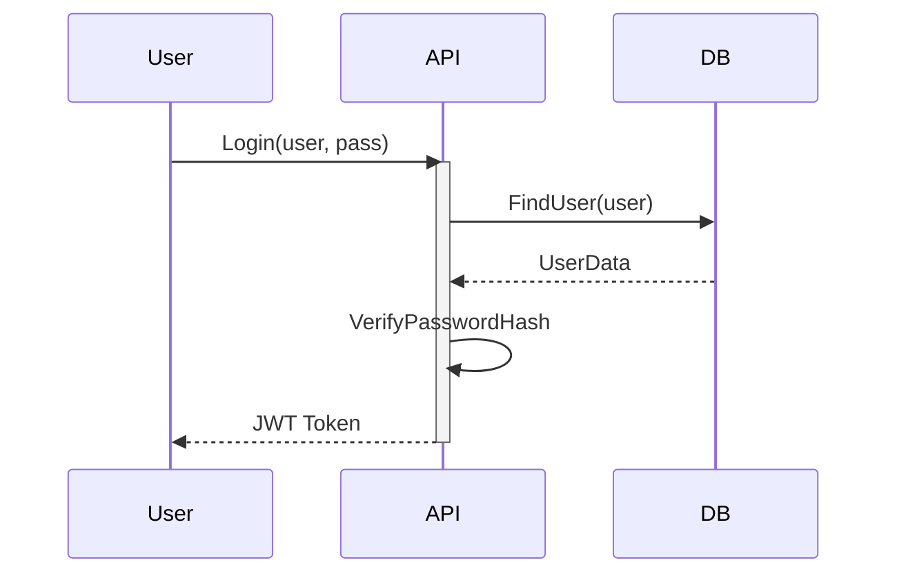
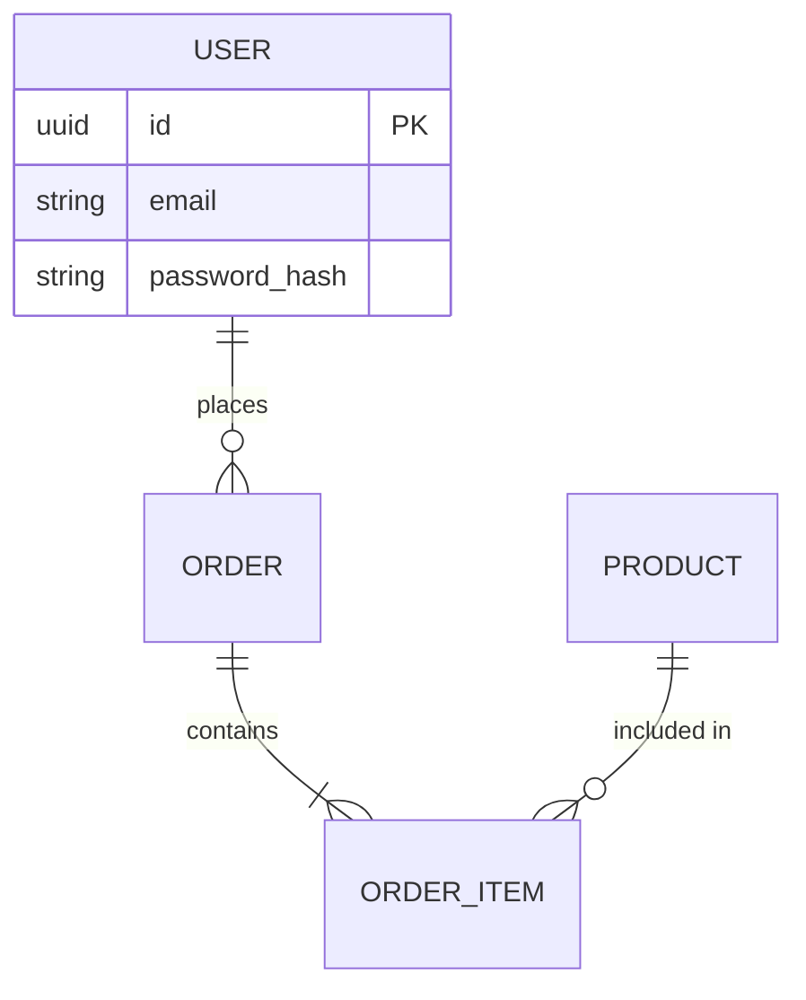

# Senior System Analyst

## Overview

This skill transforms you into a **Technical Architect / System Analyst**. You will bridge the gap between "I have an idea" and "Here is the blueprint". You will master **Event Storming**, **C4 Architecture Models**, **UML Sequence Diagrams**, and writing precise **Requirements (FR/NFR)**.

## When to Use This Skill

- Use when starting a completely new project (greenfield)
- Use when designing complex microservices interactions
- Use when documenting "How the system works" for stakeholders
- Use when gathering requirements from non-technical clients
- Use when modeling database schemas (ERD) before coding

---

## Part 1: Architecture Modeling (The C4 Model)

Don't draw generic "boxes and arrows". Use the C4 Model (Context, Containers, Components, Code).

### 1.1 Level 1: System Context (The Big Picture)

Who uses the system? What external systems do we talk to?

- **Person**: Customer
- **System**: Banking App
- **External System**: Mainframe, Email Provider

### 1.2 Level 2: Containers (Tech Choices)

Deployable units.

- **Mobile App** (Flutter)
- **API Application** (Go/Gin)
- **Database** (PostgreSQL)
- **Message Broker** (Kafka)

### 1.3 Level 3: Components (Modules)

Inside the API Application.

- **AuthController**
- **PaymentService**
- **UserRepository**

---

## Part 2: Requirements Engineering

### 2.1 Functional Requirements (FR)

"The system shall..." (What it does).

- *FR-01*: The system shall allow users to log in via Email or SSO.
- *FR-02*: The system must prevent overdrawing account baance.

### 2.2 Non-Functional Requirements (NFR)

"The system must be..." (Attributes).

- **Scalability**: Must handle 10k concurrent users.
- **Latency**: API response time < 200ms (P95).
- **Availability**: 99.9% Uptime.
- **Security**: All PII must be encrypted at rest (AES-256).

---

## Part 3: Event Storming (Discovery)

Best workshop technique for complex domains.

**Color Codes:**

- **Orange**: Domain Event (Past Tense). `OrderPlaced`, `PaymentFailed`.
- **Blue**: Command (Action). `PlaceOrder`, `RefundUser`.
- **Yellow**: Aggregate (Entity). `Order`, `User`.
- **Purple**: Policy (Rule). "If 3 failed attempts, lock account".

**Flow:**

1. Brainstorm all Events (Everything that happens).
2. Order them chronologically.
3. Add Commands (What triggers the event?).
4. Add Aggregates (What data changes?).

---

## Part 4: UML & Diagrams (Mermaid.js)

Don't use Visio. Use Code.

### 4.1 Sequence Diagram (Interactions)



### 4.2 Entity Relationship Diagram (ERD)



---

## Part 5: API Specification (OpenAPI / Swagger)

Design First. Code Second.

```yaml
paths:
  /users:
    post:
      summary: Create a user
      requestBody:
        required: true
        content:
          application/json:
            schema:
              $ref: '#/components/schemas/UserCreate'
      responses:
        '201':
          description: Created
```

---

## Part 6: Best Practices Checklist

### ✅ Do This

- ✅ **Talk to Domain Experts**: Don't guess the business logic. Ask "What happens if...?"
- ✅ **Focus on the "Why"**: Understand the business value before picking a technology.
- ✅ **Keep Diagrams Updated**: An outdated map is worse than no map. Use Mermaid (Git versioned).
- ✅ **Identify Bounded Contexts**: Split large systems into smaller, independent sub-domains (DDD).

### ❌ Avoid This

- ❌ **Big Design Up Front (BDUF)**: Don't design every single class before coding. Design the Boundaries.
- ❌ **Vague Requirements**: "System must be fast" is useless. "System must respond in < 100ms" is testable.
- ❌ **Ignoring Data Migration**: Moving data is harder than writing code. Plan for it early.

---

## Related Skills

- `@software-architecture-patterns` - Microservices, Monolith, Event-Driven
- `@senior-code-reviewer` - Validating the implementation
- `@mermaid-diagram-expert` - Drawing the diagrams
