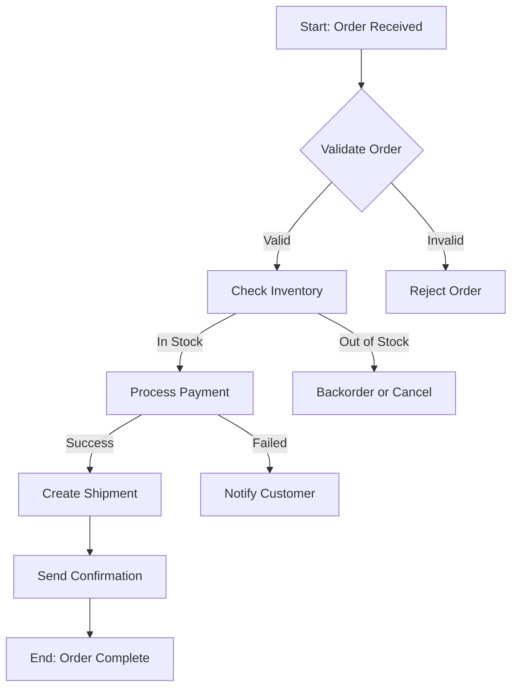

# Senior System Analyst

## Overview

Bridge business needs and technical solutions through requirements gathering, process modeling, system design, and stakeholder communication.

## When to Use This Skill

- Use when gathering requirements
- Use when designing systems
- Use when analyzing business processes
- Use when creating specifications

## How It Works

### Step 1: Requirements Gathering

```
REQUIREMENTS ENGINEERING PROCESS
├── ELICITATION
│   ├── Stakeholder interviews
│   ├── Workshops/JAD sessions
│   ├── Observation
│   ├── Document analysis
│   └── Surveys/questionnaires
│
├── ANALYSIS
│   ├── Categorize requirements
│   ├── Identify conflicts
│   ├── Prioritize (MoSCoW)
│   └── Feasibility assessment
│
├── SPECIFICATION
│   ├── Functional requirements
│   ├── Non-functional requirements
│   ├── Business rules
│   └── Constraints
│
├── VALIDATION
│   ├── Review with stakeholders
│   ├── Prototyping
│   └── Acceptance criteria
│
└── MANAGEMENT
    ├── Version control
    ├── Change management
    └── Traceability matrix
```

### Step 2: Use Case Documentation

```markdown
# Use Case: Place Order

**Actors:** Customer, Inventory System, Payment Gateway

**Preconditions:**
- User is logged in
- Shopping cart has items

**Main Flow:**
1. Customer clicks "Checkout"
2. System displays order summary
3. Customer selects shipping address
4. System calculates shipping cost
5. Customer selects payment method
6. Customer confirms order
7. System validates inventory
8. System processes payment
9. System creates order
10. System sends confirmation email
11. System displays order confirmation

**Alternative Flows:**
- 7a. Inventory unavailable:
  - System notifies customer
  - Customer modifies order
- 8a. Payment fails:
  - System displays error
  - Customer retries or changes method

**Postconditions:**
- Order is created in system
- Inventory is reserved
- Customer receives confirmation

**Business Rules:**
- BR1: Minimum order value $10
- BR2: Free shipping over $50
- BR3: Max 10 items per order
```

### Step 3: Business Process Modeling (BPMN)



### Step 4: Requirements Specification

```markdown
# Software Requirements Specification (SRS)

## 1. Introduction
### 1.1 Purpose
### 1.2 Scope
### 1.3 Definitions & Acronyms

## 2. Overall Description
### 2.1 Product Perspective
### 2.2 Product Functions
### 2.3 User Classes
### 2.4 Operating Environment
### 2.5 Constraints
### 2.6 Assumptions

## 3. Functional Requirements
### FR-001: User Registration
- Description: System shall allow new users to register
- Priority: Must Have
- Input: Name, email, password
- Output: Account created, verification email sent
- Acceptance Criteria:
  - [ ] Email must be unique
  - [ ] Password minimum 8 characters
  - [ ] Verification email sent within 1 minute

### FR-002: Order Management
...

## 4. Non-Functional Requirements
### NFR-001: Performance
- System shall support 1000 concurrent users
- Page load time < 3 seconds

### NFR-002: Security
- All data encrypted in transit (TLS 1.3)
- Session timeout after 30 minutes
```

## Best Practices

### ✅ Do This

- ✅ Clarify ambiguous requirements
- ✅ Prioritize with stakeholders
- ✅ Document assumptions
- ✅ Create traceability
- ✅ Validate with prototypes

### ❌ Avoid This

- ❌ Don't assume requirements
- ❌ Don't skip stakeholders
- ❌ Don't ignore NFRs
- ❌ Don't forget edge cases

## Related Skills

- `@senior-software-architect` - System design
- `@senior-project-manager` - Project management
