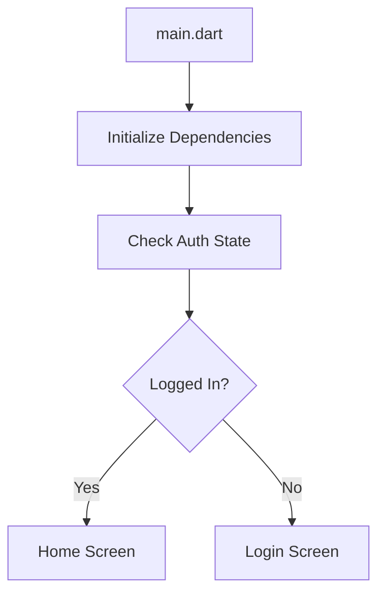
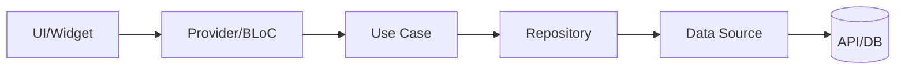

# /vibe-coding-flutter

Workflow untuk setup dokumen konteks Vibe Coding khusus **Flutter Multi-Platform App** (iOS, Android, Web, macOS, Windows, Linux) dengan Clean Architecture dan state management modern (Riverpod/BLoC/GetX).

---

## 📋 Prerequisites

Sebelum memulai, siapkan informasi berikut:

1. **Deskripsi ide aplikasi** (2-3 paragraf)
2. **Target platforms** (pilih satu atau lebih):
   - 📱 Mobile: iOS, Android
   - 🌐 Web: Chrome, Firefox, Safari, Edge
   - 🖥️ Desktop: macOS, Windows, Linux
3. **State management preference** (Riverpod/BLoC/GetX)
4. **Backend preference** (Firebase/Supabase/Custom API)
5. **Vibe/estetika** yang diinginkan
6. **Responsive strategy** (Mobile-first / Desktop-first / Adaptive)

---

## 🏗️ Phase 1: The Holy Trinity (WAJIB)

### Step 1.1: Generate PRD.md

```
Tanyakan kepada user:
"Jelaskan ide aplikasi Flutter yang ingin dibuat. Sertakan:
- Apa masalah yang diselesaikan?
- Siapa target penggunanya?
- Apa fitur utama yang diinginkan?
- Platform apa? (iOS/Android/Desktop)"
```

Gunakan skill `senior-project-manager`:

```markdown
Act as senior-project-manager.
Saya ingin membuat aplikasi Flutter: [IDE USER]

Buatkan file `PRD.md` yang mencakup:
1. Executive Summary (2-3 kalimat)
2. Problem Statement
3. Target User & Persona
4. User Stories (min 10 untuk MVP, format: As a [role], I want to [action], so that [benefit])
5. Core Features - kategorikan: Must Have, Should Have, Could Have, Won't Have
6. User Flow per fitur utama
7. Platform Requirements (iOS version, Android version, Desktop OS)
8. Success Metrics (DAU, Retention Rate, Core Action Completion Rate)

Output dalam Markdown yang rapi.
```

// turbo
**Simpan output ke file `PRD.md` di root project.**

---

### Step 1.2: Generate TECH_STACK.md

```
Tanyakan kepada user:
"Pilih preferensi:
1. State Management: Riverpod / BLoC / GetX?
2. Backend: Firebase / Supabase / Custom REST API?
3. Local Storage: Hive / Drift / SharedPreferences?"
```

Gunakan skill `tech-stack-architect` + `senior-flutter-developer`:

```markdown
Act as tech-stack-architect dan senior-flutter-developer.
Buatkan file `TECH_STACK.md` untuk Flutter app.

## Core Stack
- Flutter Version: Latest Stable (3.x)
- Dart Version: Latest Stable (3.x)

## Platform Requirements
### Mobile
- Minimum iOS: 12.0
- Minimum Android: API 21 (5.0)

### Web
- Renderer: CanvasKit (untuk performa) / HTML (untuk SEO)
- Supported Browsers: Chrome 84+, Firefox 72+, Safari 14.1+, Edge 84+
- PWA Support: Ya (service worker, manifest)

### Desktop
- Minimum macOS: 10.14 (Mojave)
- Minimum Windows: Windows 10 (1803+)
- Minimum Linux: Ubuntu 18.04+ / equivalent

## State Management
- Package: [PILIHAN: flutter_riverpod / flutter_bloc / get]
- Alasan: [JELASKAN]

## Architecture
- Pattern: Clean Architecture
- Layers: Presentation → Domain → Data

## Navigation
- Package: go_router (WAJIB)
- Alasan: Type-safe, deep linking support, Flutter team maintained

## Backend & Data
- Backend: [Firebase / Supabase / Custom]
- Auth: [firebase_auth / supabase_flutter / custom JWT]
- Database: [cloud_firestore / supabase / REST API]
- Local Storage: [hive_flutter / drift / shared_preferences]

## Networking
- HTTP Client: dio
- API Code Gen: retrofit (jika REST API)

## UI & Theming
- Design System: Custom (lihat DESIGN_SYSTEM.md)
- Icons: flutter_svg + custom icons
- Fonts: Google Fonts (google_fonts package)

## Utilities
- Date/Time: intl
- Validation: reactive_forms atau flutter_form_builder
- Image Caching: cached_network_image
- Loading States: shimmer

## Testing
- Unit Test: flutter_test + mocktail
- Widget Test: flutter_test
- Integration Test: integration_test
- Coverage Target: 80%

## Code Quality
- Linting: flutter_lints (strict)
- Code Gen: build_runner, freezed, json_serializable

## Approved Packages (pubspec.yaml)
```yaml
dependencies:
  flutter:
    sdk: flutter
  # State Management
  flutter_riverpod: ^2.4.0  # atau flutter_bloc / get
  
  # Navigation
  go_router: ^13.0.0
  
  # Networking
  dio: ^5.4.0
  retrofit: ^4.1.0
  
  # Local Storage
  hive_flutter: ^1.1.0
  shared_preferences: ^2.2.0
  
  # UI
  google_fonts: ^6.1.0
  flutter_svg: ^2.0.9
  cached_network_image: ^3.3.0
  shimmer: ^3.0.0
  
  # Responsive & Multi-Platform
  responsive_framework: ^1.1.0     # Responsive breakpoints
  flutter_adaptive_scaffold: ^0.1.0 # Adaptive layouts
  universal_platform: ^1.0.0        # Platform detection
  
  # Desktop-specific (conditional)
  window_manager: ^0.3.0           # Desktop: window control
  desktop_drop: ^0.4.0             # Desktop: drag & drop
  
  # Web-specific
  url_strategy: ^0.2.0             # Web: remove # from URL
  
  # Utils
  intl: ^0.18.1
  freezed_annotation: ^2.4.1
  json_annotation: ^4.8.1
  
dev_dependencies:
  flutter_test:
    sdk: flutter
  flutter_lints: ^3.0.1
  build_runner: ^2.4.8
  freezed: ^2.4.6
  json_serializable: ^6.7.1
  retrofit_generator: ^8.1.0
  mocktail: ^1.0.1
```

## Constraints

- Package di luar daftar DILARANG tanpa approval
- Semua dependency harus versi stable
- WAJIB null safety

```

// turbo
**Simpan output ke file `TECH_STACK.md` di root project.**

---

### Step 1.3: Generate RULES.md

Gunakan skill `senior-flutter-developer`:

```markdown
Act as senior-flutter-developer.
Buatkan file `RULES.md` sebagai panduan AI untuk Flutter project.

## Dart Code Quality Rules
- Gunakan prinsip SOLID, DRY, KISS
- Nama variabel deskriptif dalam bahasa Inggris
- Nama file: `snake_case.dart`
- Nama class: `PascalCase`
- Nama function/variable: `camelCase`
- Private members prefix dengan `_`
- Max 300 baris per file, jika lebih pecah menjadi file terpisah

## Type Safety Rules
- DILARANG menggunakan `dynamic` kecuali benar-benar diperlukan
- DILARANG menggunakan `as` untuk casting, gunakan pattern matching
- Semua function harus punya return type eksplisit
- Gunakan `final` untuk variabel yang tidak berubah
- Gunakan `const` untuk widget/value yang immutable

## Widget Rules
- Pecah widget besar menjadi widget kecil yang reusable
- Gunakan `const` constructor jika memungkinkan
- DILARANG logic bisnis di dalam Widget, pindahkan ke Provider/BLoC/Controller
- Setiap widget kompleks harus punya file terpisah
- Gunakan named parameters untuk widget custom

## State Management Rules
### Jika Riverpod:
- Gunakan `@riverpod` annotation untuk code generation
- Provider harus ada documentation comment
- Gunakan `AsyncValue` untuk async state
- DILARANG `.when()` tanpa handle semua state (data, loading, error)

### Jika BLoC:
- Setiap fitur punya Event, State, dan BLoC terpisah
- State harus immutable (gunakan freezed)
- Gunakan `Equatable` untuk State
- Handle semua state di `BlocBuilder`

### Jika GetX:
- Controller terpisah per fitur
- Gunakan `.obs` untuk reactive state
- DILARANG akses controller tanpa `Get.find()` atau dependency injection

## Error Handling Rules
- Semua async call harus di-wrap dengan try-catch
- Gunakan custom Exception class untuk domain errors
- Tampilkan user-friendly message di UI
- Log technical detail untuk debugging
- Selalu handle `ConnectionException` dan `TimeoutException`

## API & Data Rules
- API calls HANYA di Repository layer
- Gunakan DTO untuk API response, Entity untuk domain
- Mapping DTO ↔ Entity di Repository
- JANGAN expose DTO ke Presentation layer

## Navigation Rules
- Semua route didefinisikan di satu file (`app_router.dart`)
- Gunakan named routes dengan type-safe parameters
- Handle deep linking jika diperlukan

## AI Behavior Rules
1. JANGAN pernah import package yang tidak ada di `pubspec.yaml`. Cek dulu.
2. JANGAN tinggalkan komentar `// TODO` atau `// ... logic here`. Tulis sampai selesai.
3. JANGAN menebak nama field dari API. Refer ke `API_CONTRACT.md` atau `DB_SCHEMA.md`.
4. IKUTI struktur folder di `FOLDER_STRUCTURE.md`.
5. IKUTI pola coding yang ada di `EXAMPLES.md`.
6. SELALU handle loading, error, dan empty state di UI.
7. SELALU jalankan `dart analyze` sebelum submit.

## Workflow Rules
- Sebelum coding, jelaskan rencana dalam 3 bullet points
- Setelah coding, validasi dengan `flutter analyze`
- Jika ragu, TANYA user
```

// turbo
**Simpan output ke file `RULES.md` di root project.**

---

## 🎨 Phase 2: Support System

### Step 2.1: Generate DESIGN_SYSTEM.md

```
Tanyakan kepada user:
"Jelaskan vibe/estetika yang diinginkan untuk app Flutter ini."
```

Gunakan skill `senior-ui-ux-designer` + `senior-flutter-developer`:

```markdown
Act as senior-ui-ux-designer dan senior-flutter-developer.
Buatkan `DESIGN_SYSTEM.md` untuk Flutter app dengan vibe: [VIBE USER]

## 1. Color Palette (Material 3)

### Light Theme
```dart
static const lightColorScheme = ColorScheme.light(
  primary: Color(0xFF[HEX]),
  onPrimary: Color(0xFFFFFFFF),
  primaryContainer: Color(0xFF[HEX]),
  secondary: Color(0xFF[HEX]),
  onSecondary: Color(0xFFFFFFFF),
  surface: Color(0xFF[HEX]),
  onSurface: Color(0xFF[HEX]),
  background: Color(0xFF[HEX]),
  error: Color(0xFFBA1A1A),
  onError: Color(0xFFFFFFFF),
);
```

### Dark Theme

```dart
static const darkColorScheme = ColorScheme.dark(
  primary: Color(0xFF[HEX]),
  // ... lengkapi
);
```

### Semantic Colors

```dart
class AppColors {
  static const success = Color(0xFF4CAF50);
  static const warning = Color(0xFFFFC107);
  static const error = Color(0xFFE53935);
  static const info = Color(0xFF2196F3);
}
```

## 2. Typography

```dart
class AppTypography {
  static const fontFamily = 'Inter'; // dari google_fonts
  
  static const displayLarge = TextStyle(
    fontSize: 57,
    fontWeight: FontWeight.w400,
    letterSpacing: -0.25,
  );
  
  static const headlineLarge = TextStyle(
    fontSize: 32,
    fontWeight: FontWeight.w600,
  );
  
  static const headlineMedium = TextStyle(
    fontSize: 28,
    fontWeight: FontWeight.w600,
  );
  
  static const titleLarge = TextStyle(
    fontSize: 22,
    fontWeight: FontWeight.w500,
  );
  
  static const titleMedium = TextStyle(
    fontSize: 16,
    fontWeight: FontWeight.w500,
  );
  
  static const bodyLarge = TextStyle(
    fontSize: 16,
    fontWeight: FontWeight.w400,
  );
  
  static const bodyMedium = TextStyle(
    fontSize: 14,
    fontWeight: FontWeight.w400,
  );
  
  static const labelLarge = TextStyle(
    fontSize: 14,
    fontWeight: FontWeight.w500,
  );
  
  static const labelSmall = TextStyle(
    fontSize: 11,
    fontWeight: FontWeight.w500,
  );
}
```

## 3. Spacing System

```dart
class AppSpacing {
  static const double xs = 4;
  static const double sm = 8;
  static const double md = 16;
  static const double lg = 24;
  static const double xl = 32;
  static const double xxl = 48;
  
  // Edge Insets helpers
  static const paddingXs = EdgeInsets.all(xs);
  static const paddingSm = EdgeInsets.all(sm);
  static const paddingMd = EdgeInsets.all(md);
  static const paddingLg = EdgeInsets.all(lg);
  
  static const horizontalSm = EdgeInsets.symmetric(horizontal: sm);
  static const horizontalMd = EdgeInsets.symmetric(horizontal: md);
  static const verticalSm = EdgeInsets.symmetric(vertical: sm);
  static const verticalMd = EdgeInsets.symmetric(vertical: md);
}
```

## 4. Border Radius

```dart
class AppRadius {
  static const double sm = 4;
  static const double md = 8;
  static const double lg = 16;
  static const double xl = 24;
  static const double full = 999;
  
  static final borderSm = BorderRadius.circular(sm);
  static final borderMd = BorderRadius.circular(md);
  static final borderLg = BorderRadius.circular(lg);
  static final borderXl = BorderRadius.circular(xl);
  static final borderFull = BorderRadius.circular(full);
}
```

## 5. Shadows

```dart
class AppShadows {
  static const sm = [
    BoxShadow(
      color: Color(0x0D000000),
      blurRadius: 2,
      offset: Offset(0, 1),
    ),
  ];
  
  static const md = [
    BoxShadow(
      color: Color(0x1A000000),
      blurRadius: 6,
      offset: Offset(0, 4),
    ),
  ];
  
  static const lg = [
    BoxShadow(
      color: Color(0x1A000000),
      blurRadius: 15,
      offset: Offset(0, 10),
    ),
  ];
}
```

## 6. Component Specifications

### Button Styles

```dart
// Primary Button
ElevatedButton(
  style: ElevatedButton.styleFrom(
    backgroundColor: colorScheme.primary,
    foregroundColor: colorScheme.onPrimary,
    padding: EdgeInsets.symmetric(horizontal: 24, vertical: 12),
    shape: RoundedRectangleBorder(borderRadius: AppRadius.borderMd),
  ),
)

// Secondary Button
OutlinedButton(...)

// Text Button
TextButton(...)
```

### Card Style

```dart
Container(
  decoration: BoxDecoration(
    color: colorScheme.surface,
    borderRadius: AppRadius.borderLg,
    boxShadow: AppShadows.md,
  ),
  padding: AppSpacing.paddingMd,
)
```

### Input Field

```dart
TextField(
  decoration: InputDecoration(
    border: OutlineInputBorder(borderRadius: AppRadius.borderMd),
    contentPadding: EdgeInsets.symmetric(horizontal: 16, vertical: 12),
  ),
)
```

## 7. Animation & Motion

```dart
class AppDurations {
  static const fast = Duration(milliseconds: 150);
  static const normal = Duration(milliseconds: 300);
  static const slow = Duration(milliseconds: 500);
}

class AppCurves {
  static const defaultCurve = Curves.easeOutCubic;
  static const emphasis = Curves.easeInOutCubic;
  static const decelerate = Curves.decelerate;
}
```

## 8. Icons

- Gunakan `Icons` dari Material untuk icons standar
- Custom icons dalam format SVG di `assets/icons/`
- Size: 16 (small), 20 (default), 24 (medium), 32 (large)

```

// turbo
**Simpan output ke file `DESIGN_SYSTEM.md` di root project.**

---

### Step 2.2: Generate FOLDER_STRUCTURE.md

Gunakan skill `senior-flutter-developer`:

```markdown
Act as senior-flutter-developer.
Buatkan `FOLDER_STRUCTURE.md` untuk Flutter Clean Architecture.

## Project Structure

```

lib/
├── main.dart                      # App entry point
├── app.dart                       # MaterialApp configuration
│
├── core/                          # Shared/Core functionality
│   ├── constants/                 # App-wide constants
│   │   ├── app_colors.dart
│   │   ├── app_strings.dart
│   │   └── api_endpoints.dart
│   │
│   ├── theme/                     # Theming
│   │   ├── app_theme.dart
│   │   └── app_typography.dart
│   │
│   ├── utils/                     # Utility functions
│   │   ├── extensions/
│   │   ├── helpers/
│   │   └── validators/
│   │
│   ├── errors/                    # Error handling
│   │   ├── exceptions.dart
│   │   └── failures.dart
│   │
│   └── network/                   # Network configuration
│       ├── dio_client.dart
│       └── api_interceptor.dart
│
├── features/                      # Feature modules
│   └── [feature_name]/
│       ├── data/                  # Data layer
│       │   ├── datasources/       # Remote & Local data sources
│       │   ├── models/            # DTOs
│       │   └── repositories/      # Repository implementations
│       │
│       ├── domain/                # Domain layer
│       │   ├── entities/          # Business entities
│       │   ├── repositories/      # Repository interfaces
│       │   └── usecases/          # Use cases
│       │
│       └── presentation/          # Presentation layer
│           ├── providers/         # Riverpod providers
│           ├── blocs/             # atau BLoC files
│           ├── controllers/       # atau GetX controllers
│           ├── pages/             # Screen widgets
│           └── widgets/           # Feature-specific widgets
│
├── shared/                        # Shared widgets & components
│   ├── widgets/                   # Reusable widgets
│   │   ├── buttons/
│   │   ├── cards/
│   │   ├── dialogs/
│   │   ├── inputs/
│   │   └── loading/
│   │
│   └── layouts/                   # Layout components
│       ├── app_scaffold.dart
│       └── responsive_layout.dart
│
├── navigation/                    # Routing
│   ├── app_router.dart
│   └── route_names.dart
│
└── l10n/                          # Localization (jika multi-language)
    ├── app_en.arb
    └── app_id.arb

assets/
├── images/
├── icons/
├── fonts/
└── animations/                    # Lottie files

test/
├── unit/
├── widget/
└── integration/

```

## Naming Conventions
- Files: `snake_case.dart`
- Classes: `PascalCase`
- Functions/Variables: `camelCase`
- Constants: `camelCase` (bukan SCREAMING_CASE)
- Private: prefix `_`

## Feature Module Rules
- Setiap fitur adalah folder mandiri di `/features`
- Fitur tidak boleh import dari fitur lain secara langsung
- Komunikasi antar fitur melalui `core/` atau navigation
- Setiap fitur punya 3 layer: data, domain, presentation

## Import Rules
- Gunakan relative import dalam satu fitur
- Gunakan absolute import untuk cross-module
```

// turbo
**Simpan output ke file `FOLDER_STRUCTURE.md` di root project.**

---

### Step 2.3: Generate DB_SCHEMA.md

Gunakan skill `database-modeling-specialist` + `senior-firebase-developer` atau `senior-supabase-developer`:

```markdown
Act as database-modeling-specialist.
Berdasarkan fitur di PRD.md, desain database schema untuk [Firebase/Supabase].

Buatkan `DB_SCHEMA.md`.

### Untuk Firebase Firestore:
```

Collection: users
├── Document ID: {userId}
│   ├── email: string
│   ├── displayName: string
│   ├── avatarUrl: string?
│   ├── createdAt: timestamp
│   └── updatedAt: timestamp

Collection: [collection_lain]
├── ...

```

### Untuk Supabase PostgreSQL:
| Column | Type | Constraints | Description |
|--------|------|-------------|-------------|
| id | uuid | PK, DEFAULT gen_random_uuid() | User ID |
| email | text | UNIQUE, NOT NULL | Email |
...

### Security Rules (Firebase) / RLS (Supabase):
[Definisikan aturan akses]

### Indexes:
[Daftar index yang diperlukan untuk query optimal]
```

// turbo
**Simpan output ke file `DB_SCHEMA.md` di root project.**

---

### Step 2.4: Generate API_CONTRACT.md

Gunakan skill `api-design-specialist`:

```markdown
Act as api-design-specialist.
Buatkan `API_CONTRACT.md` untuk Flutter app.

Jika Firebase: dokumentasikan Firestore queries dan Cloud Functions endpoints.
Jika Supabase: dokumentasikan table operations dan Edge Functions.
Jika REST API: dokumentasikan endpoints lengkap.

Format untuk setiap endpoint:

## Authentication

### POST /api/auth/login
**Request:**
```dart
class LoginRequest {
  final String email;
  final String password;
}
```

**Response 200:**

```dart
class LoginResponse {
  final User user;
  final String accessToken;
  final String refreshToken;
}
```

**Error Codes:**

- 400: Invalid credentials
- 429: Too many attempts

[Lanjutkan untuk semua endpoints]

```

// turbo
**Simpan output ke file `API_CONTRACT.md` di root project.**

---

### Step 2.5: Generate EXAMPLES.md

Gunakan skill `senior-flutter-developer`:

```markdown
Act as senior-flutter-developer.
Buatkan `EXAMPLES.md` berisi contoh kode Flutter yang jadi standar project.

## 1. Entity Pattern (Domain Layer)
```dart
// features/user/domain/entities/user.dart
import 'package:freezed_annotation/freezed_annotation.dart';

part 'user.freezed.dart';

@freezed
class User with _$User {
  const factory User({
    required String id,
    required String email,
    required String displayName,
    String? avatarUrl,
    required DateTime createdAt,
  }) = _User;
}
```

## 2. DTO Pattern (Data Layer)

```dart
// features/user/data/models/user_dto.dart
import 'package:freezed_annotation/freezed_annotation.dart';

part 'user_dto.freezed.dart';
part 'user_dto.g.dart';

@freezed
class UserDto with _$UserDto {
  const factory UserDto({
    required String id,
    required String email,
    @JsonKey(name: 'display_name') required String displayName,
    @JsonKey(name: 'avatar_url') String? avatarUrl,
    @JsonKey(name: 'created_at') required DateTime createdAt,
  }) = _UserDto;

  factory UserDto.fromJson(Map<String, dynamic> json) => _$UserDtoFromJson(json);
}

extension UserDtoX on UserDto {
  User toEntity() => User(
    id: id,
    email: email,
    displayName: displayName,
    avatarUrl: avatarUrl,
    createdAt: createdAt,
  );
}
```

## 3. Repository Pattern

```dart
// features/user/domain/repositories/user_repository.dart
abstract class UserRepository {
  Future<Either<Failure, User>> getUser(String id);
  Future<Either<Failure, void>> updateUser(User user);
}

// features/user/data/repositories/user_repository_impl.dart
class UserRepositoryImpl implements UserRepository {
  final UserRemoteDataSource _remoteDataSource;

  UserRepositoryImpl(this._remoteDataSource);

  @override
  Future<Either<Failure, User>> getUser(String id) async {
    try {
      final dto = await _remoteDataSource.getUser(id);
      return Right(dto.toEntity());
    } on ServerException catch (e) {
      return Left(ServerFailure(e.message));
    }
  }
}
```

## 4. Provider Pattern (Riverpod)

```dart
// features/user/presentation/providers/user_provider.dart
import 'package:riverpod_annotation/riverpod_annotation.dart';

part 'user_provider.g.dart';

@riverpod
class UserNotifier extends _$UserNotifier {
  @override
  FutureOr<User?> build() async {
    return null;
  }

  Future<void> loadUser(String id) async {
    state = const AsyncValue.loading();
    state = await AsyncValue.guard(() async {
      final result = await ref.read(userRepositoryProvider).getUser(id);
      return result.fold(
        (failure) => throw Exception(failure.message),
        (user) => user,
      );
    });
  }
}
```

## 5. Page/Screen Pattern

```dart
// features/user/presentation/pages/profile_page.dart
class ProfilePage extends ConsumerWidget {
  const ProfilePage({super.key});

  @override
  Widget build(BuildContext context, WidgetRef ref) {
    final userAsync = ref.watch(userNotifierProvider);

    return Scaffold(
      appBar: AppBar(title: const Text('Profile')),
      body: userAsync.when(
        data: (user) => user != null
            ? _ProfileContent(user: user)
            : const _EmptyProfile(),
        loading: () => const Center(child: CircularProgressIndicator()),
        error: (error, stack) => _ErrorView(
          message: error.toString(),
          onRetry: () => ref.invalidate(userNotifierProvider),
        ),
      ),
    );
  }
}

class _ProfileContent extends StatelessWidget {
  final User user;
  const _ProfileContent({required this.user});

  @override
  Widget build(BuildContext context) {
    return Padding(
      padding: AppSpacing.paddingMd,
      child: Column(
        children: [
          CircleAvatar(
            radius: 48,
            backgroundImage: user.avatarUrl != null
                ? CachedNetworkImageProvider(user.avatarUrl!)
                : null,
            child: user.avatarUrl == null
                ? Text(user.displayName[0].toUpperCase())
                : null,
          ),
          const SizedBox(height: AppSpacing.md),
          Text(user.displayName, style: AppTypography.headlineMedium),
          Text(user.email, style: AppTypography.bodyMedium),
        ],
      ),
    );
  }
}
```

## 6. Reusable Widget Pattern

```dart
// shared/widgets/buttons/primary_button.dart
class PrimaryButton extends StatelessWidget {
  final String label;
  final VoidCallback? onPressed;
  final bool isLoading;
  final IconData? icon;

  const PrimaryButton({
    super.key,
    required this.label,
    this.onPressed,
    this.isLoading = false,
    this.icon,
  });

  @override
  Widget build(BuildContext context) {
    return SizedBox(
      width: double.infinity,
      child: ElevatedButton(
        onPressed: isLoading ? null : onPressed,
        child: isLoading
            ? const SizedBox(
                height: 20,
                width: 20,
                child: CircularProgressIndicator(strokeWidth: 2),
              )
            : Row(
                mainAxisAlignment: MainAxisAlignment.center,
                children: [
                  if (icon != null) ...[
                    Icon(icon, size: 20),
                    const SizedBox(width: 8),
                  ],
                  Text(label),
                ],
              ),
      ),
    );
  }
}
```

SEMUA kode baru harus mengikuti pola di atas.

```

// turbo
**Simpan output ke file `EXAMPLES.md` di root project.**

---

## 📊 Phase 3: Architecture Diagrams

### Step 3.1: Generate APP_FLOW.md

Gunakan skill `mermaid-diagram-expert`:

```markdown
Act as mermaid-diagram-expert.
Buatkan `APP_FLOW.md` untuk Flutter app.

## 1. App Initialization Flow


## 2. Authentication Flow

[Diagram untuk login/register]

## 3. Main Feature Flow

[Diagram untuk fitur utama]

## 4. Clean Architecture Data Flow



```

// turbo
**Simpan output ke file `APP_FLOW.md` di root project.**

---

## ✅ Phase 4: Validation & Setup

### Step 4.1: Create Flutter Project

// turbo
```bash
flutter create --org com.example --project-name [PROJECT_NAME] .
```

### Step 4.2: Update pubspec.yaml

// turbo
**Copy dependencies dari TECH_STACK.md ke pubspec.yaml, lalu jalankan:**

```bash
flutter pub get
```

### Step 4.3: Setup Folder Structure

// turbo
**Buat folder structure sesuai FOLDER_STRUCTURE.md:**

```bash
mkdir -p lib/{core/{constants,theme,utils,errors,network},features,shared/{widgets,layouts},navigation}
```

### Step 4.4: Setup Code Generation

// turbo

```bash
dart run build_runner build --delete-conflicting-outputs
```

---

## 📁 Final Checklist

```
/project-root
├── PRD.md                 ✅ Holy Trinity
├── TECH_STACK.md          ✅ Holy Trinity
├── RULES.md               ✅ Holy Trinity
├── DESIGN_SYSTEM.md       ✅ Support System
├── DB_SCHEMA.md           ✅ Support System
├── FOLDER_STRUCTURE.md    ✅ Support System
├── API_CONTRACT.md        ✅ Support System
├── EXAMPLES.md            ✅ Support System
├── APP_FLOW.md            ✅ Architecture
├── pubspec.yaml           ✅ Project Config
└── lib/                   ✅ Source Code
    ├── core/
    ├── features/
    ├── shared/
    └── navigation/
```

---

## 💡 Flutter-Specific Tips

### Magic Words untuk Flutter Prompts

- "Gunakan freezed untuk data class"
- "Ikuti Clean Architecture layer"
- "Handle semua state: loading, error, empty, data"
- "Gunakan const constructor"
- "Refer ke DESIGN_SYSTEM.md untuk styling"

### Common Mistakes to Avoid

| ❌ Jangan | ✅ Lakukan |
|-----------|-----------|
| Logic di Widget | Pindah ke Provider/BLoC |
| Hardcode warna | Pakai `Theme.of(context)` |
| String literals | Pakai constants atau l10n |
| Nested callbacks | Pakai async/await |
| `setState` untuk complex state | Pakai state management |


---

## 🌐 Multi-Platform Guide

### Responsive Breakpoints

Tambahkan di `DESIGN_SYSTEM.md`:

```dart
// core/constants/breakpoints.dart
class AppBreakpoints {
  static const double mobile = 0;
  static const double tablet = 600;
  static const double desktop = 1024;
  static const double largeDesktop = 1440;
  
  static bool isMobile(BuildContext context) =>
      MediaQuery.of(context).size.width < tablet;
  
  static bool isTablet(BuildContext context) =>
      MediaQuery.of(context).size.width >= tablet &&
      MediaQuery.of(context).size.width < desktop;
  
  static bool isDesktop(BuildContext context) =>
      MediaQuery.of(context).size.width >= desktop;
}
```

### Responsive Layout Pattern

```dart
// shared/layouts/responsive_layout.dart
class ResponsiveLayout extends StatelessWidget {
  final Widget mobile;
  final Widget? tablet;
  final Widget? desktop;

  const ResponsiveLayout({
    super.key,
    required this.mobile,
    this.tablet,
    this.desktop,
  });

  @override
  Widget build(BuildContext context) {
    return LayoutBuilder(
      builder: (context, constraints) {
        if (constraints.maxWidth >= AppBreakpoints.desktop) {
          return desktop ?? tablet ?? mobile;
        } else if (constraints.maxWidth >= AppBreakpoints.tablet) {
          return tablet ?? mobile;
        }
        return mobile;
      },
    );
  }
}
```

### Platform Detection

```dart
// core/utils/platform_utils.dart
import 'package:flutter/foundation.dart' show kIsWeb;
import 'dart:io' show Platform;

class PlatformUtils {
  static bool get isWeb => kIsWeb;
  
  static bool get isMobile {
    if (kIsWeb) return false;
    return Platform.isIOS || Platform.isAndroid;
  }
  
  static bool get isDesktop {
    if (kIsWeb) return false;
    return Platform.isMacOS || Platform.isWindows || Platform.isLinux;
  }
  
  static bool get isIOS => !kIsWeb && Platform.isIOS;
  static bool get isAndroid => !kIsWeb && Platform.isAndroid;
  static bool get isMacOS => !kIsWeb && Platform.isMacOS;
  static bool get isWindows => !kIsWeb && Platform.isWindows;
  static bool get isLinux => !kIsWeb && Platform.isLinux;
}
```

### Desktop-Specific: Window Management

```dart
// main.dart - Desktop window setup
import 'package:window_manager/window_manager.dart';

void main() async {
  WidgetsFlutterBinding.ensureInitialized();
  
  if (PlatformUtils.isDesktop) {
    await windowManager.ensureInitialized();
    
    WindowOptions windowOptions = const WindowOptions(
      size: Size(1280, 720),
      minimumSize: Size(800, 600),
      center: true,
      title: 'App Name',
    );
    
    await windowManager.waitUntilReadyToShow(windowOptions, () async {
      await windowManager.show();
      await windowManager.focus();
    });
  }
  
  runApp(const MyApp());
}
```

### Web-Specific: URL Strategy

```dart
// main.dart - Web URL strategy
import 'package:url_strategy/url_strategy.dart';

void main() {
  // Remove # from web URLs
  setPathUrlStrategy();
  runApp(const MyApp());
}
```

### Multi-Platform Folder Additions

```text
lib/
├── core/
│   ├── constants/
│   │   └── breakpoints.dart      # Responsive breakpoints
│   └── utils/
│       └── platform_utils.dart   # Platform detection
│
├── shared/
│   ├── layouts/
│   │   ├── responsive_layout.dart
│   │   └── adaptive_scaffold.dart
│   └── widgets/
│       └── platform_widgets/
│           ├── adaptive_button.dart
│           └── adaptive_dialog.dart
```

---

## 🚀 Platform Build Commands

### Mobile

```bash
# iOS
flutter build ios --release

# Android
flutter build appbundle --release
```

### Web

```bash
# CanvasKit (performa tinggi)
flutter build web --web-renderer canvaskit --release

# HTML (ukuran kecil, SEO friendly)
flutter build web --web-renderer html --release
```

### Desktop

```bash
# macOS
flutter build macos --release

# Windows
flutter build windows --release

# Linux
flutter build linux --release
```

---

## ✅ Multi-Platform Checklist

| Platform | Item | Status |
| -------- | ---- | ------ |
| **All** | Responsive breakpoints defined | ☐ |
| **All** | Platform detection utils | ☐ |
| **All** | Adaptive layouts implemented | ☐ |
| **Mobile** | iOS minimum 12.0 set | ☐ |
| **Mobile** | Android minSdk 21 set | ☐ |
| **Web** | URL strategy configured | ☐ |
| **Web** | PWA manifest.json created | ☐ |
| **Desktop** | Window size configured | ☐ |
| **Desktop** | Minimum window size set | ☐ |

