# Mermaid Diagram Expert

## Overview

This skill helps you create diagrams as code using Mermaid.js syntax for documentation, READMEs, and technical specs.

## When to Use This Skill

- Use when documenting in Markdown
- Use when creating diagrams in code
- Use when version-controlling diagrams
- Use when embedding in docs/wikis

## How It Works

### Step 1: Flowchart


**Syntax:**

```
flowchart TD
    A[Rectangle] --> B{Diamond/Decision}
    B -->|Label| C(Rounded)
    B -->|Other| D([Stadium])
    D --> E[[Subroutine]]
    E --> F[(Database)]
    F --> G((Circle))
```

**Directions:** `TD` (top-down), `LR` (left-right), `BT`, `RL`

### Step 2: Sequence Diagram


**Arrow Types:**

```
->>   Solid line with arrow
-->>  Dotted line with arrow
-x    Solid line with X
--x   Dotted line with X
-)    Async arrow
```

### Step 3: Entity Relationship Diagram


**Cardinality:**

```
||--||  One to one
||--o{  One to many
o{--o{  Many to many
```

### Step 4: Class Diagram


**Relationships:**

```
<|--  Inheritance
*--   Composition
o--   Aggregation
-->   Association
..>   Dependency
```

### Step 5: State Diagram


### Step 6: Gantt Chart


### Step 7: Pie Chart


### Step 8: Git Graph


### Step 9: Architecture Diagram (C4-style)

```mermaid
flowchart TB
    subgraph Users
        U1[👤 Customer]
        U2[👤 Admin]
    end
    
    subgraph Frontend["Frontend Layer"]
        WEB[🌐 Web App<br/>Next.js]
        MOB[📱 Mobile App<br/>Flutter]
    end
    
    subgraph Backend["Backend Layer"]
        API[🔧 API Gateway<br/>Kong]
        AUTH[🔐 Auth Service<br/>Node.js]
        PROD[📦 Product Service<br/>Go]
        ORDER[🛒 Order Service<br/>Python]
    end
    
    subgraph Data["Data Layer"]
        DB[(🗄️ PostgreSQL)]
        CACHE[(⚡ Redis)]
        MQ[📨 RabbitMQ]
    end
    
    U1 --> WEB
    U1 --> MOB
    U2 --> WEB
    
    WEB --> API
    MOB --> API
    
    API --> AUTH
    API --> PROD
    API --> ORDER
    
    AUTH --> DB
    AUTH --> CACHE
    PROD --> DB
    ORDER --> DB
    ORDER --> MQ
```



## Mermaid in Documentation

### GitHub README

~~~markdown
# Architecture


~~~

### Docusaurus / MkDocs

Mermaid diagrams render automatically in most doc platforms.

## Best Practices

### ✅ Do This

- ✅ Keep diagrams simple
- ✅ Use meaningful node IDs
- ✅ Add titles and labels
- ✅ Use subgraphs for grouping
- ✅ Match style with docs

### ❌ Avoid This

- ❌ Don't overcrowd diagrams
- ❌ Don't use complex nested structures
- ❌ Don't forget accessibility
- ❌ Don't skip testing in preview

## Related Skills

- `@uml-specialist` - Formal UML modeling
- `@senior-technical-writer` - Documentation
