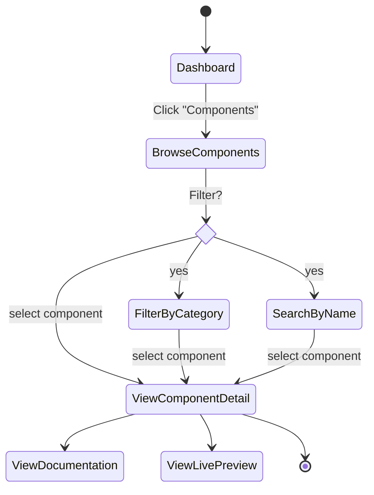

# Workflow: UI/UX Prototyping - Flutter UI Kit

## Overview
This workflow guides the creation of high-fidelity UI prototypes and the extraction of a semantic Design System for the Flutter UI Kit. Instead of manual wireframes, we leverage **Stitch AI** to generate production-ready UI designs and extract a "Source of Truth" `DESIGN.md` file that will map directly to Flutter's `ThemeData`.

## Output Location
**Base Folder:** `flutter-ui-kit/02-ui-ux-prototyping/`

**Output Files:**
- `user-flows-wireframes.md` - ASCII Wireframes and User Flow Documentation
- `ui-prompts.md` - Optimized prompts for Stitch screen generation
- `DESIGN.md` - Extracted Design System (Source of Truth)
- `component-anatomy.md` - Interaction notes and state diagrams

## Prerequisites
- PRD Analysis completed (`01_prd_analysis.md`)
- Component priorities defined (`03_component_development.md`)
- Understanding of target user personas
- Access to **Stitch AI MCP** and related skills (`stitch-enhance-prompt`, `stitch-design-md`)

---

## Deliverables

### 1. ASCII Wireframing & User Flows

**Description:** Create low-fidelity text-based wireframes for quick visualization, logic checking, and iteration before moving to high-fidelity AI generation. This helps users easily analyze the pages and screens needed.

**Recommended Skills:** `senior-ui-ux-designer`

**Instructions:**
1. Map user journeys based on personas (e.g., Onboarding, Component Browse, Checkout).
2. Create user flow diagrams showing entry points, decision points, and exit paths.
3. Design ASCII wireframes for all key screens.

**Output Format (User Flow):**
```markdown
# User Flows & Wireframes

## Component Browse Flow

```

**ASCII Notation Reference:**
| Symbol | Element | Example |
|--------|---------|---------|
| `┌─┐│└┘` | Container/border | `┌─────┐` |
| `[Text]` | Button/CTA | `[Submit]` |
| `(____)` | Text input | `(Enter email)` |
| `☐` | Checkbox (unchecked) | `☐ Agree` |
| `☑` | Checkbox (checked) | `☑ Agree` |
| `◉` | Radio (selected) | `◉ Option A` |
| `○` | Radio (unselected) | `○ Option B` |
| `>>>` | Link/Navigation | `>>> Details` |
| `===` | Divider/separator | `=== OR ===` |

**Example ASCII Wireframe (Dashboard):**
```text
┌─────────────────────────────────────────────────────────────┐
│  [Logo]  Dashboard  Components  Templates   🔍(Search)  👤  │
├────────┬────────────────────────────────────────────────────┤
│  MENU  │                                                    │
│  ● Home│  Welcome, Developer!                               │
│  ● Lib │  ┌──────────┐ ┌──────────┐ ┌──────────┐            │
│  ● Docs│  │ Earnings │ │ Downloads│ │ Rating   │            │
│        │  │  $1,240  │ │    345   │ │ 4.8/5.0  │            │
│  HELP  │  └──────────┘ └──────────┘ └──────────┘            │
│  [❓]  │                                                    │
│        │  Recent Component Updates               [View All] │
│        │  ┌──────────────────────────────────────────────┐  │
│        │  │ Name       | Category | Status   | Last Mod  │  │
│        │  ├────────────┼──────────┼──────────┼───────────┤  │
│        │  │ AppButton  | Input    | ✅ Active| Today     │  │
│        │  │ AppCard    | Surface  | ⏳ Draft | Yesterday │  │
│        │  └──────────────────────────────────────────────┘  │
└────────┴────────────────────────────────────────────────────┘
```

---

### 2. UI Prompt Engineering

**Description:** Transform PRD requirements into polished, Stitch-optimized prompts.

**Recommended Skills:** `senior-ui-ux-designer`, `stitch-enhance-prompt`

**Instructions:**
1. Identify key user journeys and screens from the PRD (e.g., Onboarding, Component Browse, Checkout).
2. For each screen, draft a basic text description.
3. Use the `stitch-enhance-prompt` skill to enhance the description into a structured prompt with UI/UX keywords, mood descriptors, and formal layout structure.
4. Save the enhanced prompts to `ui-prompts.md` for tracking.

**Example Process:**
_User Intent:_ "Dashboard for selling Flutter UI Kits"
_Enhanced Prompt (via `stitch-enhance-prompt`):_
```markdown
A premium, trustworthy developer dashboard for managing UI Kit sales and license keys.

**DESIGN SYSTEM (REQUIRED):**
- Platform: Web, Desktop-first
- Theme: Dark, sleek, professional
- Background: Deep Slate (#0f172a)
- Surface: Midnight Blue (#1e293b) for cards
- Primary Accent: Brand Cyan (#06b6d4)
- Text Primary: Pure White (#ffffff)
- Typography: Inter or Roboto Mono for data, 400/500/700 weights

**Page Structure:**
1. **Header:** Minimal logo, earnings summary, user avatar.
2. **Key Metrics:** Grid of 4 cards (Total Revenue, Active Users, Refund Rate, Current MRR).
3. **Recent Sales:** Data table with sortable columns...
```

---

### 3. High-Fidelity Prototyping with Stitch

**Description:** Generate the actual UI screens based on the ASCII structure and generated prompts.

**Recommended Tools:** `mcp_stitch_generate_screen_from_text`

**Instructions:**
1. Execute the enhanced prompts using the Stitch MCP tool `mcp_stitch_generate_screen_from_text`.
2. Review the generated output (screenshot and HTML/CSS structure).
3. If the design needs adjustment, use `mcp_stitch_edit_screens` with specific targeted feedback (e.g., "Make the buttons pill-shaped and increase the padding in the feature cards").
4. Ensure all core P0 and P1 components from the catalog are represented across the generated screens.
5. Create variants for dark and light modes if necessary using `mcp_stitch_generate_variants`.

---

### 4. Design System Extraction (Source of Truth)

**Description:** Extract a semantic Design System from the approved Stitch prototypes to serve as the structural foundation for Flutter implementation.

**Recommended Skills:** `stitch-design-md`

**Instructions:**
1. Once the key screens (e.g., Dashboard, Component Detail, Checkout) are finalized and approved, invoke the `stitch-design-md` skill.
2. Ask the agent: `"Analyze the newly created Stitch project [Project ID] and generate the DESIGN.md"`.
3. The skill will analyze the CSS, Tailwind classes, and color palettes from the Stitch output and create a comprehensive `DESIGN.md` file.
4. Review the `DESIGN.md` to ensure it captures:
   - Primary, Secondary, and Semantic Colors with specific Hex Codes.
   - Typography scales (Display, Heading 1-6, Body, Caption).
   - Border radius rules, shadows (elevation), and spacing systems.
5. Save `DESIGN.md` into `flutter-ui-kit/02-ui-ux-prototyping/DESIGN.md`. This file is the **absolute contract** for the `ThemeData` generation in the next phase.

---

### 5. Component Anatomy & Interaction Notes

**Description:** Document interactions, UX flow, and state transitions that static designs do not fully convey.

**Recommended Skills:** `interaction-designer`

**Instructions:**
1. For complex components (e.g., buttons with loading states, multi-step forms), document the state machine.
2. Document hover, focus, pressed, and disabled states.
3. Specify animation curves and durations (e.g., "Hover transition: Ease-in-out 200ms").

**Output Format (Component State Machine):**
```markdown
# Component Anatomy & States

## AppButton State Machine

```mermaid
stateDiagram-v2
    [*] --> Default
     Default: Elevation 0, Bg Primary
    
    Default --> Hover: Mouse Enter
    Hover: Elev 2, Brightness +5%
    Hover --> Default: Mouse Leave
    
    Default --> Pressed: Tap Down
    Hover --> Pressed: Tap Down
    Pressed: Elev 0, Scale 0.98, Brightness -10%
    Pressed --> Default: Tap Up
    Pressed --> Hover: Tap Up (if mouse still over)
    
    Default --> Disabled: isEnabled = false
    Disabled: Bg Muted Gray, Text Inactive
    Disabled --> Default: isEnabled = true
    
    Default --> Loading: isLoading = true
    Loading: Show Spinner, Disable interactions
    Loading --> Default: isLoading = false
```

### Animation Specs:
- **Hover transition**: Ease-in-out 200ms
- **Press transition**: Ease-out 100ms
- **Scale factor**: 0.98 on press
```

---

## Workflow Validation Checklist

### Pre-Execution
- [ ] List of required screens mapped from PRD
- [ ] Target aesthetic (mood, vibe) agreed upon
- [ ] ASCII Wireframes & User flows completed for all key screens

### During Execution
- [ ] Base prompts enhanced using `stitch-enhance-prompt`
- [ ] Screens generated and refined using Stitch MCP
- [ ] Visual consistency maintained across all screens

### Post-Execution
- [ ] `DESIGN.md` successfully extracted using `stitch-design-md`
- [ ] Color values, typography, and spacing tokens explicitly defined
- [ ] Interactions and state transitions documented
- [ ] Ready for Flutter `ThemeData` translation in Phase 3
