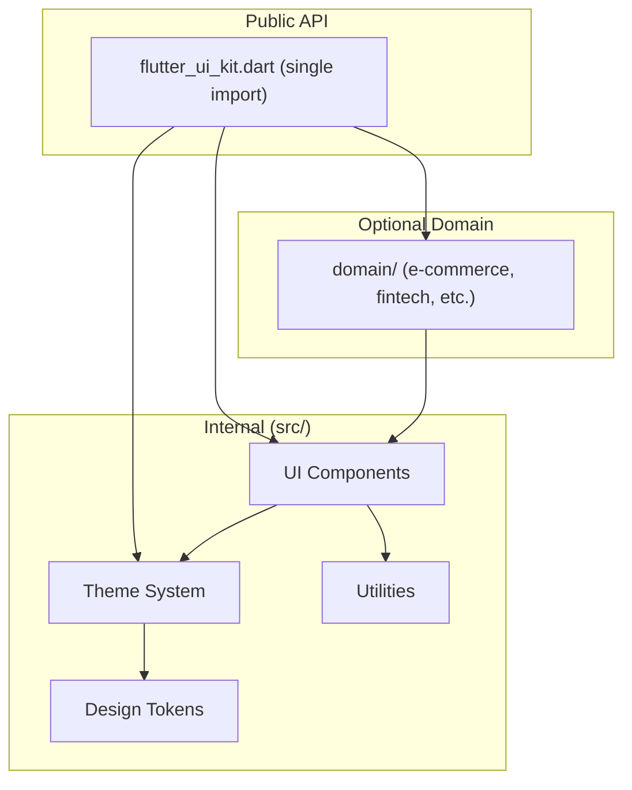
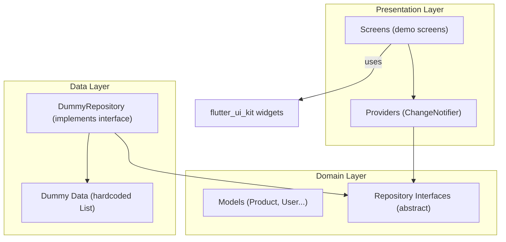
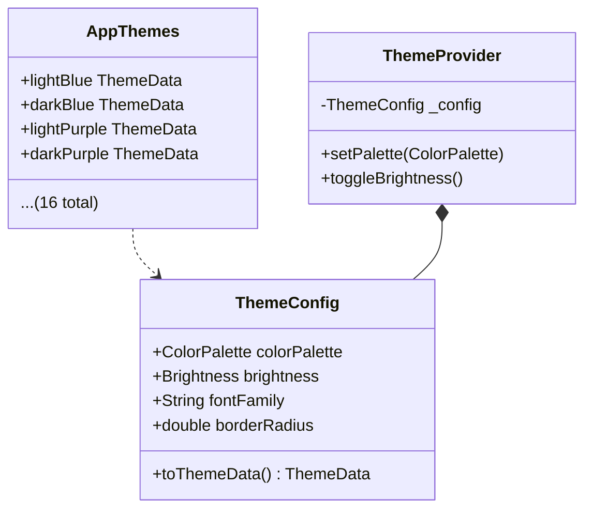

# Workflow: Technical Implementation - Flutter UI Kit

## Overview

Workflow ini memandu implementasi teknis produk Flutter. **Mode yang dipilih akan menentukan output structure.**

**Mode Selection Impact:**

| Mode | Product Type | Output Structure | pubspec.yaml |
|------|-------------|------------------|--------------|
| **Mode A** | UI Kit Package | `lib/src/components/` | package |
| **Mode B** | Showcase App | `lib/features/` + `main.dart` | app |
| **Mode C** | Hybrid | Both structures | Both files |

**CRITICAL:** Mode HARUS sudah dipilih di Phase 1. Structure berbeda berdasarkan mode.

## Output Location

**Base Folder:** `flutter-ui-kit/03-technical-implementation/`

**Output Files (Mode-Aware):**

| File | Mode A (UI Kit) | Mode B (Showcase) | Mode C (Hybrid) |
|------|-----------------|-------------------|-----------------|
| `package-structure.md` | Package layout | App layout | Both layouts |
| `dependencies.md` | Minimal deps | Full app deps | Both |
| `design-tokens.md` | Same (from DESIGN.md) | Same | Same |
| `theme-system.md` | ThemeConfig | ThemeData | Both |
| `component-api-spec.md` | Component APIs | Screen APIs | Both |
| `testing-strategy.md` | Widget tests | Integration tests | Both |

## Prerequisites

- **Mode selected:** Confirmed in Phase 1
- PRD Analysis selesai (`01_prd_analysis.md` → mode + requirements)
- UI/UX Prototyping selesai (`02_ui_ux_prototyping.md` → `DESIGN.md` ready)
- Component priorities defined (P0/P1/P2 dari Phase 1)
- Flutter SDK >=3.10.0 installed

---

## Agent Behavior: Mode-Specific Implementation

**GOLDEN RULE:** Struktur teknis HARUS sesuai mode yang dipilih di Phase 1. Jangan mix structure!

### Prinsip Utama: OUTPUT BERDASARKAN MODE

**Mode A (UI Kit Package):**
```
Output: Flutter package untuk developer
Structure: lib/src/components/
Constraint: DILARANG state management, database di core package
Dependencies: Minimal (google_fonts, intl, flutter_localizations)
Example: Small demo app di folder example/
```

**Mode B (Showcase App):**
```
Output: Flutter app runnable
Structure: lib/features/ (feature-first) + main.dart
Constraint: Boleh state management (Riverpod/BLoC)
Dependencies: Sesuai kebutuhan app (boleh Riverpod, go_router, dll)
Data: Dummy/hardcoded (NO database untuk demo)
```

**Mode C (Hybrid):**
```
Phase 1 (Week 1-8): Build Mode A structure
Phase 2 (Week 9-12): Build Mode B structure (reuses UI Kit)
Result: UI Kit package + Showcase app
```

### Input dari Phase Sebelumnya

```
Phase 1 (PRD) → Mode Selection (A/B/C)
                           ↓
Phase 2 (UI/UX) → DESIGN.md (colors, typography, spacing, radius, shadows)
                           ↓
Phase 3 (Technical) → Structure + Code (MODE-DEPENDENT)
```

#### DESIGN.md → ThemeData Translation Rules

Agen WAJIB menerjemahkan setiap section dari `DESIGN.md` ke Flutter code:

| DESIGN.md Section | Flutter Implementation | File |
|-------------------|----------------------|------|
| Color Palette (Light) | `ColorScheme` + `ThemeData.colorScheme` | `lib/src/tokens/colors.dart` |
| Color Palette (Dark) | `ColorScheme` dark variant | `lib/src/theme/dark_theme.dart` |
| Typography Scale | `TextTheme` + font package | `lib/src/tokens/typography.dart` |
| Spacing System | `AppSpacing` constants class | `lib/src/tokens/spacing.dart` |
| Border Radius | `AppRadius` constants + component defaults | `lib/src/tokens/radius.dart` |
| Elevation/Shadows | `AppShadows` + `BoxShadow` lists | `lib/src/tokens/shadows.dart` |

#### Domain-Specific Component Handling

Jika Phase 1 mendeteksi target domain (e-commerce, fintech, dll), Phase 3 harus:
- Include domain components sebagai **optional sub-package** atau folder terpisah
- Core components (AppButton, AppCard, dll) = WAJIB, zero-dependency
- Domain components (ProductCard, BalanceCard, dll) = OPSIONAL, boleh di folder terpisah

```text
lib/src/components/
├── core/              # P0 - WAJIB ada (AppButton, AppCard, AppTextField...)
├── navigation/        # P0 - WAJIB ada (AppBottomNav, AppTabBar...)
├── feedback/          # P0 - WAJIB ada (AppDialog, AppSnackBar...)
├── data_display/      # P1 - Core (AppAvatar, AppBadge, AppChip...)
└── domain/            # P1 - OPSIONAL, berdasarkan target domain
    ├── ecommerce/     # ProductCard, CartItem, PriceTag (jika domain = e-commerce)
    ├── fintech/       # BalanceCard, TransactionItem (jika domain = fintech)
    └── dashboard/     # StatCard, DataTable (jika domain = dashboard)
```

---

## Deliverables

### 1. Package Structure (Mode-Specific)

**Description:** Setup directory structure sesuai mode yang dipilih.

**Recommended Skills:** `senior-flutter-developer`

**Mode A (UI Kit Package):**
```
1. Create package structure:
   - Single entry point (`flutter_ui_kit.dart`)
   - Internal implementation dalam src/ folder
   - Component organization by category
   - Test structure mirroring source

2. Configure package metadata:
   - pubspec.yaml dengan ZERO third-party di dependencies
   - analysis_options.yaml dengan strict linting
   - README.md, CHANGELOG.md, LICENSE (MIT)

3. Setup example app structure (showcase kecil):
   - Demo screen per component
   - Theme switching capability
   - Code example display

4. Setup CI/CD:
   - GitHub Actions for tests
   - Coverage reporting (>85% gate)
   - Automated pub.dev publishing
```

**Mode B (Showcase App):**
```
1. Create app structure:
   - main.dart entry point
   - Feature-first organization (lib/features/)
   - Shared widgets (lib/shared/)
   - Data layer (lib/data/) - dummy only

2. Configure app metadata:
   - pubspec.yaml untuk aplikasi
   - analysis_options.yaml
   - README.md, LICENSE

3. Setup state management (optional):
   - Riverpod / BLoC (boleh untuk app)
   - DI setup (manual atau package)

4. Setup CI/CD:
   - GitHub Actions for tests
   - Build/deployment pipeline
```

**Mode C (Hybrid):**
```
Phase 1: Build Mode A structure (Week 1-8)
Phase 2: Build Mode B structure (Week 9-12)
Result: Both structures exist, Mode B reuses Mode A components
```

**Mode A Structure:**
```text
flutter_ui_kit/
│
├── lib/
│   ├── flutter_ui_kit.dart            # Main export (PUBLIC API)
│   │
│   └── src/
│       ├── tokens/                    # Design Tokens
│       │   ├── colors.dart
│       │   ├── typography.dart
│       │   ├── spacing.dart
│       │   ├── radius.dart
│       │   ├── shadows.dart
│       │   └── tokens.dart
│       │
│       ├── theme/                     # Theme Configuration
│       │   ├── theme_config.dart
│       │   ├── color_palette.dart
│       │   ├── light_theme.dart
│       │   ├── dark_theme.dart
│       │   ├── themes.dart
│       │   └── theme.dart
│       │
│       ├── components/                # UI Components
│       │   ├── core/                  # P0 Core Components
│       │   │   ├── button/
│       │   │   ├── text_field/
│       │   │   ├── card/
│       │   │   └── ...
│       │   ├── navigation/
│       │   ├── feedback/
│       │   └── domain/                # Domain-specific
│       │
│       └── utils/
│
├── example/                           # Showcase App (kecil)
│   ├── lib/
│   │   ├── main.dart
│   │   └── screens/
│   └── pubspec.yaml
│
├── test/
├── pubspec.yaml                       # Package config
└── README.md
```

**Mode B Structure (Feature-First):**
```text
showcase_app/
│
├── lib/
│   ├── main.dart                      # Entry point
│   │
│   ├── bootstrap/                     # App initialization
│   │   ├── app.dart
│   │   └── bootstrap.dart
│   │
│   ├── core/                          # App-level concerns
│   │   ├── di/                        # Dependency injection
│   │   ├── error/
│   │   ├── router/                    # GoRouter config
│   │   ├── storage/
│   │   └── theme/                     # App theme
│   │
│   ├── features/                      # Feature modules (FEATURE-FIRST!)
│   │   ├── auth/
│   │   │   ├── data/
│   │   │   ├── domain/
│   │   │   └── presentation/
│   │   │
│   │   ├── dashboard/
│   │   │   ├── data/
│   │   │   ├── domain/
│   │   │   └── presentation/
│   │   │
│   │   ├── service_order/             # Fitur utama
│   │   │   ├── data/
│   │   │   │   ├── datasources/
│   │   │   │   ├── models/
│   │   │   │   └── repositories/
│   │   │   ├── domain/
│   │   │   │   ├── entities/
│   │   │   │   ├── repositories/
│   │   │   │   └── usecases/
│   │   │   └── presentation/
│   │   │       ├── controllers/
│   │   │       ├── screens/
│   │   │       └── widgets/
│   │   │
│   │   ├── service_tracking/
│   │   ├── payment/
│   │   └── customer/
│   │
│   ├── shared/                        # Shared across features
│   │   ├── extensions/
│   │   ├── utils/
│   │   └── widgets/                   # Reusable UI components
│   │
│   └── data/                          # Dummy data only
│       ├── dummy_customers.dart
│       ├── dummy_vehicles.dart
│       └── dummy_services.dart
│
├── test/
├── pubspec.yaml                       # App config
└── README.md
```

**Output Format:**
```markdown
# Package Structure

## Architecture


## Directory Layout
```text
flutter_ui_kit/
│
├── lib/
│   ├── flutter_ui_kit.dart            # Main export (PUBLIC API)
│   │
│   └── src/
│       ├── tokens/                    # Design Tokens
│       │   ├── colors.dart            # Color palettes (from DESIGN.md)
│       │   ├── typography.dart        # Font scales (from DESIGN.md)
│       │   ├── spacing.dart           # Spacing system (from DESIGN.md)
│       │   ├── radius.dart            # Border radius (from DESIGN.md)
│       │   ├── shadows.dart           # Shadow/elevation (from DESIGN.md)
│       │   └── tokens.dart            # Export barrel
│       │
│       ├── theme/                     # Theme Configuration
│       │   ├── theme_config.dart      # ThemeConfig class
│       │   ├── color_palette.dart     # AppColorPalette enum/class
│       │   ├── light_theme.dart       # Light ThemeData builder
│       │   ├── dark_theme.dart        # Dark ThemeData builder
│       │   ├── themes.dart            # Pre-built AppThemes (8×2=16)
│       │   └── theme.dart             # Export barrel
│       │
│       ├── components/                # UI Components
│       │   ├── core/                  # P0 Core Components
│       │   │   ├── button/
│       │   │   │   ├── app_button.dart
│       │   │   │   ├── button_variant.dart
│       │   │   │   └── button_size.dart
│       │   │   ├── text_field/
│       │   │   ├── card/
│       │   │   ├── checkbox/
│       │   │   └── switch/
│       │   │
│       │   ├── navigation/            # Navigation Components
│       │   │   ├── bottom_nav/
│       │   │   └── tab_bar/
│       │   │
│       │   ├── feedback/              # Feedback Components
│       │   │   ├── dialog/
│       │   │   ├── snackbar/
│       │   │   └── toast/
│       │   │
│       │   ├── data_display/          # Data Display Components
│       │   │   ├── avatar/
│       │   │   ├── badge/
│       │   │   └── chip/
│       │   │
│       │   └── domain/               # OPTIONAL Domain Components
│       │       ├── ecommerce/         # (if target domain = e-commerce)
│       │       ├── fintech/           # (if target domain = fintech)
│       │       └── dashboard/         # (if target domain = dashboard)
│       │
│       └── utils/                     # Internal Utilities
│           ├── extensions.dart
│           └── constants.dart
│
├── example/                           # Showcase App (Clean Architecture + Dummy Data)
│   ├── lib/
│   │   ├── main.dart                  # Entry point, ThemeProvider setup
│   │   │
│   │   ├── core/                      # App-level concerns
│   │   │   ├── theme/
│   │   │   │   └── theme_provider.dart  # ChangeNotifier for theme switching
│   │   │   └── di/
│   │   │       └── service_locator.dart # Manual DI (constructor injection)
│   │   │
│   │   ├── domain/                    # Abstract interfaces + models
│   │   │   ├── models/
│   │   │   │   ├── product.dart       # Data class (domain-dependent)
│   │   │   │   ├── user.dart
│   │   │   │   └── transaction.dart
│   │   │   └── repositories/
│   │   │       ├── product_repository.dart    # Abstract interface
│   │   │       ├── user_repository.dart
│   │   │       └── transaction_repository.dart
│   │   │
│   │   ├── data/                      # Concrete implementations
│   │   │   ├── dummy/                 # Hardcoded dummy data (NO database)
│   │   │   │   ├── dummy_products.dart
│   │   │   │   ├── dummy_users.dart
│   │   │   │   └── dummy_transactions.dart
│   │   │   └── repositories/
│   │   │       ├── dummy_product_repository.dart  # implements ProductRepository
│   │   │       ├── dummy_user_repository.dart
│   │   │       └── dummy_transaction_repository.dart
│   │   │
│   │   └── presentation/             # Screens + state providers
│   │       ├── providers/
│   │       │   ├── product_provider.dart    # ChangeNotifier (built-in)
│   │       │   ├── theme_provider.dart      # ValueNotifier<ThemeMode>
│   │       │   └── catalog_provider.dart
│   │       └── screens/
│   │           ├── catalog_screen.dart      # All components grid
│   │           ├── component_detail.dart    # Single component preview + knobs
│   │           ├── theme_builder.dart       # Live theme switching
│   │           ├── button_demo.dart         # Per-component demos
│   │           ├── text_field_demo.dart
│   │           └── template_screens/        # Domain template screens
│   │               ├── login_screen.dart
│   │               ├── dashboard_screen.dart
│   │               └── settings_screen.dart
│   └── pubspec.yaml                   # go_router only (for navigation)
│
├── test/                              # Tests (mirror src/)
│   ├── tokens/
│   ├── theme/
│   ├── components/
│   └── goldens/
│
├── pubspec.yaml                       # ZERO third-party deps
├── analysis_options.yaml              # Strict linting
├── CHANGELOG.md
├── README.md
└── LICENSE                            # MIT
```

## pubspec.yaml (MINIMAL Curated Dependencies)
```yaml
name: flutter_ui_kit
description: A beautiful, production-ready Flutter UI Kit with i18n support.
version: 1.0.0
homepage: https://flutteruikit.com
repository: https://github.com/username/flutter_ui_kit

environment:
  sdk: '>=3.0.0 <4.0.0'
  flutter: '>=3.10.0'

# MINIMAL curated — only essentials
dependencies:
  flutter:
    sdk: flutter
  flutter_localizations:          # i18n support (Flutter SDK, bukan third-party)
    sdk: flutter
  google_fonts: ^6.0.0            # Premium typography (Inter, Outfit, Plus Jakarta Sans)
  intl: ^0.19.0                   # Date/number/currency formatting + ARB translations

# DILARANG ditambah: riverpod, bloc, getx, hive, sqflite, isar, dio, http

# Dev deps — OK
dev_dependencies:
  flutter_test:
    sdk: flutter
  flutter_lints: ^3.0.0
  mocktail: ^1.0.0
  very_good_analysis: ^5.0.0
  golden_toolkit: ^0.15.0
```

### Dependency Policy

| Package | Kategori | Alasan | Wajib? |
|---------|----------|--------|--------|
| `flutter` | SDK | Core framework | ✅ Wajib |
| `flutter_localizations` | SDK | Multi-language support | ✅ Wajib |
| `google_fonts` | Typography | Font premium tanpa bundle .ttf besar | ✅ Wajib |
| `intl` | i18n | Date, number, currency formatting + ARB | ✅ Wajib |
| `go_router` | Navigation | **Hanya di example app** | ⚠️ Example only |
| ~~riverpod/bloc/getx~~ | State mgmt | **DILARANG** — pembeli pilih sendiri | ❌ Dilarang |
| ~~hive/sqflite/isar~~ | Database | **DILARANG** — bukan concern UI Kit | ❌ Dilarang |
| ~~dio/http~~ | Networking | **DILARANG** — bukan concern UI Kit | ❌ Dilarang |

## analysis_options.yaml
```yaml
include: package:very_good_analysis/analysis_options.5.0.0.yaml

linter:
  rules:
    public_member_api_docs: true
    document_ignores: true
```
```

## Showcase App Architecture (Clean Architecture + Dummy Data)

**CRITICAL:** Showcase app (`example/`) menggunakan **clean architecture** untuk mendemonstrasikan UI Kit dalam konteks real, tapi TANPA database. Semua data = dummy/hardcoded.

### Why Clean Architecture di Showcase App?
- Pembeli lihat **cara profesional** pakai UI Kit dalam arsitektur nyata
- Pattern yang ditunjukkan bisa di-copy ke project pembeli
- Tanpa database = zero config, clone → run → lihat langsung
- Built-in state management = compatible dengan SEMUA state management pilihan pembeli

### Architecture Layers



### State Management: Built-in Only

```dart
// ✅ GUNAKAN (bawaan Flutter, zero dependency)
ChangeNotifier          // untuk state kompleks (ProductProvider, CartProvider)
ValueNotifier<T>        // untuk state sederhana (ThemeMode, selectedIndex)
ListenableBuilder       // untuk listen ChangeNotifier
ValueListenableBuilder  // untuk listen ValueNotifier

// ❌ JANGAN GUNAKAN di showcase app (third-party)
Riverpod, BLoC, GetX, Provider package
```

### Contoh Implementasi

**Domain Model:**
```dart
// example/lib/domain/models/product.dart
class Product {
  final String id;
  final String name;
  final String description;
  final double price;
  final String imageUrl;
  final String category;

  const Product({
    required this.id,
    required this.name,
    required this.description,
    required this.price,
    required this.imageUrl,
    required this.category,
  });
}
```

**Abstract Repository:**
```dart
// example/lib/domain/repositories/product_repository.dart
abstract class ProductRepository {
  List<Product> getProducts();
  Product? getProductById(String id);
  List<Product> getProductsByCategory(String category);
  List<String> getCategories();
}
```

**Dummy Data:**
```dart
// example/lib/data/dummy/dummy_products.dart
final dummyProducts = [
  const Product(
    id: '1',
    name: 'Wireless Headphones',
    description: 'Premium noise-cancelling headphones',
    price: 79.99,
    imageUrl: 'assets/images/headphones.png',
    category: 'Electronics',
  ),
  // ... 15-20 items per domain
];
```

**Repository Implementation:**
```dart
// example/lib/data/repositories/dummy_product_repository.dart
class DummyProductRepository implements ProductRepository {
  @override
  List<Product> getProducts() => dummyProducts;

  @override
  Product? getProductById(String id) =>
      dummyProducts.where((p) => p.id == id).firstOrNull;

  @override
  List<Product> getProductsByCategory(String category) =>
      dummyProducts.where((p) => p.category == category).toList();

  @override
  List<String> getCategories() =>
      dummyProducts.map((p) => p.category).toSet().toList();
}
```

**State Provider (ChangeNotifier):**
```dart
// example/lib/presentation/providers/product_provider.dart
class ProductProvider extends ChangeNotifier {
  final ProductRepository _repository;

  ProductProvider(this._repository);

  List<Product> get products => _repository.getProducts();
  List<String> get categories => _repository.getCategories();

  String _selectedCategory = 'All';
  String get selectedCategory => _selectedCategory;

  List<Product> get filteredProducts => _selectedCategory == 'All'
      ? products
      : _repository.getProductsByCategory(_selectedCategory);

  void selectCategory(String category) {
    _selectedCategory = category;
    notifyListeners();
  }
}
```

**Demo Screen (menggunakan UI Kit widgets):**
```dart
// example/lib/presentation/screens/product_list_demo.dart
class ProductListDemo extends StatelessWidget {
  final ProductProvider provider;
  const ProductListDemo({super.key, required this.provider});

  @override
  Widget build(BuildContext context) {
    return ListenableBuilder(
      listenable: provider,
      builder: (context, _) => Column(
        children: [
          // UI Kit: AppChip untuk filter
          Wrap(
            children: provider.categories.map((cat) =>
              AppChip(
                label: cat,
                isSelected: provider.selectedCategory == cat,
                onTap: () => provider.selectCategory(cat),
              ),
            ).toList(),
          ),
          // UI Kit: AppCard untuk product items
          Expanded(
            child: GridView.builder(
              itemCount: provider.filteredProducts.length,
              gridDelegate: const SliverGridDelegateWithFixedCrossAxisCount(
                crossAxisCount: 2,
              ),
              itemBuilder: (context, index) {
                final product = provider.filteredProducts[index];
                return AppCard(
                  child: Column(
                    children: [
                      AppAvatar(imageUrl: product.imageUrl, size: AvatarSize.lg),
                      Text(product.name),
                      Text('\$${product.price}'),
                      AppButton(
                        text: 'Add to Cart',
                        variant: ButtonVariant.primary,
                        size: ButtonSize.small,
                        onPressed: () {},
                      ),
                    ],
                  ),
                );
              },
            ),
          ),
        ],
      ),
    );
  }
}
```

### Showcase App Dependencies (example/pubspec.yaml)
```yaml
# example/pubspec.yaml — hanya go_router untuk navigation
dependencies:
  flutter:
    sdk: flutter
  flutter_ui_kit:
    path: ../                    # Link ke parent package
  go_router: ^14.0.0            # Navigation saja

# TIDAK ADA: riverpod, bloc, getx, hive, sqflite, isar
# State management = ChangeNotifier + ValueNotifier (built-in)
# Data = dummy (hardcoded lists)
```

### Domain-Specific Dummy Data

Models dan dummy data disesuaikan berdasarkan target domain dari Phase 1:

| Domain | Models | Dummy Items |
|--------|--------|-------------|
| E-Commerce | Product, CartItem, Category, Order | 20 products, 5 categories |
| Fintech | Account, Transaction, Card, Transfer | 15 transactions, 3 accounts |
| Social Media | Post, UserProfile, Comment, Story | 15 posts, 10 users |
| Dashboard | Metric, ChartData, Activity, User | 10 metrics, 20 activities |
| General | Item, Category, User | 10 items, 5 users |

---

### 1b. Internationalization (i18n) & Localization Setup

**Description:** Setup multi-language support dan Google Fonts integration di package.

**Recommended Skills:** `senior-flutter-developer`, `internationalization-specialist`

**Instructions:**
1. Setup Flutter localization infrastructure
2. Create ARB files untuk bahasa yang didukung
3. Configure Google Fonts sebagai default typography
4. Buat localized component labels

#### Directory Structure
```text
lib/src/
├── l10n/                             # Localization
│   ├── app_localizations.dart        # Generated (dart run intl)
│   ├── arb/
│   │   ├── app_en.arb                # English (default)
│   │   ├── app_id.arb                # Bahasa Indonesia
│   │   ├── app_es.arb                # Spanish
│   │   ├── app_ja.arb                # Japanese
│   │   └── app_zh.arb                # Chinese
│   └── l10n.dart                     # Export barrel + helper
│
├── typography/                       # Google Fonts integration
│   ├── app_text_theme.dart           # TextTheme builder using google_fonts
│   └── font_config.dart              # Font family selector
```

#### l10n.yaml Configuration
```yaml
# l10n.yaml di root package
arb-dir: lib/src/l10n/arb
template-arb-file: app_en.arb
output-localization-file: app_localizations.dart
output-class: AppLocalizations
nullable-getter: false
```

#### Supported Locales
```dart
// lib/src/l10n/l10n.dart
import 'package:flutter/material.dart';
import 'package:flutter_localizations/flutter_localizations.dart';
import 'app_localizations.dart';

/// Supported locales for the UI Kit.
class AppL10n {
  static const supportedLocales = [
    Locale('en'),    // English (default)
    Locale('id'),    // Bahasa Indonesia
    Locale('es'),    // Spanish
    Locale('ja'),    // Japanese
    Locale('zh'),    // Chinese
  ];

  static const localizationsDelegates = [
    AppLocalizations.delegate,
    GlobalMaterialLocalizations.delegate,
    GlobalWidgetsLocalizations.delegate,
    GlobalCupertinoLocalizations.delegate,
  ];
}
```

#### ARB File Template (English — Default)
```json
// lib/src/l10n/arb/app_en.arb
{
  "@@locale": "en",

  "buttonLoading": "Loading...",
  "buttonRetry": "Retry",
  "buttonCancel": "Cancel",
  "buttonConfirm": "Confirm",
  "buttonSave": "Save",
  "buttonDelete": "Delete",
  "buttonEdit": "Edit",
  "buttonClose": "Close",
  "buttonBack": "Back",
  "buttonNext": "Next",

  "dialogAlertTitle": "Alert",
  "dialogConfirmTitle": "Are you sure?",
  "dialogDeleteMessage": "This action cannot be undone.",

  "searchHint": "Search...",
  "searchNoResults": "No results found",
  "searchClear": "Clear",

  "emptyStateTitle": "Nothing here yet",
  "emptyStateDescription": "Start by adding your first item",

  "validationRequired": "This field is required",
  "validationEmail": "Enter a valid email",
  "validationMinLength": "Must be at least {length} characters",
  "@validationMinLength": {
    "placeholders": { "length": { "type": "int" } }
  },

  "dateFormatShort": "MM/dd/yyyy",
  "currencySymbol": "$"
}
```

#### ARB File (Bahasa Indonesia)
```json
// lib/src/l10n/arb/app_id.arb
{
  "@@locale": "id",
  "buttonLoading": "Memuat...",
  "buttonRetry": "Coba Lagi",
  "buttonCancel": "Batal",
  "buttonConfirm": "Konfirmasi",
  "buttonSave": "Simpan",
  "buttonDelete": "Hapus",
  "buttonEdit": "Ubah",
  "buttonClose": "Tutup",
  "buttonBack": "Kembali",
  "buttonNext": "Berikutnya",
  "dialogAlertTitle": "Peringatan",
  "dialogConfirmTitle": "Apakah Anda yakin?",
  "dialogDeleteMessage": "Tindakan ini tidak dapat dibatalkan.",
  "searchHint": "Cari...",
  "searchNoResults": "Tidak ada hasil",
  "emptyStateTitle": "Belum ada data",
  "emptyStateDescription": "Mulai dengan menambahkan item pertama"
}
```

#### Google Fonts Integration
```dart
// lib/src/typography/app_text_theme.dart
import 'package:google_fonts/google_fonts.dart';
import 'package:flutter/material.dart';

/// Builds a TextTheme using Google Fonts.
///
/// Default font: Inter. Can be overridden per-kit via [fontFamily].
class AppTextTheme {
  /// Creates a complete TextTheme using the specified Google Font.
  static TextTheme textTheme({String fontFamily = 'Inter'}) {
    final baseTextTheme = GoogleFonts.getTextTheme(fontFamily);
    return baseTextTheme.copyWith(
      displayLarge: baseTextTheme.displayLarge?.copyWith(
        fontWeight: FontWeight.w700,
      ),
      // ... customize all text styles
    );
  }

  /// Available font presets for the UI Kit.
  static const availableFonts = [
    'Inter',             // Modern, clean
    'Plus Jakarta Sans', // Friendly, rounded
    'Outfit',            // Geometric, modern
    'DM Sans',           // Classic, professional
    'Poppins',           // Popular, versatile
  ];
}
```

#### Component Localization Pattern
```dart
// Komponen HARUS mendukung localized labels:

/// A confirmation dialog with localized default labels.
class AppDialog extends StatelessWidget {
  /// Title of the dialog. Falls back to localized default.
  final String? title;

  /// Cancel button text. Falls back to localized default.
  final String? cancelText;

  /// Confirm button text. Falls back to localized default.
  final String? confirmText;

  @override
  Widget build(BuildContext context) {
    final l10n = AppLocalizations.of(context);
    return AlertDialog(
      title: Text(title ?? l10n.dialogConfirmTitle),
      actions: [
        AppButton(
          text: cancelText ?? l10n.buttonCancel,
          variant: ButtonVariant.ghost,
          onPressed: () => Navigator.pop(context),
        ),
        AppButton(
          text: confirmText ?? l10n.buttonConfirm,
          variant: ButtonVariant.primary,
          onPressed: onConfirm,
        ),
      ],
    );
  }
}
```

#### i18n Quality Rules
- SEMUA component string defaults harus di-localize via ARB
- User-passed strings (label, title) = override, TIDAK perlu di-localize (pembeli atur sendiri)
- Format date/number/currency menggunakan `intl` package (DateFormat, NumberFormat)
- Min. 2 bahasa: English (default) + Bahasa Indonesia
- ARB files = source of truth untuk translations

### 2. Design Tokens Implementation

**Description:** Translate `DESIGN.md` dari Phase 2 menjadi Dart code. Setiap hex code, font size, spacing value di DESIGN.md harus ter-implementasi 1:1.

**Recommended Skills:** `senior-flutter-developer`

**CRITICAL RULE:** Values di file ini HARUS match persis dengan `DESIGN.md`. Jika DESIGN.md bilang `primary: #3b82f6`, maka code harus `Color(0xFF3B82F6)` — tidak boleh diubah tanpa update DESIGN.md.

**Instructions:**
1. Parse `DESIGN.md` — extract semua token values
2. Implement color tokens:
   - Primary palette (10-shade scale: 50-900)
   - 8 color palette options (blue, purple, green, red, orange, teal, pink, slate)
   - Semantic colors (success, warning, error, info)
   - Light AND dark variants
3. Implement typography tokens:
   - Font families (primary, secondary, mono)
   - Font sizes (xs to 5xl)
   - Font weights, line heights, letter spacing
4. Implement spacing tokens (4px grid base)
5. Implement border radius tokens
6. Implement shadow/elevation tokens
7. Write unit tests verifying all token values match DESIGN.md

**Output Format:**
```markdown
# Design Tokens Implementation

## DESIGN.md Reference
Source: `flutter-ui-kit/02-ui-ux-prototyping/DESIGN.md`
All values below MUST match DESIGN.md exactly.

## Theme & Component Data Models

```dart
// lib/src/theme/theme_config.dart

/// Configuration class for building Flutter ThemeData.
///
/// Map of DESIGN.md sections:
/// - Colors → AppColorPalette
/// - Typography → fontFamilyPrimary
/// - Radius → defaultBorderRadius
class AppThemeConfig {
  final AppColorPalette colors;
  final String fontFamilyPrimary;
  final double defaultBorderRadius;
  final ThemeMode themeMode;

  const AppThemeConfig({
    required this.colors,
    this.fontFamilyPrimary = 'Inter',
    this.defaultBorderRadius = 12.0,
    this.themeMode = ThemeMode.light,
  });

  /// Translates config to Flutter ThemeData.
  ThemeData toThemeData() { /* ... */ }
}

/// Color palette container mapped from DESIGN.md.
class AppColorPalette {
  final Color primary;
  final Color onPrimary;
  final Color secondary;
  final Color surface;
  final Color background;
  final Color error;
  final Color success;
  final Color warning;

  const AppColorPalette({
    required this.primary,
    required this.onPrimary,
    required this.secondary,
    required this.surface,
    required this.background,
    required this.error,
    required this.success,
    required this.warning,
  });
}
```

## Color Tokens

### Primary Palette (from DESIGN.md)
```dart
// lib/src/tokens/colors.dart
// Values MUST match DESIGN.md Color Palette section

class AppColors {
  // Primary shade scale
  static const Color primary50 = Color(0xFFEFF6FF);
  static const Color primary100 = Color(0xFFDBEAFE);
  static const Color primary200 = Color(0xFFBFDBFE);
  static const Color primary300 = Color(0xFF93C5FD);
  static const Color primary400 = Color(0xFF60A5FA);
  static const Color primary500 = Color(0xFF3B82F6);  // Base
  static const Color primary600 = Color(0xFF2563EB);
  static const Color primary700 = Color(0xFF1D4ED8);
  static const Color primary800 = Color(0xFF1E40AF);
  static const Color primary900 = Color(0xFF1E3A8A);

  // Semantic
  static const Color success = Color(0xFF22C55E);
  static const Color warning = Color(0xFFF59E0B);
  static const Color error = Color(0xFFEF4444);
  static const Color info = Color(0xFF3B82F6);
}
```

### 8 Color Palettes
```dart
enum ColorPalette {
  blue,      // Tech, Professional
  purple,    // Creative, Modern
  green,     // Finance, Health
  red,       // Bold, Energy
  orange,    // Warm, Friendly
  teal,      // Calm, Wellness
  pink,      // Beauty, Lifestyle
  slate,     // Minimal, Clean
}
```

## Typography Tokens (from DESIGN.md)
```dart
// lib/src/tokens/typography.dart
// Values MUST match DESIGN.md Typography Scale section

class AppTypography {
  static const String fontFamilyPrimary = 'Inter';
  static const String fontFamilySecondary = 'Poppins';
  static const String fontFamilyMono = 'JetBrains Mono';

  static const double fontSizeXS = 12.0;
  static const double fontSizeSM = 14.0;
  static const double fontSizeBase = 16.0;
  static const double fontSizeLG = 18.0;
  static const double fontSizeXL = 20.0;
  static const double fontSize2XL = 24.0;
  static const double fontSize3XL = 30.0;
  static const double fontSize4XL = 36.0;
  static const double fontSize5XL = 48.0;

  static const FontWeight weightRegular = FontWeight.w400;
  static const FontWeight weightMedium = FontWeight.w500;
  static const FontWeight weightSemiBold = FontWeight.w600;
  static const FontWeight weightBold = FontWeight.w700;

  static const double lineHeightTight = 1.25;
  static const double lineHeightNormal = 1.5;
  static const double lineHeightRelaxed = 1.625;
}
```

## Spacing Tokens (from DESIGN.md)
```dart
// lib/src/tokens/spacing.dart
// Base: 4px grid from DESIGN.md Spacing System section

class AppSpacing {
  static const double space0 = 0.0;
  static const double space1 = 4.0;     // xs
  static const double space2 = 8.0;     // sm
  static const double space3 = 12.0;
  static const double space4 = 16.0;    // md
  static const double space5 = 20.0;
  static const double space6 = 24.0;    // lg
  static const double space8 = 32.0;    // xl
  static const double space10 = 40.0;
  static const double space12 = 48.0;   // 2xl

  // Semantic aliases
  static const double paddingXS = space2;
  static const double paddingMD = space4;
  static const double paddingLG = space6;
}
```

## Border Radius Tokens (from DESIGN.md)
```dart
// lib/src/tokens/radius.dart

class AppRadius {
  static const double none = 0.0;
  static const double sm = 4.0;
  static const double md = 8.0;
  static const double lg = 12.0;
  static const double xl = 16.0;
  static const double xxl = 24.0;
  static const double full = 9999.0;

  // Component defaults
  static const double button = md;
  static const double input = md;
  static const double card = lg;
  static const double avatar = full;
}
```

## Shadow Tokens (from DESIGN.md)
```dart
// lib/src/tokens/shadows.dart

class AppShadows {
  static const List<BoxShadow> none = [];

  static const List<BoxShadow> sm = [
    BoxShadow(
      color: Color(0x0A000000),
      offset: Offset(0, 1),
      blurRadius: 2,
    ),
  ];

  static const List<BoxShadow> md = [
    BoxShadow(
      color: Color(0x0A000000),
      offset: Offset(0, 4),
      blurRadius: 6,
    ),
  ];

  static const List<BoxShadow> lg = [
    BoxShadow(
      color: Color(0x0A000000),
      offset: Offset(0, 10),
      blurRadius: 15,
    ),
  ];
}
```

## Token Tests
```dart
// test/tokens/colors_test.dart
// Verify values match DESIGN.md

void main() {
  group('AppColors', () {
    test('primary500 matches DESIGN.md', () {
      expect(AppColors.primary500.value, equals(0xFF3B82F6));
    });

    test('all semantic colors defined', () {
      expect(AppColors.success, isNotNull);
      expect(AppColors.warning, isNotNull);
      expect(AppColors.error, isNotNull);
      expect(AppColors.info, isNotNull);
    });
  });
}
```
```

---

### 3. Theme System Implementation

**Description:** Build flexible theme system dengan 8 palettes × 2 brightness = 16 pre-built themes.

**Recommended Skills:** `senior-flutter-developer`

**Instructions:**
1. Create `ThemeConfig` class:
   - Color palette selection (8 options)
   - Brightness (light/dark)
   - Font family customizeable
   - Border radius customizeable
   - `toThemeData()` method → Flutter `ThemeData`
2. Implement 16 pre-built themes (8 palettes × light/dark)
3. Theme extension system untuk custom themes
4. Theme provider (ChangeNotifier) untuk runtime switching

**Output Format:**
```markdown
# Theme System Implementation

## Architecture


## ThemeConfig Class
```dart
// lib/src/theme/theme_config.dart

class ThemeConfig {
  final ColorPalette colorPalette;
  final Brightness brightness;
  final String fontFamily;
  final double borderRadius;

  const ThemeConfig({
    this.colorPalette = ColorPalette.blue,
    this.brightness = Brightness.light,
    this.fontFamily = AppTypography.fontFamilyPrimary,
    this.borderRadius = AppRadius.md,
  });

  /// Builds Flutter ThemeData from this config.
  /// Mapping strictly follows DESIGN.md contract.
  ThemeData toThemeData() {
    final colors = _getColorScheme();
    final textTheme = _getTextTheme();

    return ThemeData(
      useMaterial3: true,
      brightness: brightness,
      colorScheme: colors,
      textTheme: textTheme,
      fontFamily: fontFamily,
      inputDecorationTheme: InputDecorationTheme(
        border: OutlineInputBorder(
          borderRadius: BorderRadius.circular(borderRadius),
        ),
      ),
      cardTheme: CardTheme(
        shape: RoundedRectangleBorder(
          borderRadius: BorderRadius.circular(borderRadius),
        ),
      ),
    );
  }
}
```

## Pre-built Themes (16 total)
```dart
// lib/src/theme/themes.dart

class AppThemes {
  static ThemeData get lightBlue =>
    const ThemeConfig(colorPalette: ColorPalette.blue).toThemeData();

  static ThemeData get darkBlue =>
    const ThemeConfig(
      colorPalette: ColorPalette.blue,
      brightness: Brightness.dark,
    ).toThemeData();

  // ... 14 more (purple, green, red, orange, teal, pink, slate × light/dark)
}
```

## Developer Usage
```dart
// In user's app — simple integration
import 'package:flutter_ui_kit/flutter_ui_kit.dart';

MaterialApp(
  theme: AppThemes.lightBlue,
  darkTheme: AppThemes.darkBlue,
  themeMode: ThemeMode.system,
);

// Custom theme
MaterialApp(
  theme: ThemeConfig(
    colorPalette: ColorPalette.purple,
    borderRadius: AppRadius.lg,
  ).toThemeData(),
);
```

## Theme Provider (Runtime Switching)
```dart
class ThemeProvider extends ChangeNotifier {
  ThemeConfig _config = const ThemeConfig();

  ThemeData get theme => _config.toThemeData();

  void setPalette(ColorPalette palette) {
    _config = ThemeConfig(
      colorPalette: palette,
      brightness: _config.brightness,
    );
    notifyListeners();
  }

  void toggleBrightness() {
    _config = ThemeConfig(
      colorPalette: _config.colorPalette,
      brightness: _config.brightness == Brightness.light
          ? Brightness.dark
          : Brightness.light,
    );
    notifyListeners();
  }
}
```
```

---

### 4. Component API Specification

**Description:** Definisikan API patterns yang konsisten untuk semua komponen UI Kit.

**Recommended Skills:** `senior-flutter-developer`, `api-design-specialist`

**Instructions:**
1. Establish API design principles:
   - Naming: `App` prefix (AppButton, AppTextField, AppCard)
   - Parameter order: Key → Required → Optional → Callbacks
   - Null safety throughout
   - dartdoc on all public APIs
2. Define component base patterns:
   - When StatelessWidget vs StatefulWidget
   - Theme inheritance via `Theme.of(context)`
   - Consistent state handling (default, hover, pressed, disabled, loading, error)
3. Create API specifications for ALL P0 components
4. If domain-specific: create API specs for domain components (P1)

**P0 Components — WAJIB dimiliki API spec:**

| Component | Variants | Sizes | States | Key Properties |
|-----------|----------|-------|--------|----------------|
| AppButton | primary, secondary, outline, ghost, destructive | sm, md, lg | default, hover, pressed, disabled, loading | text, icon, onPressed |
| AppTextField | default, search, password | - | empty, focused, filled, error, disabled | controller, label, hint, errorText |
| AppCard | default, image, outlined | - | default, hover, pressed | child, elevation, onTap |
| AppCheckbox | default | - | unchecked, checked, indeterminate, disabled | value, onChanged, label |
| AppSwitch | default | - | off, on, disabled | value, onChanged, label |
| AppDropdown | default | - | closed, open, selected, error | items, value, onChanged |
| AppDialog | alert, confirm, custom | - | closed, open | title, content, actions |
| AppSnackBar | info, success, warning, error | - | hidden, visible | message, action, duration |
| AppAvatar | image, initials, icon | xs, sm, md, lg, xl | default | imageUrl, initials, size |
| AppChip | default, selected, removable | sm, md | default, selected, disabled | label, onTap, onDelete |
| AppBadge | default, dot | - | visible, hidden | content, color, child |
| AppBottomNav | default | - | default | items, currentIndex, onTap |
| AppTabBar | default | - | default | tabs, controller |

**Output Format:**
```markdown
# Component API Specification

## API Design Principles

### Naming
- `App` prefix: AppButton, AppTextField, AppCard
- Enums: PascalCase (ButtonVariant.primary)
- Booleans: is/has prefix (isLoading, hasIcon)

### Parameter Order
1. Key (always super.key)
2. Required parameters
3. Optional (common → rare)
4. Callbacks (last)

## AppButton API
```dart
/// A customizable button with multiple variants and sizes.
///
/// ```dart
/// AppButton(
///   text: 'Submit',
///   variant: ButtonVariant.primary,
///   onPressed: () => print('Pressed!'),
/// )
/// ```
class AppButton extends StatelessWidget {
  final String text;
  final ButtonVariant variant;
  final ButtonSize size;
  final bool isLoading;
  final bool isDisabled;
  final IconData? icon;
  final VoidCallback? onPressed;
  final double? width;

  const AppButton({
    super.key,
    required this.text,
    this.variant = ButtonVariant.primary,
    this.size = ButtonSize.medium,
    this.isLoading = false,
    this.isDisabled = false,
    this.icon,
    this.onPressed,
    this.width,
  });
}

enum ButtonVariant { primary, secondary, outline, ghost, destructive }
enum ButtonSize { small, medium, large }
```

## AppTextField API
```dart
/// A text field with label, validation, and icon support.
class AppTextField extends StatelessWidget {
  final TextEditingController? controller;
  final String? label;
  final String? hint;
  final String? errorText;
  final IconData? prefixIcon;
  final Widget? suffixIcon;
  final bool obscureText;
  final TextInputType keyboardType;
  final int? maxLines;
  final bool enabled;
  final ValueChanged<String>? onChanged;

  const AppTextField({
    super.key,
    this.controller,
    this.label,
    this.hint,
    this.errorText,
    this.prefixIcon,
    this.suffixIcon,
    this.obscureText = false,
    this.keyboardType = TextInputType.text,
    this.maxLines = 1,
    this.enabled = true,
    this.onChanged,
  });
}
```

[... repeat for each P0 component ...]

## Component States (ALL components must implement)

| State | Visual Treatment | Accessibility |
|-------|-----------------|---------------|
| Default | Standard styling | Announce role |
| Hover | Color shift, elevation +1 | - |
| Focused | Focus ring: 2px primary, offset 2px | Announce "focused" |
| Pressed | Scale 0.98, color darken | - |
| Disabled | Opacity 0.5, gray tint | Announce "disabled" |
| Loading | Spinner, disable interactions | Announce "loading" |
| Error | Red border, error message | Announce error text |

## Accessibility Requirements
- Minimum touch target: 48×48 dp
- Color contrast: WCAG 2.1 AA (4.5:1)
- Screen reader support (Semantics widget)
- Respect textScaleFactor
```

---

### 5. Testing Strategy

**Description:** Testing strategy untuk memastikan kualitas UI Kit (>85% coverage).

**Recommended Skills:** `senior-flutter-developer`

**Instructions:**
1. Coverage targets:
   - P0 Components: >90%
   - Theme System: >85%
   - Design Tokens: >80%
   - Overall: >85%
2. Test types per component:
   - Rendering (basic display)
   - Interaction (tap, input)
   - State (loading, disabled, error)
   - Accessibility (semantics)
   - Theme (light/dark mode)
3. Golden tests for visual regression
4. CI/CD integration (GitHub Actions)

**Output Format:**
```markdown
# Testing Strategy

## Coverage Requirements
| Category | Target | Priority |
|----------|--------|----------|
| P0 Components | >90% | Critical |
| P1 Components | >85% | High |
| Theme System | >85% | High |
| Design Tokens | >80% | Medium |
| **Overall** | **>85%** | **Gate** |

## Test Template per Component

```dart
// test/components/button_test.dart

void main() {
  group('AppButton', () {
    // 1. Rendering
    testWidgets('renders text', (tester) async {
      await tester.pumpWidget(
        MaterialApp(home: Scaffold(body: AppButton(text: 'Test'))),
      );
      expect(find.text('Test'), findsOneWidget);
    });

    // 2. Interaction
    testWidgets('calls onPressed', (tester) async {
      var pressed = false;
      await tester.pumpWidget(
        MaterialApp(
          home: Scaffold(
            body: AppButton(
              text: 'Test',
              onPressed: () => pressed = true,
            ),
          ),
        ),
      );
      await tester.tap(find.byType(AppButton));
      expect(pressed, isTrue);
    });

    // 3. States
    testWidgets('shows spinner when loading', (tester) async {
      await tester.pumpWidget(
        MaterialApp(
          home: Scaffold(
            body: AppButton(text: 'Test', isLoading: true),
          ),
        ),
      );
      expect(find.byType(CircularProgressIndicator), findsOneWidget);
    });

    testWidgets('does not respond when disabled', (tester) async {
      var pressed = false;
      await tester.pumpWidget(
        MaterialApp(
          home: Scaffold(
            body: AppButton(
              text: 'Test',
              isDisabled: true,
              onPressed: () => pressed = true,
            ),
          ),
        ),
      );
      await tester.tap(find.byType(AppButton));
      expect(pressed, isFalse);
    });

    // 4. Variants
    testWidgets('renders all variants', (tester) async {
      await tester.pumpWidget(
        MaterialApp(
          home: Scaffold(
            body: Column(children: [
              AppButton(text: 'P', variant: ButtonVariant.primary),
              AppButton(text: 'S', variant: ButtonVariant.secondary),
              AppButton(text: 'O', variant: ButtonVariant.outline),
            ]),
          ),
        ),
      );
      expect(find.byType(AppButton), findsNWidgets(3));
    });

    // 5. Accessibility
    testWidgets('has correct semantics', (tester) async {
      await tester.pumpWidget(
        MaterialApp(
          home: Scaffold(
            body: AppButton(text: 'Submit', onPressed: () {}),
          ),
        ),
      );
      expect(
        tester.getSemantics(find.byType(AppButton)),
        matchesSemantics(label: 'Submit', isButton: true),
      );
    });
  });
}
```

## Golden Tests
```dart
// test/goldens/button_golden_test.dart

void main() {
  testGoldens('AppButton all variants', (tester) async {
    final builder = GoldenBuilder.grid(columns: 2);
    builder.addScenario('Primary', AppButton(text: 'Primary'));
    builder.addScenario('Secondary', AppButton(text: 'Sec', variant: ButtonVariant.secondary));
    builder.addScenario('Outline', AppButton(text: 'Out', variant: ButtonVariant.outline));
    builder.addScenario('Disabled', AppButton(text: 'Dis', isDisabled: true));

    await tester.pumpWidgetBuilder(builder.build());
    await expectLater(
      find.byType(GoldenBuilder),
      matchesGoldenFile('goldens/button_variants.png'),
    );
  });
}
```

## CI/CD
```yaml
# .github/workflows/test.yml
name: Tests
on:
  push:
    branches: [main, develop]
  pull_request:
    branches: [main]

jobs:
  test:
    runs-on: ubuntu-latest
    steps:
      - uses: actions/checkout@v3
      - uses: subosito/flutter-action@v2
        with: { flutter-version: '3.16.0' }
      - run: flutter pub get
      - run: flutter test --coverage
      - name: Coverage Gate (>85%)
        run: |
          # Fail if coverage < 85%
          echo "Checking coverage threshold..."
```
```

---

## Workflow Steps

1. **Package Setup** — Directory structure, pubspec.yaml, analysis options. 1 hari.
2. **Design Tokens** — Parse DESIGN.md → Dart code (colors, typography, spacing, radius, shadows). 3-4 hari.
3. **Theme System** — ThemeConfig, 16 pre-built themes, ThemeProvider. 3-4 hari.
4. **Component APIs** — API specs for 13+ P0 components + domain components if applicable. 2-3 hari.
5. **Testing Setup** — Test infrastructure, templates, CI/CD, golden tests. 2 hari.

**Total:** 10-14 hari

## Success Criteria

### Quality Gates
- [ ] Produk = Flutter PACKAGE (bukan standalone app)
- [ ] `pubspec.yaml` has ZERO third-party dependencies
- [ ] All tokens match `DESIGN.md` values exactly
- [ ] 8 color palettes × 2 brightness = 16 pre-built themes
- [ ] `ThemeConfig.toThemeData()` produces valid Flutter ThemeData
- [ ] 13+ P0 component APIs defined with dartdoc
- [ ] All components handle 7 states consistently
- [ ] Accessibility: 48×48 touch targets, WCAG AA contrast, Semantics
- [ ] Test coverage >85%
- [ ] CI/CD pipeline configured
- [ ] Single import: `import 'package:flutter_ui_kit/flutter_ui_kit.dart';`
- [ ] Domain components in separate folder (if applicable)

### Content Depth Minimums
| Deliverable | Min. Lines | Key Sections |
|-------------|------------|-------------|
| package-structure.md | 100 | Architecture diagram, directory layout, pubspec.yaml, analysis_options |
| design-tokens.md | 200 | Colors (8 palettes), Typography, Spacing, Radius, Shadows + tests |
| theme-system.md | 150 | ThemeConfig class, 16 themes, ThemeProvider, usage examples |
| component-api-spec.md | 200 | 13+ component APIs, states table, accessibility requirements |
| testing-strategy.md | 150 | Coverage targets, test templates, golden tests, CI/CD yaml |

---

## Cross-References

- **Previous Phase** → `02_ui_ux_prototyping.md` (DESIGN.md is primary input)
- **Next Phase** → `04_component_development.md` (builds components from these specs)
- **Source PRD** → `../../docs/flutter-ui-kit/01_PRD.md`
- **Technical Spec** → `../../docs/flutter-ui-kit/02_TECHNICAL_SPEC.md`
- **Component Catalog** → `../../docs/flutter-ui-kit/03_COMPONENT_CATALOG.md`

## Tools & Templates
- Flutter SDK >=3.10.0
- VS Code / Android Studio
- very_good_analysis package
- mocktail for mocking
- golden_toolkit for visual regression
- GitHub Actions for CI/CD

---

## Workflow Validation Checklist

### Pre-Execution
- [ ] `DESIGN.md` from Phase 2 is available and finalized
- [ ] 5 dimensi UI kit from Phase 1 available (terutama target domain)
- [ ] Flutter SDK >=3.10.0 installed
- [ ] Output folder `flutter-ui-kit/03-technical-implementation/` created

### During Execution
- [ ] Package structure follows Flutter best practices
- [ ] Token values match DESIGN.md exactly
- [ ] Theme system produces valid ThemeData for all 16 combos
- [ ] Component APIs consistent (naming, params, states)
- [ ] Tests written alongside implementation

### Post-Execution
- [ ] All 5+ deliverable files at correct path
- [ ] Token↔DESIGN.md parity verified
- [ ] Tests passing (>85% coverage)
- [ ] Example app demonstrates all themes
- [ ] Ready for Phase 4 (component development)
- [ ] Quality Gates passed
