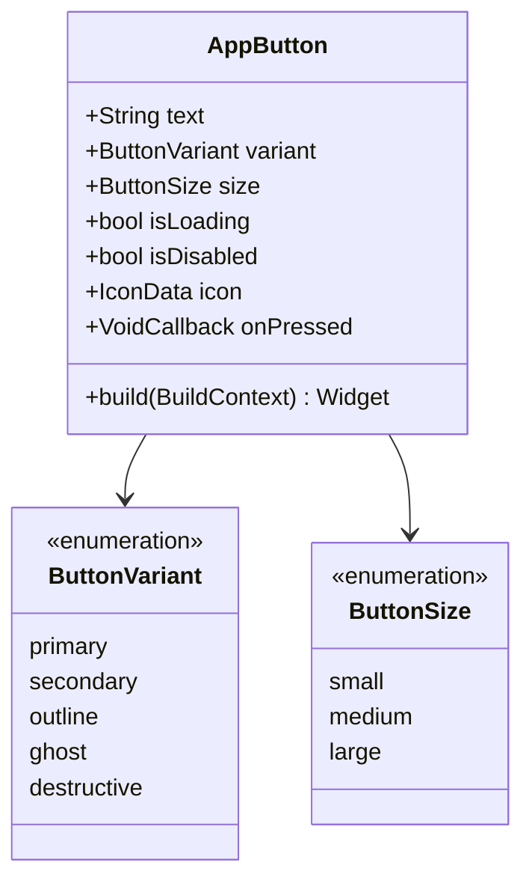

# Workflow: Component Development - Flutter UI Kit

## Overview
This workflow guides the systematic development of UI components for the Flutter UI Kit, following the prioritized component catalog from P0 (Critical) to P3 (Future).

## Output Location
**Base Folder:** `flutter-ui-kit/03-component-development/`

**Output Files:**
- `mvp-components.md` - MVP Component Implementation Plan (Week 1-4)
- `core-components.md` - Core Components Implementation (Week 5-8)
- `enhanced-components.md` - Enhanced Components Plan (Month 3)
- `component-checklist.md` - Component Development Checklist & Quality Gates

## Prerequisites
- Technical Implementation completed (`02_technical_implementation.md`)
- Design tokens and theme system ready
- Component API specifications defined
- Development environment setup with testing

## Component Priority Legend

| Priority | Description | Timeline | Components |
|----------|-------------|----------|------------|
| **P0** | Critical - MVP Required | Week 1-4 | 9 components |
| **P1** | High - Core Features | Week 5-8 | 11 components |
| **P2** | Medium - Enhanced UX | Month 3 | 15+ components |
| **P3** | Low - Future | Month 4+ | 8+ components |

---

## Deliverables

### 1. MVP Components (P0 - Week 1-4)

**Description:** Implement the critical 9 components required for MVP launch.

**Recommended Skills:** `senior-flutter-developer`, `component-specialist`

**Instructions:**
1. Implement button components:
   - AppButton with 5 variants (primary, secondary, outline, ghost, destructive)
   - 3 sizes (small, medium, large)
   - States: default, loading, disabled
   - Icon support
2. Implement input components:
   - AppTextField with full features
   - AppCheckbox, AppRadio, AppSwitch
   - AppDropdown
3. Implement card components:
   - AppCard (basic)
   - AppImageCard
4. Implement feedback components:
   - AppSnackBar
   - AppDialog
   - AppLoadingIndicator
5. Implement data display:
   - AppAvatar
   - AppChip
6. Write comprehensive tests for each component
7. Create demo screens for example app

**Output Format:**
```markdown
# MVP Components Implementation

## Component 1: AppButton

### Implementation Status
- [x] Base structure created
- [x] All 5 variants implemented
- [x] 3 sizes working
- [x] Loading state with indicator
- [x] Disabled state
- [x] Icon support
- [x] Accessibility (semantics)
- [x] Widget tests (>90% coverage)
- [x] Golden tests
- [x] Demo screen

### API
```dart
AppButton(
  text: 'Submit',
  variant: ButtonVariant.primary,  // 5 variants
  size: ButtonSize.medium,         // 3 sizes
  isLoading: false,
  isDisabled: false,
  icon: Icons.arrow_forward,
  onPressed: () {},
)
```

### Test Coverage: 95%
### Demo Screen: `example/lib/screens/button_demo.dart`

### Architecture


---

## Component 2: AppTextField

### Implementation Status
- [x] Base text input
- [x] Label and hint
- [x] Error state with message
- [x] Prefix/suffix icons
- [x] Obscure text mode
- [x] Keyboard types
- [x] Max lines (multi-line)
- [x] Enabled/disabled
- [x] Widget tests
- [x] Demo screen

### API
```dart
AppTextField(
  controller: _controller,
  label: 'Email',
  hint: 'Enter your email',
  errorText: 'Invalid format',
  prefixIcon: Icons.email,
  suffixIcon: Icons.check_circle,
  obscureText: false,
  keyboardType: TextInputType.emailAddress,
  maxLines: 1,
  enabled: true,
  onChanged: (value) {},
)
```

### Test Coverage: 92%
### Demo Screen: `example/lib/screens/text_field_demo.dart`

---

## MVP Component Summary

| Component | Variants | Test Coverage | Status |
|-----------|----------|---------------|--------|
| AppButton | 5 variants, 3 sizes | 95% | ✅ Complete |
| AppTextField | Full featured | 92% | ✅ Complete |
| AppCheckbox | With label | 90% | ✅ Complete |
| AppRadio | With label | 90% | ✅ Complete |
| AppSwitch | Toggle | 90% | ✅ Complete |
| AppDropdown | Select | 88% | ✅ Complete |
| AppCard | Basic | 90% | ✅ Complete |
| AppImageCard | With image | 90% | ✅ Complete |
| AppSnackBar | 4 types | 88% | ✅ Complete |
| AppDialog | Alert/Confirm | 90% | ✅ Complete |
| AppLoadingIndicator | Circular/Linear | 92% | ✅ Complete |
| AppAvatar | With fallback | 90% | ✅ Complete |
| AppChip | With delete | 88% | ✅ Complete |

**MVP Total: 13 components**
**Average Test Coverage: 91%**
```

---

### 2. Core Components (P1 - Week 5-8)

**Description:** Implement enhanced components for core product offering.

**Recommended Skills:** `senior-flutter-developer`, `navigation-specialist`

**Instructions:**
1. Implement navigation components:
   - AppBottomNavigationBar
   - AppTabBar
   - AppDrawer
   - AppBar (custom)
   - AppBreadcrumb
   - AppStepper
2. Implement enhanced inputs:
   - AppSearchField
   - AppPasswordField
   - AppRadioGroup
   - AppCheckboxGroup
3. Implement feedback enhancements:
   - AppBottomSheet
   - AppSkeleton
   - AppBanner
   - AppBadge
4. Implement data display:
   - AppListTile
   - AppEmptyState
5. Implement layout:
   - AppContainer
   - AppSpacer
   - AppDivider
   - AppGrid
6. Write tests and create demos

**Output Format:**
```markdown
# Core Components Implementation (P1)

## Navigation Components

### AppBottomNavigationBar

**Status:** In Progress
**Complexity:** Medium
**Estimated Time:** 6-8 hours

**Features:**
- 3-5 navigation items
- Icon + label support
- Badge for notifications
- Custom colors
- Animation on selection

**API:**
```dart
AppBottomNavigationBar(
  items: [
    BottomNavItem(icon: Icons.home, label: 'Home'),
    BottomNavItem(icon: Icons.search, label: 'Search'),
    BottomNavItem(icon: Icons.person, label: 'Profile'),
  ],
  currentIndex: 0,
  onTap: (index) {},
  backgroundColor: Colors.white,
  selectedItemColor: AppColors.blue500,
  unselectedItemColor: AppColors.gray400,
)
```

**Tests Required:**
- [ ] Renders all items
- [ ] Updates on tap
- [ ] Badge displays correctly
- [ ] Custom colors applied
- [ ] Accessibility semantics

---

### AppTabBar

**Status:** Planned
**Complexity:** Low
**Estimated Time:** 4-6 hours

**Features:**
- Tab with icons and/or labels
- Badge support
- Scrollable tabs
- Custom indicator

---

### AppDrawer

**Status:** Planned
**Complexity:** Medium
**Estimated Time:** 6-8 hours

**Features:**
- Drawer header
- Drawer items with icons
- Divider support
- Account section

---

## Enhanced Input Components

### AppSearchField

**Status:** Planned
**Complexity:** Low
**Estimated Time:** 3-4 hours

**Features:**
- Search icon
- Clear button
- Debounced search
- Loading state

---

### AppPasswordField

**Status:** Planned
**Complexity:** Low
**Estimated Time:** 3-4 hours

**Features:**
- Show/hide toggle
- Password strength indicator
- Validation rules

---

## Feedback Components

### AppBottomSheet

**Status:** Planned
**Complexity:** Medium
**Estimated Time:** 6-8 hours

**Features:**
- Modal bottom sheet
- Drag to dismiss
- Header handle
- Custom content

---

### AppSkeleton

**Status:** Planned
**Complexity:** Medium
**Estimated Time:** 4-6 hours

**Features:**
- Shimmer effect
- Multiple shapes (line, circle, box)
- Custom animations

---

## Core Component Summary

| Component | Complexity | Est. Time | Status |
|-----------|------------|-----------|--------|
| AppBottomNavigationBar | Medium | 6-8h | 🔄 In Progress |
| AppTabBar | Low | 4-6h | ⏳ Planned |
| AppDrawer | Medium | 6-8h | ⏳ Planned |
| AppBar | Medium | 6-8h | ⏳ Planned |
| AppBreadcrumb | Low | 3-4h | ⏳ Planned |
| AppStepper | Medium | 6-8h | ⏳ Planned |
| AppSearchField | Low | 3-4h | ⏳ Planned |
| AppPasswordField | Low | 3-4h | ⏳ Planned |
| AppRadioGroup | Low | 3-4h | ⏳ Planned |
| AppCheckboxGroup | Low | 3-4h | ⏳ Planned |
| AppBottomSheet | Medium | 6-8h | ⏳ Planned |
| AppSkeleton | Medium | 4-6h | ⏳ Planned |
| AppBanner | Low | 3-4h | ⏳ Planned |
| AppBadge | Low | 2-3h | ⏳ Planned |
| AppListTile | Low | 3-4h | ⏳ Planned |
| AppEmptyState | Low | 2-3h | ⏳ Planned |
| AppContainer | Low | 1-2h | ⏳ Planned |
| AppSpacer | Low | 1-2h | ⏳ Planned |
| AppDivider | Low | 1-2h | ⏳ Planned |
| AppGrid | Medium | 4-6h | ⏳ Planned |

**Core Total: 20 components**
**Estimated Time: 80-100 hours**
```

---

### 3. Enhanced Components (P2 - Month 3)

**Description:** Plan for advanced and specialized components.

**Recommended Skills:** `senior-flutter-developer`, `specialized-component-engineer`

**Instructions:**
1. Plan specialized input components:
   - AppPhoneNumberField (with country code)
   - AppOtpField (4-6 digit OTP)
   - AppTagInput (chips input)
2. Plan specialized cards:
   - AppProductCard (e-commerce)
   - AppProfileCard (user profiles)
   - AppExpandableCard
3. Plan advanced feedback:
   - AppToast
   - AppNotification
   - AppProgressBar
4. Plan data visualization:
   - AppDataTable
   - AppTimeline
   - AppStatisticCard
   - AppRatingBar
   - AppProgressRing
5. Plan specialized components:
   - AppDatePicker
   - AppTimePicker
   - AppRatingInput
   - AppSlider
   - AppSegmentedControl
6. Create technical specifications for each

**Output Format:**
```markdown
# Enhanced Components Plan (P2)

## Specialized Inputs

### AppPhoneNumberField

**Priority:** P2
**Complexity:** High
**Estimated Time:** 12-16 hours

**Technical Challenges:**
- Country code dropdown with flags
- Phone number formatting per country
- Validation with libphonenumber

**Dependencies:**
- country_code_picker package
- libphonenumber plugin

**API Draft:**
```dart
AppPhoneNumberField(
  controller: _phoneController,
  initialCountryCode: 'ID',
  formatOnUpdate: true,
  validator: (value) => _validatePhone(value),
)
```

---

### AppOtpField

**Priority:** P2
**Complexity:** Medium
**Estimated Time:** 6-8 hours

**Features:**
- 4-6 digit configuration
- Auto-focus next field
- Paste support
- Resend timer

**API Draft:**
```dart
AppOtpField(
  length: 6,
  onCompleted: (code) => _verify(code),
  onResend: () => _resend(),
)
```

---

## Data Visualization

### AppDataTable

**Priority:** P2
**Complexity:** High
**Estimated Time:** 16-20 hours

**Features:**
- Sortable columns
- Pagination
- Row selection
- Responsive design
- Export to CSV

**Technical Approach:**
- Use DataTable widget with custom styling
- Implement sorting algorithms
- Add pagination logic

---

### AppTimeline

**Priority:** P2
**Complexity:** High
**Estimated Time:** 10-12 hours

**Features:**
- Vertical/horizontal orientation
- Custom indicators
- Connected lines
- Content on both sides

---

## Date & Time Pickers

### AppDatePicker

**Priority:** P2
**Complexity:** Medium
**Estimated Time:** 6-8 hours

**Features:**
- Material Design date picker
- Custom theme
- Date range selection
- Min/max date constraints

---

## Component Prioritization Matrix

```
                    High Impact
                        │
        ┌───────────────┼───────────────┐
        │   AppSlider   │  AppDataTable │
        │  AppRatingBar │  AppTimeline  │
        │               │               │
Low Effort──────────────┼───────────────High Effort
        │               │               │
        │  AppToast     │ AppPhoneNumber│
        │  AppBadge     │ AppOtpField   │
        │ AppDivider    │ AppSegmented  │
        └───────────────┼───────────────┘
                        │
                    Low Impact
```

## Development Order (Month 3)

### Week 9-10: Specialized Inputs
- AppPhoneNumberField
- AppOtpField
- AppTagInput

### Week 11-12: Data Display
- AppDataTable
- AppTimeline
- AppStatisticCard

### Week 13-14: Pickers & Ratings
- AppDatePicker
- AppTimePicker
- AppRatingBar
- AppRatingInput

### Week 15-16: Additional Components
- AppSlider
- AppSegmentedControl
- AppToast
- AppProgressBar
```

---

### 4. Component Development Checklist

**Description:** Quality gate checklist for every component.

**Recommended Skills:** All developers

**Instructions:**
Use this checklist for every component to ensure consistency and quality.

**Output Format:**
```markdown
# Component Development Checklist

## Pre-Development
- [ ] API design finalized and reviewed
- [ ] Variants defined in spec
- [ ] Edge cases identified
- [ ] Accessibility requirements documented
- [ ] Test scenarios planned

## Development
- [ ] Component file created in correct directory
- [ ] All variants implemented
- [ ] All states handled:
  - [ ] Default
  - [ ] Hover (web/desktop)
  - [ ] Focused
  - [ ] Pressed
  - [ ] Disabled
  - [ ] Loading (if applicable)
  - [ ] Error (if applicable)
- [ ] Responsive tested (mobile, tablet, desktop)
- [ ] Light theme tested
- [ ] Dark theme tested
- [ ] Color palette variations tested

## Quality Assurance
- [ ] Widget tests written
  - [ ] Renders correctly
  - [ ] Interactions work
  - [ ] States change properly
  - [ ] Callbacks fire correctly
- [ ] Test coverage >85%
- [ ] Accessibility checked:
  - [ ] Semantics labels
  - [ ] Touch target >=48x48 dp
  - [ ] Color contrast >=4.5:1
  - [ ] Screen reader tested
- [ ] Performance profiled:
  - [ ] No unnecessary rebuilds
  - [ ] Const constructors used
  - [ ] Efficient animations
- [ ] dartdoc comments complete:
  - [ ] Class documentation
  - [ ] Parameter documentation
  - [ ] Usage examples
  - [ ] See also references

## Documentation
- [ ] Example in demo app
- [ ] README section updated
- [ ] Code snippets prepared
- [ ] Screenshots captured
- [ ] API documentation generated

## Code Review
- [ ] Self-review completed
- [ ] Peer review scheduled
- [ ] Review feedback addressed
- [ ] Linter passes (no warnings)
- [ ] Format applied (dart format)

## Release Ready
- [ ] Component exported in main library
- [ ] Added to CHANGELOG.md
- [ ] Version bumped (if breaking change)
- [ ] Migration guide (if breaking change)

---

## Component Status Template

```markdown
### AppButton

**Status:** 🟢 Complete | 🟡 In Progress | 🔴 Blocked | ⚪ Not Started

**Implementation:**
- Variants: 5/5 ✅
- Sizes: 3/3 ✅
- States: 6/6 ✅

**Quality:**
- Test Coverage: 95% ✅
- Accessibility: Pass ✅
- Performance: 60fps ✅

**Architecture:**
- State Machine: Documented ✅
- Class Diagram: Documented ✅

**Documentation:**
- API Docs: ✅
- Demo Screen: ✅
- README: ✅

**Overall:** ✅ Ready for Release
```

---

## Component Complexity Matrix

| Complexity | Count | Time Each | Total Time |
|------------|-------|-----------|------------|
| **Low** | 25 | 2-4 hours | 50-100 hours |
| **Medium** | 18 | 4-8 hours | 72-144 hours |
| **High** | 7 | 8-16 hours | 56-112 hours |
| **Total** | 50 | - | **178-356 hours** |

---

## Workflow Steps

### Phase 1: MVP Components (Week 1-4)

1. **AppButton** (Senior Flutter Developer)
   - Implement all 5 variants
   - Add loading/disabled states
   - Write tests (>90% coverage)
   - Create demo screen
   - Duration: 2 days

2. **Input Components** (Senior Flutter Developer)
   - AppTextField (2 days)
   - AppCheckbox, AppRadio, AppSwitch (1 day)
   - AppDropdown (1 day)
   - Tests and demos (1 day)
   - Duration: 5 days

3. **Card & Feedback** (Senior Flutter Developer)
   - AppCard, AppImageCard (1 day)
   - AppSnackBar, AppDialog (1 day)
   - AppLoadingIndicator (1 day)
   - Tests and demos (1 day)
   - Duration: 4 days

4. **Data Display** (Senior Flutter Developer)
   - AppAvatar, AppChip (1 day)
   - Tests and demos (1 day)
   - Buffer (1 day)
   - Duration: 3 days

**MVP Total: 13 components in 15 days**

### Phase 2: Core Components (Week 5-8)

1. **Navigation** (Senior Flutter Developer)
   - AppBottomNavigationBar (2 days)
   - AppTabBar (1 day)
   - AppDrawer (2 days)
   - AppBar (1 day)
   - AppBreadcrumb, AppStepper (1 day)
   - Tests and demos (2 days)
   - Duration: 9 days

2. **Enhanced Inputs** (Senior Flutter Developer)
   - AppSearchField, AppPasswordField (1 day)
   - AppRadioGroup, AppCheckboxGroup (1 day)
   - Tests and demos (1 day)
   - Duration: 3 days

3. **Feedback & Display** (Senior Flutter Developer)
   - AppBottomSheet (2 days)
   - AppSkeleton (1 day)
   - AppBanner, AppBadge (1 day)
   - AppListTile, AppEmptyState (1 day)
   - Tests and demos (2 days)
   - Duration: 7 days

4. **Layout** (Senior Flutter Developer)
   - AppContainer, AppSpacer, AppDivider (1 day)
   - AppGrid (1 day)
   - Tests and demos (1 day)
   - Buffer (1 day)
   - Duration: 4 days

**Core Total: 20 components in 23 days**

### Phase 3: Enhanced Components (Month 3)

Follow similar pattern for P2 components based on prioritization matrix.

---

## Success Criteria
- MVP: 13 components complete with >85% test coverage
- Core: 20 additional components complete
- All components pass accessibility checks
- Demo app showcases all components
- Documentation complete for all components
- Code reviewed and approved

## Cross-References

- **Previous Phase** → `03_technical_implementation.md`
- **Go-to-Market** → `05_gtm_launch.md`
- **Roadmap** → `06_roadmap_execution.md`
- **Source Catalog** → `../../docs/flutter-ui-kit/03_COMPONENT_CATALOG.md`

## Tools & Templates
- Flutter DevTools for profiling
- Accessibility Insights for testing
- Golden Toolkit for visual tests
- Mocktail for mocking
- Component checklist template
- Status tracking board

---

## Workflow Validation Checklist

### Pre-Execution
- [ ] Technical implementation complete
- [ ] Design tokens ready
- [ ] Theme system functional
- [ ] Component priorities confirmed

### During Execution
- [ ] MVP components implemented (13)
- [ ] Core components implemented (20)
- [ ] All components tested (>85% coverage)
- [ ] Demo app updated
- [ ] Documentation complete

### Post-Execution
- [ ] All deliverables reviewed
- [ ] Code quality approved
- [ ] Ready for launch preparation
