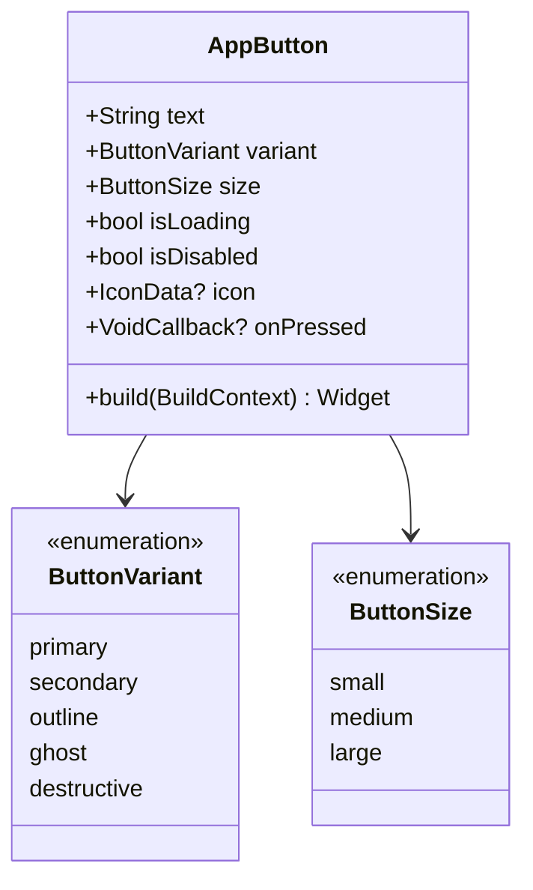

# Workflow: Component Development - Flutter UI Kit

## Overview
Workflow ini memandu implementasi sistematik komponen UI Kit — dari P0 (MVP Critical) hingga P2 (Enhanced). Setiap komponen melewati quality gate yang ketat sebelum dianggap selesai.

**CRITICAL:** Output dari fase ini SELALU berupa **widget classes di dalam Flutter package**, bukan screen/page app. Setiap komponen harus theme-aware, tested, documented, dan accessible.

## Output Location
**Base Folder:** `flutter-ui-kit/04-component-development/`

**Output Files:**
- `mvp-components.md` - P0 MVP Component Implementation (Week 1-4)
- `core-components.md` - P1 Core Component Implementation (Week 5-8)
- `domain-components.md` - Domain-Specific Components (jika applicable)
- `enhanced-components.md` - P2 Enhanced Components Plan (Month 3)
- `component-checklist.md` - Per-Component Quality Gate Checklist

## Prerequisites
- Technical Implementation selesai (`03_technical_implementation.md`):
  - Package structure ready
  - Design tokens implemented (from DESIGN.md)
  - Theme system functional (16 pre-built themes)
  - Component API specs defined
- 5 dimensi UI Kit dari Phase 1 (terutama target domain)
- Flutter SDK >=3.10.0, test infrastructure ready

---

## Agent Behavior: Context Chain

**GOLDEN RULE:** Agen WAJIB menggunakan API specs dari Phase 3 sebagai blueprint. Setiap komponen HARUS mengikuti API pattern yang sudah didefinisikan — naming, parameter order, state handling.

### Prinsip Utama: KOMPONEN = WIDGET DI DALAM PACKAGE

Setiap component yang dibangun:
- Adalah `StatelessWidget` atau `StatefulWidget` di dalam `lib/src/components/`
- Menggunakan `Theme.of(context)` untuk theming (bukan hardcode warna)
- Menggunakan design tokens (`AppSpacing`, `AppRadius`, `AppShadows`) untuk layout
- Menggunakan `AppLocalizations.of(context)` untuk default labels (bukan hardcode string)
- Menggunakan `google_fonts` untuk typography (via `AppTextTheme`)
- Memiliki `App` prefix (AppButton, AppCard, AppTextField)
- Minimal curated dependencies (google_fonts, intl, flutter_localizations)
- Ter-export via single entry point `flutter_ui_kit.dart`

### Input dari Phase Sebelumnya

```
Phase 1 (PRD) → Target domain, component priorities (P0/P1/P2)
Phase 2 (UI/UX) → DESIGN.md (visual reference), component-anatomy.md (states)
Phase 3 (Technical) → API specs, design tokens code, theme system
                           ↓
Phase 4 (THIS) → Actual widget implementation + tests
```

### Development Flow per Component

```
1. Read API spec → 2. Implement widget → 3. Handle ALL states
       ↓                    ↓                      ↓
4. Apply tokens → 5. Write tests → 6. Create demo screen (clean arch)
       ↓                    ↓                      ↓
7. dartdoc → 8. Accessibility check → 9. Quality gate ✅
```

### Demo Screen Rules (Clean Architecture)

Demo screens di `example/` HARUS mengikuti clean architecture:
- **Presentation:** Screen file di `example/lib/presentation/screens/`
- **State:** `ChangeNotifier` atau `ValueNotifier` di `example/lib/presentation/providers/`
- **Data:** Dummy data dari `example/lib/data/dummy/` (NO database)
- **Domain:** Model classes di `example/lib/domain/models/`
- **TIDAK BOLEH** pakai Riverpod, BLoC, GetX, Hive, Sqflite di demo app
- **HANYA** pakai built-in Flutter state management

### Domain-Specific Component Rules

Jika Phase 1 mendeteksi target domain, Phase 4 harus:
- **Core components (P0)** → SELALU dibangun dulu, apapun domain
- **Domain components** → Dibangun sebagai P1, di folder `components/domain/[domain]/`
- Domain components BOLEH mengkomposisi core components (misal: ProductCard menggunakan AppCard + AppButton)
- Domain components TIDAK BOLEH memperkenalkan dependency baru

| Target Domain | Domain Components (P1) | Composed From |
|---------------|----------------------|---------------|
| E-Commerce | ProductCard, CartItem, PriceTag, CategoryFilter, CheckoutSummary | AppCard + AppChip + AppButton |
| Fintech | BalanceCard, TransactionItem, PinInput, TransferForm | AppCard + AppTextField + AppButton |
| Social Media | PostCard, StoryAvatar, CommentItem, FollowButton | AppCard + AppAvatar + AppButton |
| Dashboard | StatCard, DataTable, ChartPlaceholder, FilterBar | AppCard + AppChip + AppDropdown |
| General | (No domain components — core only) | — |

---

## Component Priority Overview

| Priority | Description | Timeline | Count | Coverage Target |
|----------|-------------|----------|-------|----------------|
| **P0** | Critical — MVP | Week 1-4 | 13 components | >90% |
| **P1** | Core + Domain | Week 5-8 | 15-20 components | >85% |
| **P2** | Enhanced UX | Month 3 | 15+ components | >85% |
| **P3** | Future | Month 4+ | 8+ components | >80% |

---

## Deliverables

### 1. MVP Components (P0 — Week 1-4)

**Description:** 13 komponen critical yang WAJIB ada untuk MVP launch. Tanpa ini, UI Kit tidak layak dijual.

**Recommended Skills:** `senior-flutter-developer`

**P0 Component List (13 WAJIB):**

| # | Component | Category | Variants | Sizes | States | Est. Hours |
|---|-----------|----------|----------|-------|--------|------------|
| 1 | **AppButton** | Core/Input | primary, secondary, outline, ghost, destructive | sm, md, lg | default, hover, pressed, disabled, loading | 8-10h |
| 2 | **AppTextField** | Core/Input | default, search, password | — | empty, focused, filled, error, disabled | 8-10h |
| 3 | **AppCheckbox** | Core/Input | default | — | unchecked, checked, indeterminate, disabled | 3-4h |
| 4 | **AppRadio** | Core/Input | default | — | unselected, selected, disabled | 3-4h |
| 5 | **AppSwitch** | Core/Input | default | — | off, on, disabled | 3-4h |
| 6 | **AppDropdown** | Core/Input | default | — | closed, open, selected, error, disabled | 6-8h |
| 7 | **AppCard** | Core/Surface | default, outlined | — | default, hover, pressed | 4-6h |
| 8 | **AppImageCard** | Core/Surface | default | — | default, loading (skeleton) | 4-6h |
| 9 | **AppSnackBar** | Feedback | info, success, warning, error | — | hidden, entering, visible, exiting | 4-6h |
| 10 | **AppDialog** | Feedback | alert, confirm, custom | — | closed, open | 6-8h |
| 11 | **AppLoadingIndicator** | Feedback | circular, linear | sm, md, lg | active | 2-3h |
| 12 | **AppAvatar** | Data Display | image, initials, icon | xs, sm, md, lg, xl | default, loading (fallback) | 4-6h |
| 13 | **AppChip** | Data Display | default, selected, removable | sm, md | default, selected, disabled | 3-4h |

**Instructions per Component:**
1. Buat file di `lib/src/components/[category]/[component_name]/`
2. Implement widget class sesuai API spec dari Phase 3
3. Handle SEMUA states dari tabel di atas
4. Gunakan design tokens (AppSpacing, AppRadius, AppShadows, AppColors via Theme)
5. Tambahkan Semantics wrapper untuk accessibility
6. Tulis widget tests (target >90% coverage):
   - Rendering test (basic display)
   - Interaction test (tap, input)
   - State test (loading, disabled, error)
   - Accessibility test (Semantics)
   - Theme test (light/dark)
7. Buat demo screen di `example/lib/screens/`
8. Tambahkan dartdoc comments
9. Export di `flutter_ui_kit.dart`

**Output Format per Component:**
```markdown
## AppButton

### Implementation Status
- [x] Base structure created
- [x] All 5 variants implemented
- [x] 3 sizes working
- [x] Loading state with CircularProgressIndicator
- [x] Disabled state (opacity 0.5, no interaction)
- [x] Icon support (leading icon)
- [x] Accessibility (Semantics, min 48x48 touch target)
- [x] Widget tests (>90% coverage)
- [x] Golden test
- [x] Demo screen
- [x] dartdoc complete

### API (from Phase 3 spec)
```dart
AppButton(
  text: 'Submit',
  variant: ButtonVariant.primary,
  size: ButtonSize.medium,
  isLoading: false,
  isDisabled: false,
  icon: Icons.arrow_forward,
  onPressed: () {},
)
```

### File Location
- Widget: `lib/src/components/core/button/app_button.dart`
- Test: `test/components/core/button/app_button_test.dart`
- Demo: `example/lib/presentation/screens/button_demo.dart`

### Test Coverage: 95%
### Architecture

```mermaid
classDiagram
    class AppButton {
        +String text
        +ButtonVariant variant
        +ButtonSize size
        +bool isLoading
        +bool isDisabled
        +IconData? icon
        +VoidCallback? onPressed
        +build(BuildContext) Widget
    }
    class ButtonVariant {
        <<enumeration>>
        primary
        secondary
        outline
        ghost
        destructive
    }
    class ButtonSize {
        <<enumeration>>
        small
        medium
        large
    }
    AppButton --> ButtonVariant
    AppButton --> ButtonSize
```
```

**MVP Summary Table:**
```markdown
| Component | Variants | States | Tests | Coverage | Status |
|-----------|----------|--------|-------|----------|--------|
| AppButton | 5v, 3s | 5 | ✅ | 95% | ✅ Complete |
| AppTextField | 3v | 5 | ✅ | 92% | ✅ Complete |
| AppCheckbox | 1v | 4 | ✅ | 90% | ✅ Complete |
| AppRadio | 1v | 3 | ✅ | 90% | ✅ Complete |
| AppSwitch | 1v | 3 | ✅ | 90% | ✅ Complete |
| AppDropdown | 1v | 5 | ✅ | 88% | ✅ Complete |
| AppCard | 2v | 3 | ✅ | 90% | ✅ Complete |
| AppImageCard | 1v | 2 | ✅ | 90% | ✅ Complete |
| AppSnackBar | 4v | 4 | ✅ | 88% | ✅ Complete |
| AppDialog | 3v | 2 | ✅ | 90% | ✅ Complete |
| AppLoadingIndicator | 2v, 3s | 1 | ✅ | 92% | ✅ Complete |
| AppAvatar | 3v, 5s | 2 | ✅ | 90% | ✅ Complete |
| AppChip | 3v, 2s | 3 | ✅ | 88% | ✅ Complete |

**MVP Total: 13 components | Avg Coverage: 91%**
```

---

### 2. Core Components (P1 — Week 5-8)

**Description:** 15-20 komponen tambahan untuk produk yang kompetitif. Termasuk navigation, enhanced inputs, feedback, layout, dan domain-specific (jika ada).

**Recommended Skills:** `senior-flutter-developer`

**P1 Component List:**

#### Navigation (6 components)
| Component | Complexity | Est. Hours | Key Features |
|-----------|-----------|------------|--------------|
| AppBottomNav | Medium | 6-8h | 3-5 items, badge, animation |
| AppTabBar | Low | 4-6h | Icons/labels, scrollable, custom indicator |
| AppDrawer | Medium | 6-8h | Header, items, dividers, account section |
| AppAppBar | Medium | 6-8h | Title, actions, back button, custom leading |
| AppBreadcrumb | Low | 3-4h | Separator, clickable items |
| AppStepper | Medium | 6-8h | Horizontal/vertical, states (done/active/pending) |

#### Enhanced Inputs (4 components)
| Component | Complexity | Est. Hours | Key Features |
|-----------|-----------|------------|--------------|
| AppSearchField | Low | 3-4h | Search icon, clear, debounce, loading |
| AppPasswordField | Low | 3-4h | Show/hide toggle, strength indicator |
| AppRadioGroup | Low | 3-4h | Grouped radio buttons, label |
| AppCheckboxGroup | Low | 3-4h | Grouped checkboxes, select all |

#### Feedback (4 components)
| Component | Complexity | Est. Hours | Key Features |
|-----------|-----------|------------|--------------|
| AppBottomSheet | Medium | 6-8h | Modal, drag dismiss, handle |
| AppSkeleton | Medium | 4-6h | Shimmer effect, shapes (line/circle/box) |
| AppBanner | Low | 3-4h | Dismissible, icon, action button |
| AppBadge | Low | 2-3h | Dot/content, position, color |

#### Layout (4 components)
| Component | Complexity | Est. Hours | Key Features |
|-----------|-----------|------------|--------------|
| AppListTile | Low | 3-4h | Leading, title, subtitle, trailing |
| AppEmptyState | Low | 2-3h | Icon/image, title, description, action |
| AppDivider | Low | 1-2h | Horizontal/vertical, label, spacing |
| AppSpacer | Low | 1-2h | Directional spacing using AppSpacing tokens |

#### Domain-Specific Components (jika applicable)
| Target Domain | Components | Complexity | Est. Hours |
|---------------|-----------|-----------|------------|
| E-Commerce | ProductCard, CartItem, PriceTag, CategoryFilter, CheckoutSummary | Medium-High | 20-30h |
| Fintech | BalanceCard, TransactionItem, PinInput, TransferForm | Medium-High | 20-25h |
| Social Media | PostCard, StoryAvatar, CommentItem, FollowButton | Medium | 15-20h |
| Dashboard | StatCard, DataTable, FilterBar | Medium-High | 15-20h |
| General | (skip domain components) | — | — |

**Instructions per P1 Component:**
Same development flow as P0, but coverage target is >85% instead of >90%.

**P1 Summary Table Template:**
```markdown
| Component | Category | Complexity | Est. Hours | Coverage | Status |
|-----------|----------|-----------|------------|----------|--------|
| AppBottomNav | Navigation | Medium | 6-8h | — | ⏳ Planned |
| AppTabBar | Navigation | Low | 4-6h | — | ⏳ Planned |
| [... all P1 components ...] | | | | | |

**Core Total: 18-25 components (depending on domain)**
**Estimated: 80-120 hours**
```

---

### 3. Enhanced Components (P2 — Month 3)

**Description:** Specialized components yang meningkatkan value proposition UI Kit.

**Recommended Skills:** `senior-flutter-developer`

**P2 Component List:**

#### Specialized Inputs
| Component | Complexity | Est. Hours | Notes |
|-----------|-----------|------------|-------|
| AppPhoneNumberField | High | 12-16h | Country code, formatting — MAY need package |
| AppOtpField | Medium | 6-8h | Auto-focus, paste, resend timer |
| AppTagInput | Medium | 6-8h | Chips input, autocomplete |
| AppSlider | Medium | 4-6h | Range, labels, custom track |
| AppSegmentedControl | Medium | 4-6h | Multi-option toggle |
| AppRatingInput | Low | 3-4h | Stars, half-star, custom icon |

#### Data Visualization
| Component | Complexity | Est. Hours | Notes |
|-----------|-----------|------------|-------|
| AppDataTable | High | 16-20h | Sort, paginate, select, responsive |
| AppTimeline | High | 10-12h | Vertical/horizontal, custom indicators |
| AppStatisticCard | Medium | 4-6h | Value, trend, icon, chart mini |
| AppRatingBar | Low | 2-3h | Display-only stars |
| AppProgressRing | Medium | 4-6h | Circular progress, percentage label |
| AppProgressBar | Low | 2-3h | Linear, labeled, colored segments |

#### Date & Time
| Component | Complexity | Est. Hours | Notes |
|-----------|-----------|------------|-------|
| AppDatePicker | Medium | 6-8h | Material picker, range, constraints |
| AppTimePicker | Medium | 6-8h | Material picker, 12/24h format |

#### Cards (Specialized)
| Component | Complexity | Est. Hours | Notes |
|-----------|-----------|------------|-------|
| AppExpandableCard | Medium | 4-6h | Collapsible content, animation |
| AppProfileCard | Medium | 4-6h | Avatar, name, role, actions |

**P2 Prioritization Matrix:**
```text
                    High Impact
                        │
        ┌───────────────┼───────────────┐
        │   AppSlider   │  AppDataTable │
        │  AppRatingBar │  AppTimeline  │
        │ AppSegmented  │  AppOtpField  │
Low Effort──────────────┼───────────────High Effort
        │ AppProgressBar│ AppPhoneNumber│
        │ AppRatingInput│  AppTagInput  │
        │               │              │
        └───────────────┼───────────────┘
                        │
                    Low Impact
```

**P2 Development Order (Month 3):**
1. Week 9-10: Specialized Inputs (AppOtpField, AppSlider, AppSegmentedControl, AppRatingInput)
2. Week 11-12: Data Visualization (AppDataTable, AppTimeline, AppStatisticCard)
3. Week 13-14: Date/Time + Cards (AppDatePicker, AppTimePicker, AppExpandableCard)
4. Week 15-16: Remaining (AppPhoneNumberField, AppTagInput, AppProgressRing)

---

### 4. Component Development Checklist (Per-Component Quality Gate)

**Description:** Checklist yang WAJIB di-pass setiap komponen sebelum dianggap "complete".

**Instructions:** Gunakan checklist ini untuk SETIAP komponen, tanpa exception.

**Quality Gate Checklist:**
```markdown
# Component Quality Gate: [ComponentName]

## Pre-Development
- [ ] API spec reviewed (from Phase 3 component-api-spec.md)
- [ ] Variants, sizes, states listed
- [ ] Edge cases identified
- [ ] Accessibility requirements documented
- [ ] Test cases planned

## Implementation
- [ ] Widget file created at `lib/src/components/[category]/[name]/`
- [ ] All variants implemented
- [ ] All sizes implemented (if applicable)
- [ ] All states handled:
  - [ ] Default
  - [ ] Hover (web/desktop)
  - [ ] Focused (keyboard navigation)
  - [ ] Pressed (tap down)
  - [ ] Disabled (opacity 0.5, no interaction)
  - [ ] Loading (if applicable — CircularProgressIndicator)
  - [ ] Error (if applicable — red border, error text)
- [ ] Design tokens used:
  - [ ] Colors via Theme.of(context).colorScheme
  - [ ] Spacing via AppSpacing constants
  - [ ] Radius via AppRadius constants
  - [ ] Shadows via AppShadows constants
- [ ] Light theme tested
- [ ] Dark theme tested
- [ ] All 8 color palettes tested (spot check minimum 3)
- [ ] Responsive: mobile + tablet + desktop (if applicable)

## Testing (Coverage Gate)
- [ ] Widget tests written:
  - [ ] Renders correctly (basic display)
  - [ ] Interactions work (tap, input, toggle)
  - [ ] State changes properly (loading, disabled, error)
  - [ ] Callbacks fire correctly
  - [ ] Variants render differently
- [ ] Coverage: P0 ≥90%, P1 ≥85%
- [ ] Golden test (visual regression)

## Accessibility
- [ ] Semantics widget wrapping interactive elements
- [ ] Touch target ≥48x48 dp
- [ ] Color contrast ≥4.5:1 (WCAG AA)
- [ ] Screen reader labels descriptive
- [ ] textScaleFactor respected

## Performance
- [ ] No unnecessary rebuilds (const constructors)
- [ ] Efficient animations (< 16ms per frame)
- [ ] Keys properly propagated

## Documentation
- [ ] dartdoc: class-level documentation
- [ ] dartdoc: all parameters documented
- [ ] dartdoc: usage example in comments
- [ ] dartdoc: @see references to related components
- [ ] Demo screen in example app
- [ ] README section updated
- [ ] Screenshots captured

## Code Quality
- [ ] dart format applied
- [ ] dart fix applied
- [ ] analyze_files: zero warnings
- [ ] Peer review feedback addressed
- [ ] Exported in flutter_ui_kit.dart

## Release Ready
- [ ] Added to CHANGELOG.md
- [ ] Version bump (if breaking)
- [ ] Migration guide (if breaking)
```

**Component Status Indicators:**

| Indicator | Meaning |
|-----------|---------|
| 🟢 | Complete — all gates passed |
| 🟡 | In Progress — implementation ongoing |
| 🔴 | Blocked — dependency or issue |
| ⚪ | Not Started |
| ✅ | Gate passed |
| ❌ | Gate failed — needs fix |

---

## Workflow Steps

### Phase A: MVP Components (Week 1-4)

1. **Buttons & Inputs** — Week 1-2
   - AppButton: 2 hari (5 variants, 3 sizes, all states)
   - AppTextField: 2 hari (label, hint, error, icons)
   - AppCheckbox + AppRadio + AppSwitch: 1 hari
   - AppDropdown: 1 hari
   - Tests + demos: 2 hari
   - **Subtotal: 8 hari**

2. **Cards & Feedback** — Week 3
   - AppCard + AppImageCard: 1.5 hari
   - AppSnackBar: 1 hari
   - AppDialog: 1.5 hari
   - AppLoadingIndicator: 0.5 hari
   - Tests + demos: 1.5 hari
   - **Subtotal: 6 hari**

3. **Data Display + Polish** — Week 4
   - AppAvatar: 1 hari
   - AppChip: 1 hari
   - MVP integration test: 1 hari
   - Buffer + bug fixes: 2 hari
   - **Subtotal: 5 hari**

**MVP Total: 13 components in ~19 working days**

### Phase B: Core + Domain Components (Week 5-8)

1. **Navigation** — Week 5-6
   - AppBottomNav, AppTabBar, AppDrawer, AppAppBar, AppBreadcrumb, AppStepper
   - Tests + demos
   - **Subtotal: 9-12 hari**

2. **Enhanced Inputs + Feedback** — Week 7
   - AppSearchField, AppPasswordField, AppRadioGroup, AppCheckboxGroup
   - AppBottomSheet, AppSkeleton, AppBanner, AppBadge
   - Tests + demos
   - **Subtotal: 8-10 hari**

3. **Layout + Domain** — Week 8
   - AppListTile, AppEmptyState, AppDivider, AppSpacer
   - Domain components (jika applicable): 3-5 hari tambahan
   - Tests + demos
   - **Subtotal: 5-10 hari**

**Core Total: 18-25 components in ~20-32 working days**

### Phase C: Enhanced Components (Month 3)
Follow P2 development order. Budget: 15-20 working days.

**Grand Total: 46-58+ components over 3 months**

---

## Success Criteria

### Quality Gates
- [ ] Output = widget classes di PACKAGE (bukan app screens)
- [ ] ALL P0 components (13) complete dengan >90% test coverage
- [ ] ALL P1 components (15-20) complete dengan >85% coverage
- [ ] ZERO third-party dependencies di production code
- [ ] ALL components use design tokens (AppSpacing, AppRadius, AppShadows)
- [ ] ALL components theme-aware (Theme.of(context).colorScheme)
- [ ] ALL components work in light AND dark mode
- [ ] ALL components work with ALL 8 color palettes (spot-checked)
- [ ] ALL interactive components accessible (Semantics, 48x48 touch, WCAG AA)
- [ ] ALL components have dartdoc documentation
- [ ] ALL components have demo screens in example app
- [ ] Domain components (if any) are in separate `domain/` folder
- [ ] Per-component quality gate checklist passed for every component

### Content Depth Minimums
| Deliverable | Min. Lines | Key Sections |
|-------------|------------|-------------|
| mvp-components.md | 200 | 13 P0 components with status, API, tests, file locations |
| core-components.md | 150 | P1 components with status, estimates, priority |
| domain-components.md | 100 | Domain-specific components (if applicable, else skip) |
| enhanced-components.md | 100 | P2 plan, prioritization matrix, dev order |
| component-checklist.md | 80 | Full quality gate checklist template |

### Complexity Matrix
| Complexity | Count | Time Each | Total |
|------------|-------|-----------|-------|
| Low | ~20 | 2-4h | 40-80h |
| Medium | ~18 | 4-8h | 72-144h |
| High | ~8 | 8-20h | 64-160h |
| **Total** | **~46** | — | **176-384h** |

---

## Cross-References

- **Previous Phase** → `03_technical_implementation.md` (API specs, tokens, theme system)
- **Next Phase** → `05_gtm_launch.md` (launch preparation)
- **Roadmap** → `06_roadmap_execution.md` (sprint tracking)
- **Component Catalog** → `../../docs/flutter-ui-kit/03_COMPONENT_CATALOG.md`
- **API Specs** → `flutter-ui-kit/03-technical-implementation/component-api-spec.md`

## Tools & Templates
- Flutter DevTools for profiling
- Accessibility Scanner for a11y checks
- golden_toolkit for visual regression
- mocktail for mocking
- Component quality gate checklist (above)

---

## Workflow Validation Checklist

### Pre-Execution
- [ ] Phase 3 complete (tokens, themes, API specs ready)
- [ ] Target domain confirmed from Phase 1
- [ ] Test infrastructure ready (flutter_test, golden_toolkit, mocktail)
- [ ] Output folder `flutter-ui-kit/04-component-development/` created

### During Execution
- [ ] P0 components built following API specs from Phase 3
- [ ] Each component passes quality gate checklist
- [ ] Design tokens used consistently (no hardcoded values)
- [ ] Domain components in separate folder (if applicable)
- [ ] Tests written alongside implementation

### Post-Execution
- [ ] All deliverable files at correct output path
- [ ] 13 P0 components complete (>90% coverage each)
- [ ] P1 components planned/started
- [ ] Example app demonstrates ALL implemented components
- [ ] All components exported via single import
- [ ] Quality Gates checklist passed
