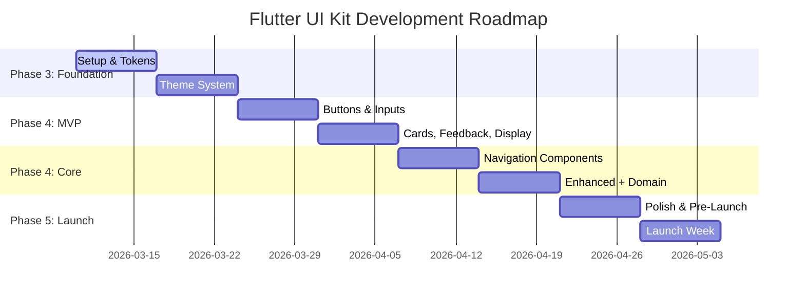

# Workflow: Roadmap Execution - Flutter UI Kit

## Overview
Workflow ini memandu eksekusi dan tracking roadmap pengembangan **Flutter UI Kit** — dari sprint planning, milestone gates, resource tracking, hingga risk management. Ini adalah "project management backbone" yang mengikat semua phase.

**CRITICAL:** Workflow ini BUKAN tentang membangun fitur baru — ini tentang **mengelola eksekusi** Phase 1-5. Semua sprint goals dan milestones harus align dengan deliverables di workflow sebelumnya.

## Output Location
**Base Folder:** `flutter-ui-kit/06-roadmap-execution/`

**Output Files:**
- `sprint-plan.md` - Weekly Sprint Plans (8 weeks + beyond)
- `milestone-tracking.md` - 5 Milestone Definitions and Progress
- `resource-management.md` - Time, Budget, Tool Tracking
- `risk-register.md` - Risk Matrix, Mitigation Plans
- `progress-reports.md` - Weekly Status Reports

## Prerequisites
- All previous workflows reviewed (Phase 1-5)
- Development timeline committed (8 weeks for MVP+launch)
- Budget allocated
- Team/individual capacity confirmed

---

## Agent Behavior: Context Chain

**GOLDEN RULE:** Sprint tasks dan milestones HARUS merujuk ke deliverables spesifik dari Phase 1-5. Agen tidak boleh mendefinisikan tasks yang tidak ada di workflow manapun.

### Master Roadmap → Workflow Mapping

```
Sprint 1-2 → Phase 3: Technical Implementation (tokens, themes)
Sprint 3-4 → Phase 4: Component Development (P0 MVP, 13 components)
Sprint 5-6 → Phase 4: Component Development (P1 Core, 15-20 components)
Sprint 7   → Phase 5: GTM Launch (pre-launch, content creation)
Sprint 8   → Phase 5: GTM Launch (launch week, post-launch start)
```

**Milestone ↔ Phase Mapping:**

| Milestone | Target | Phase | Key Deliverable |
|-----------|--------|-------|----------------|
| M1: Foundation | Week 2 | Phase 3 | Tokens + 16 themes working |
| M2: MVP Components | Week 4 | Phase 4 | 13 P0 components, >90% coverage |
| M3: Core Components | Week 6 | Phase 4 | 15-20 P1 components |
| M4: Polish & Docs | Week 7 | Phase 3+4 | >85% coverage, docs, example app |
| M5: Launch Ready | Week 8 | Phase 5 | Channels live, first sale |

---

## Deliverables

### 1. Sprint Plan (8-Week Breakdown)

**Description:** Weekly sprint plans dengan daily tasks, mapped ke deliverables workflow sebelumnya.

**Instructions:**
1. Break 8-week roadmap into weekly sprints
2. Setiap sprint punya clear goal linked ke milestone
3. Daily task breakdowns dengan hour estimates
4. Track planned vs actual hours

**Sprint Overview:**



**Sprint Detail Format:**

```markdown
## Sprint [N]: Week [N] — [Sprint Goal]

**Goal:** [1-line goal linked ke milestone]
**Phase:** [Phase 3/4/5 reference]
**Duration:** 5 working days

### Daily Breakdown

#### Day 1: [Topic]
- [ ] Task 1 — [detail]
- [ ] Task 2 — [detail]
**Hours:** [planned]

#### Day 2: [Topic]
...

#### Day 5: Sprint Review + Buffer
- [ ] Review deliverables
- [ ] Fix issues
- [ ] Retrospective

### Sprint Deliverables
- ✅ [Deliverable 1]
- ✅ [Deliverable 2]

### Sprint Metrics
- Planned Hours: [X]
- Actual Hours: TBD
- Tasks Completed: TBD / [total]
- Blockers: [count]
```

**Sprint Summary Table:**

| Sprint | Week | Goal | Phase | Est. Hours |
|--------|------|------|-------|------------|
| S1 | W1 | Project setup + design tokens | Phase 3 | 38h |
| S2 | W2 | Theme system (16 themes) | Phase 3 | 40h |
| S3 | W3 | AppButton, AppTextField, Checkbox, Radio, Switch, Dropdown | Phase 4 | 40h |
| S4 | W4 | AppCard, AppDialog, AppSnackBar, AppAvatar, AppChip + tests | Phase 4 | 38h |
| S5 | W5 | Navigation (BottomNav, TabBar, Drawer, AppBar, etc.) | Phase 4 | 42h |
| S6 | W6 | Enhanced inputs + feedback + domain components | Phase 4 | 40h |
| S7 | W7 | Polish, docs, testing, pre-launch setup | Phase 3+4+5 | 40h |
| S8 | W8 | Launch week execution | Phase 5 | 44h |

**Total: 322 hours over 8 weeks**

---

### 2. Milestone Tracking

**Description:** 5 milestone gates dengan criteria yang HARUS dipenuhi sebelum lanjut.

**Instructions:**
1. Definisikan 5 milestone dengan deliverable + acceptance criteria
2. Setiap milestone = go/no-go decision point
3. Track progress weekly

**Milestone Overview:**
```
┌─────────────────────────────────────────────────────┐
│  M1: Foundation              │  Week 2    │ Status  │
├─────────────────────────────────────────────────────┤
│  M2: MVP Components          │  Week 4    │ Status  │
├─────────────────────────────────────────────────────┤
│  M3: Core Components         │  Week 6    │ Status  │
├─────────────────────────────────────────────────────┤
│  M4: Polish & Docs           │  Week 7    │ Status  │
├─────────────────────────────────────────────────────┤
│  M5: Launch Ready            │  Week 8    │ Status  │
└─────────────────────────────────────────────────────┘
```

**Milestone Detail Format:**

```markdown
## Milestone [N]: [Name]

**Target:** Week [N]
**Status:** 🟢 On Track | 🟡 At Risk | 🔴 Behind | ⚪ Not Started
**Completion:** [X]%

### Acceptance Criteria (ALL must pass)
- [ ] Criteria 1
- [ ] Criteria 2
- [ ] ...

### Deliverables
| Deliverable | Status | Owner | Due |
|-------------|--------|-------|-----|
| [item] | ✅/🔄/⏳ | [who] | Week [N] |

### Go/No-Go Decision
- [ ] All acceptance criteria met
- [ ] Quality gate passed
- [ ] Team agrees to proceed
```

**Milestone Acceptance Criteria:**

| Milestone | Criteria |
|-----------|----------|
| **M1: Foundation** | All tokens implemented + tested, 16 themes working, package structure complete |
| **M2: MVP Core** | 13 P0 components complete, >90% test coverage, demo screens exist |
| **M3: Core Plus** | 15-20 P1 components complete, >85% coverage, domain components (if any) |
| **M4: Polish** | Overall >85% coverage, all public APIs documented, example app polished |
| **M5: Launch** | pub.dev published, Gumroad live, landing page live, first sale made |

---

### 3. Resource Management

**Description:** Track waktu, budget, dan tools.

**Instructions:**
1. Define capacity per role per week
2. Track actual vs planned hours
3. Monitor budget burn rate

**Capacity Plan:**

| Role | W1-2 | W3-4 | W5-6 | W7-8 | Total |
|------|------|------|------|------|-------|
| Flutter Dev | 40h/w | 40h/w | 40h/w | 40h/w | 320h |
| Content/Marketing | 0h | 0h | 5h/w | 30h/w | 70h |
| **Total** | 80h | 80h | 90h | 140h | **390h** |

**Budget:**

| Category | Amount | Notes |
|----------|--------|-------|
| Domain | $20/year | flutteruikit.com |
| Hosting | $20/month | Vercel Pro |
| Email marketing | $30/month | ConvertKit |
| Analytics | $9/month | Plausible |
| Design assets | $100 one-time | Icons, images |
| **6-month total** | ~$700 | Excluding platform fees |
| Gumroad fees | ~10% of revenue | Est. $1,365 on $13,650 |

**Time Tracking Template:**
```markdown
## Week [N] Time Log
| Date | Task | Hours | Notes |
|------|------|-------|-------|
| Mon | [task] | [h] | [notes] |
| ... | | | |
**Week Total:** [Xh] / Planned: [Yh]
**Cumulative:** [Zh]
```

---

### 4. Risk Register

**Description:** Identifikasi, scoring, dan mitigasi risiko project.

**Instructions:**
1. Identifikasi technical, project, dan market risks
2. Score: Probability × Impact
3. Define mitigation plans untuk High risks
4. Review weekly

**Risk Matrix:**
```
              Impact
          Low   Med   High
        ┌─────┬─────┬─────┐
  Low   │ 🟢  │ 🟢  │ 🟡  │
        ├─────┼─────┼─────┤
Prob Med│ 🟢  │ 🟡  │ 🔴  │
        ├─────┼─────┼─────┤
  High  │ 🟡  │ 🔴  │ 🔴  │
        └─────┴─────┴─────┘
```

**Risk Register:**

| ID | Category | Risk | Prob | Impact | Score | Mitigation | Status |
|----|----------|------|:----:|:------:|:-----:|------------|--------|
| T-001 | Technical | Flutter breaking changes | Med | Med | 🟡 | Pin SDK version, test on stable | Open |
| T-002 | Technical | Test coverage too low | Low | Med | 🟢 | CI gate at 85%, daily testing | Open |
| T-003 | Technical | Performance issues | Low | High | 🟡 | Profile early, const constructors | Open |
| P-001 | Project | Scope creep | High | High | 🔴 | Strict MVP, backlog extras | Monitoring |
| P-002 | Project | Burnout (solo dev) | Med | High | 🔴 | 40h/week max, breaks, celebrate wins | Monitoring |
| P-003 | Project | Timeline slip | Med | Med | 🟡 | Buffer days, cut P2 if needed | Open |
| M-001 | Market | Low launch traction | Med | High | 🔴 | Extend early bird, more content | Open |
| M-002 | Market | Competitor price drop | Low | Med | 🟢 | Emphasize quality + support | Open |
| M-003 | Market | Package piracy | High | Low | 🟡 | Focus on value-add (support) | Open |

**Mitigation Plans (High Priority):**

**P-001: Scope Creep**
- Trigger: New feature request mid-sprint
- Action: Add to backlog, evaluate at sprint boundary only
- Owner: Project lead

**P-002: Burnout Prevention**
- Trigger: Working >50h/week for 2+ weeks
- Action: Reduce scope, defer P2, take 1-day break
- Owner: Self-management

**M-001: Low Launch Traction**
- Trigger: <20 sales in first 2 weeks
- Action: Increase content output, extend 40% discount, join more communities
- Owner: Marketing

---

### 5. Progress Reports

**Description:** Weekly status reports — template untuk tracking progress.

**Instructions:**
1. Submit every Friday
2. Cover: completed, in progress, blockers, next week, metrics
3. Include team health check

**Weekly Report Template:**

```markdown
# Weekly Progress Report — Week [N]

## Executive Summary
**Status:** 🟢 On Track | 🟡 At Risk | 🔴 Behind

**Highlights:**
- [Key accomplishment 1]
- [Key accomplishment 2]

**Key Metrics:**
- Planned Hours: [X] | Actual: [Y]
- Tasks Completed: [N] / [Total]
- Blockers: [count]

## Sprint [N] Progress
### Completed ✅
- [Task 1]
- [Task 2]

### In Progress 🔄
- [Task 3] — [X]% complete

### Blocked 🔴
- [Task 4] — reason: [blocker]

## Milestone Status
- M[N]: [Name] — [X]% complete — 🟢/🟡/🔴

## Next Week Plan
- Sprint Goal: [goal]
- Key Tasks: [1], [2], [3]

## Team Health
| Metric | Rating |
|--------|--------|
| Workload | Good / Heavy / Light |
| Morale | High / Medium / Low |
| Blockers | None / [describe] |
```

**Monthly Summary Template:**
```markdown
# Month [N] Summary

**Overall:** 🟢/🟡/🔴
**Hours:** [planned] vs [actual]
**Components:** [N] / [target]
**Coverage:** [X]%
**Key Wins:** [1], [2]
**Key Risks:** [1], [2]
**Next Month:** [focus area]
```

---

## Workflow Steps

1. **Initial Planning** — Create sprint plan, define milestones, setup tracking. 1-2 hari.
2. **Daily Execution** — Complete tasks, update status, log hours. Ongoing.
3. **Weekly Review** — Progress report, sprint retro, plan next sprint. 2-3 jam/minggu.
4. **Milestone Gate** — Review deliverables, quality check, go/no-go. 1 jam per milestone.

## Success Criteria

### Quality Gates
- [ ] Sprint plans cover ALL 8 weeks mapped ke Phase 3-5 deliverables
- [ ] 5 milestones defined dengan clear acceptance criteria
- [ ] Milestones aligned dengan Phase outputs (not invented tasks)
- [ ] Risk register has >5 identified risks with mitigation plans
- [ ] Budget tracking active
- [ ] Weekly progress reports submitted on time
- [ ] Sprints goals met ≥80% of weeks
- [ ] All milestones achieved (or explicitly re-scoped with justification)
- [ ] Product launched by Week 8
- [ ] Team health maintained (no burnout signals)

### Content Depth Minimums
| Deliverable | Min. Lines | Key Sections |
|-------------|------------|-------------|
| sprint-plan.md | 150 | 8 sprint summaries, daily breakdowns for S1-S2 |
| milestone-tracking.md | 100 | 5 milestones with acceptance criteria, deliverable tables |
| resource-management.md | 60 | Capacity plan, budget table, time tracking template |
| risk-register.md | 80 | Risk matrix, 8+ risks, mitigation plans for 🔴 risks |
| progress-reports.md | 60 | Weekly + monthly report templates |

---

## Cross-References

- **Phase 1** → `01_prd_analysis.md` (PRD, pricing, personas)
- **Phase 2** → `02_ui_ux_prototyping.md` (DESIGN.md, wireframes)
- **Phase 3** → `03_technical_implementation.md` (tokens, themes, APIs)
- **Phase 4** → `04_component_development.md` (P0/P1/P2 components)
- **Phase 5** → `05_gtm_launch.md` (distribution, marketing, launch)
- **Source Roadmap** → `../../docs/flutter-ui-kit/05_ROADMAP.md`

## Tools & Templates
- GitHub Projects / Notion for sprint boards
- Google Sheets for time tracking
- GitHub Issues for task tracking
- Mermaid for Gantt charts

---

## Workflow Validation Checklist

### Pre-Execution
- [ ] All 5 previous workflow files reviewed
- [ ] 8-week timeline committed
- [ ] Capacity + budget confirmed
- [ ] Sprint board created (kanban: Backlog → To Do → In Progress → Review → Done)
- [ ] Output folder `flutter-ui-kit/06-roadmap-execution/` created

### During Execution
- [ ] Weekly sprints running
- [ ] Progress reports submitted Friday
- [ ] Milestones reviewed at gate points
- [ ] Risk register updated weekly
- [ ] Hours tracked

### Post-Execution
- [ ] All 5 deliverable files at correct path
- [ ] All milestones achieved or re-scoped
- [ ] Product launched
- [ ] Retrospective completed
- [ ] Lessons learned documented
- [ ] Quality Gates passed
