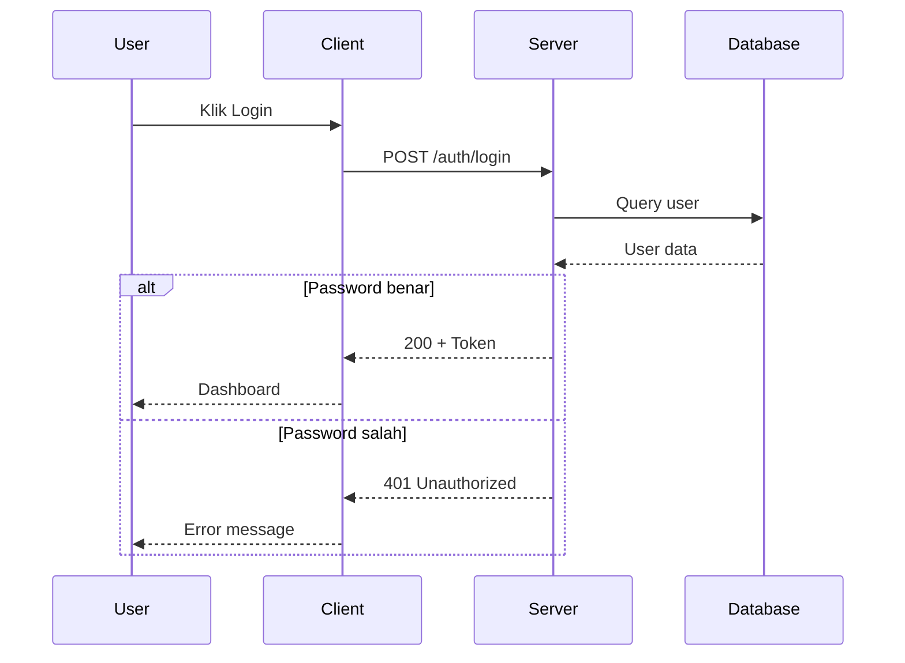

# Fase 3: Pembuatan Materi

## Overview

Fase ini mengubah roadmap menjadi **materi pembelajaran lengkap** untuk setiap fase. Setiap materi berisi teori, contoh kode/praktek, latihan, dan mini project.

## Pre-requisites

- File `roadmap/roadmap.md` dari Fase 2 (sudah disetujui user)
- File `discovery/brainstorming-summary.md` dari Fase 1
- Opsional skill: `senior-technical-writer`, `mermaid-diagram-expert`, skill spesifik per topik

## Instruksi

### Step 1: Baca Profil & Roadmap

// turbo
Baca kedua file berikut:
1. `discovery/brainstorming-summary.md` — Untuk gaya materi dan preferensi
2. `roadmap/roadmap.md` — Untuk daftar fase dan topik

Identifikasi:
- Gaya penulisan yang diminta (formal/casual/praktis/analogi)
- Bahasa materi (Indonesia/English/campuran)
- Level learner (nol/pemula/intermediate)
- Format contoh yang sesuai

### Step 2: Tentukan Gaya Penulisan

Berdasarkan profil learner, gunakan salah satu gaya berikut:

#### Gaya A: Formal & Akademis
```markdown
## Variabel dalam Python

Variabel adalah sebuah _identifier_ yang digunakan untuk menyimpan nilai 
dalam memori komputer. Dalam bahasa pemrograman Python, variabel tidak 
memerlukan deklarasi tipe data secara eksplisit, karena Python menggunakan 
_dynamic typing_.

**Sintaks:**
`nama_variabel = nilai`

**Contoh:**
```python
nama = "Budi"        # tipe string
umur = 25             # tipe integer
tinggi = 175.5        # tipe float
aktif = True           # tipe boolean
```
```

#### Gaya B: Casual & Conversational
```markdown
## Variabel — "Kotak Penyimpanan" di Kode Kamu

Bayangin kamu punya kotak-kotak di meja kerja. Setiap kotak punya label 
(nama) dan isi (nilai). Nah, variabel itu persis kayak gitu!

Kamu kasih nama ke kotak → terus masukin sesuatu ke dalamnya.

```python
# Ini variabel! Simpel kan?
nama = "Budi"        # kotak bernama 'nama', isinya "Budi"
umur = 25             # kotak bernama 'umur', isinya 25
```

Gampang kan? Yang penting ingat: **nama di kiri, isi di kanan, = di tengah** 😄
```

#### Gaya C: Praktis & To-the-Point
```markdown
## Variabel

```python
# Cara buat variabel:
nama = "Budi"         # string
umur = 25              # integer
tinggi = 175.5         # float
aktif = True           # boolean

# Cara pakai:
print(nama)            # Output: Budi
print(umur + 5)        # Output: 30
```

**Ingat:** Python auto-detect tipe data. Tidak perlu tulis `int`, `str`, dll.
```

#### Gaya D: Analogi & Cerita
```markdown
## Variabel — Seperti Rak Buku di Perpustakaan 📚

Perpustakaan punya banyak rak. Setiap rak punya label:
- Rak "Fiksi" → isinya novel-novel
- Rak "Sains" → isinya buku-buku sains

Di programming, "rak" ini namanya **variabel**:
- Variabel `nama` → isinya "Budi"
- Variabel `umur` → isinya 25

```python
nama = "Budi"    # Rak 'nama' diisi dengan "Budi"
umur = 25         # Rak 'umur' diisi dengan angka 25
```

Dan yang keren: kamu bisa ganti isi rak kapan saja!
```python
nama = "Budi"     # Awalnya Budi
nama = "Ani"      # Sekarang jadi Ani (isi rak diganti)
```
```

### Step 3: Struktur Materi Per Fase

Untuk setiap fase di roadmap, buat folder dan file berikut:

```
materi/fase-XX-<nama>/
├── README.md              # Overview & tujuan fase
├── 01-<sub-topik-1>.md    # Materi teori + contoh
├── 02-<sub-topik-2>.md    # Materi teori + contoh
├── ...
├── latihan/
│   ├── soal-01.md         # Soal latihan
│   ├── soal-02.md
│   └── jawaban/
│       ├── jawaban-01.md  # Jawaban + penjelasan
│       └── jawaban-02.md
└── mini-project/
    ├── project-01-brief.md    # Brief project
    ├── project-01-hints.md    # Hints jika stuck
    └── project-01-solution/   # Solusi (opsional)
├── glossary.md            # Daftar istilah teknis fase ini
```

### Step 4: Template Materi

#### Template README.md (Overview Fase)

```markdown
# Fase X: <Nama Fase>

## 🎯 Tujuan
Setelah menyelesaikan fase ini, Anda akan bisa:
- [ ] <kemampuan 1>
- [ ] <kemampuan 2>
- [ ] <kemampuan 3>

## ⏰ Estimasi Waktu
- **Durasi:** X minggu
- **Jam/minggu:** ~Y jam (Z jam/hari)

## 📚 Daftar Materi

| # | Topik | File | Estimasi |
|---|-------|------|----------|
| 1 | <topik 1> | [01-topik.md](./01-topik.md) | X jam |
| 2 | <topik 2> | [02-topik.md](./02-topik.md) | X jam |

## 🧩 Latihan
- [Soal Latihan 1](./latihan/soal-01.md)
- [Soal Latihan 2](./latihan/soal-02.md)

## 🎯 Mini Project
- [Project 1: <nama>](./mini-project/project-01-brief.md)

## 📖 Resource Tambahan
- [<resource 1>](<url>)
- [<resource 2>](<url>)

## ➡️ Next
Setelah selesai fase ini → [Fase X+1: <nama>](../fase-XX-<nama>/README.md)
```

#### Template Materi (Per Sub-topik)

```markdown
# <Nomor>. <Judul Sub-topik>

## 📖 Penjelasan

<penjelasan teori dengan gaya yang sesuai profil learner>

## 💻 Contoh Kode

<contoh kode dengan komentar yang jelas>

## 🔍 Penjelasan Kode

<penjelasan baris per baris jika perlu, terutama untuk pemula level nol>

## ⚠️ Kesalahan Umum

<kesalahan yang sering dibuat pemula dan cara menghindarinya>

## 🧪 Coba Sendiri

<instruksi untuk praktek langsung, bisa berisi:>
1. Ketik kode berikut di editor Anda
2. Jalankan dan lihat hasilnya
3. Modifikasi bagian X, apa yang terjadi?

## 📝 Rangkuman

<poin-poin utama yang harus diingat dari materi ini>

## ➡️ Selanjutnya
→ [<Topik berikutnya>](./<file-berikutnya>.md)
```

#### Template Soal Latihan

```markdown
# Latihan <Nomor>: <Topik>

## Tingkat: ⭐ Mudah / ⭐⭐ Sedang / ⭐⭐⭐ Sulit

### Soal 1 ⭐
<deskripsi soal>

**Input:** <contoh input>
**Output yang diharapkan:** <contoh output>

### Soal 2 ⭐⭐
<deskripsi soal>

### Soal 3 ⭐⭐⭐
<deskripsi soal>

---
💡 **Hints:** [Lihat hints](./jawaban/jawaban-XX.md#hints)
✅ **Jawaban:** [Lihat jawaban](./jawaban/jawaban-XX.md)
```

#### Template Mini Project Brief

```markdown
# Mini Project: <Nama Project>

## 📋 Deskripsi
<apa yang akan dibuat>

## 🎯 Tujuan Pembelajaran
- <konsep yang dilatih 1>
- <konsep yang dilatih 2>

## ✅ Requirements
- [ ] <requirement 1>
- [ ] <requirement 2>
- [ ] <requirement 3>

## 💡 Hints
<petunjuk untuk memulai, tanpa memberikan jawaban langsung>

1. Mulai dengan ...
2. Gunakan konsep ... yang sudah dipelajari di materi ...
3. Jika stuck, coba ...

## 🌟 Bonus Challenge
<fitur tambahan untuk yang ingin tantangan lebih>

## ⏰ Estimasi Waktu
~X jam

## 📎 Referensi
- [Materi terkait](./../XX-topik.md)
```

#### Template Glossary (Daftar Istilah Per Fase)

```markdown
# 📖 Daftar Istilah — Fase X: <Nama Fase>

| Istilah | Arti Singkat | Contoh / Konteks |
|---------|-------------|------------------|
| Variable | Tempat menyimpan data di memori | `nama = "Budi"` |
| Function | Kumpulan kode yang bisa dipanggil ulang | `def halo(): print("Halo!")` |
| Loop | Perulangan untuk mengeksekusi kode berulang kali | `for i in range(5):` |
| ... | ... | ... |

> **Tips:** Jika menemukan istilah baru yang membingungkan saat belajar,
> tambahkan sendiri ke tabel ini sebagai catatan pribadi!
```

### Step 5: Panduan Panjang Materi

Sesuaikan kedalaman materi berdasarkan level learner:

| Level Learner | Panjang per Sub-topik | Contoh Kode | Latihan | Penjelasan |
|--------------|----------------------|-------------|---------|------------|
| 🔴 Nol/Pemula | 300-500 baris MD | 3-5 contoh | 3-5 soal | Detail, step-by-step, banyak analogi |
| 🟡 Intermediate | 200-400 baris MD | 2-3 contoh | 2-4 soal | Fokus konsep, kurangi penjelasan dasar |
| 🔵 Advanced | 150-300 baris MD | 1-2 contoh | 1-3 soal | Konsep lanjut, best practice, edge cases |

> [!TIP]
> Jika ragu, **lebih panjang lebih baik** untuk pemula. Lebih mudah skip daripada cari info yang tidak ada.

### Step 6: Diagram Visual (Mermaid)

> **Skill:** `mermaid-diagram-expert`

Tambahkan diagram Mermaid di materi untuk meningkatkan pemahaman visual. Penelitian menunjukkan visual learning meningkatkan retensi **65%** dibanding teks saja.

**Kapan menggunakan diagram:**

| Jenis Diagram | Gunakan Untuk | Contoh |
|--------------|---------------|--------|
| `flowchart` | Alur logika, decision tree | if/else, loops, algoritma |
| `sequenceDiagram` | Interaksi antar komponen | HTTP request/response, API call |
| `erDiagram` | Relasi data/database | Schema database, entity relationships |
| `classDiagram` | Struktur OOP | Class hierarchy, inheritance |
| `stateDiagram` | State management | App states, lifecycle |
| `gantt` | Timeline/project plan | Sprint plan, development phases |

**Template Mermaid dalam materi:**

````markdown
## Alur Autentikasi


````

**Aturan penggunaan diagram:**
1. Minimal **1 diagram per sub-topik** yang melibatkan alur/proses
2. Diagram harus **menyertakan penjelasan** di bawahnya
3. Gunakan label bahasa sesuai preferensi learner (ID/EN)
4. Jangan overcrowd — maksimal 10 node per diagram
5. Untuk topik non-programming, gunakan `flowchart` dan `gantt` sebagai default

### Step 7: Gamification Elements

Tambahkan elemen gamifikasi untuk menjaga motivasi learner:

**Badge System:**
```markdown
## 🏅 Achievements

| Badge | Nama | Syarat |
|-------|------|--------|
| 🌱 | First Code | Berhasil menjalankan kode pertama |
| 📝 | Problem Solver | Selesaikan 10 soal latihan |
| 🏗️ | Builder | Selesaikan mini project pertama |
| 🔥 | On Fire | Belajar 7 hari berturut-turut |
| 💎 | Deep Diver | Selesaikan semua soal di 1 fase |
| 🏆 | Phase Master | Selesaikan 1 fase lengkap |
| 🎓 | Graduate | Selesaikan seluruh materi |
```

**XP Points per Aktivitas:**
```markdown
| Aktivitas | XP |
|-----------|----|
| Baca 1 sub-topik | +10 XP |
| Selesaikan 1 soal latihan | +25 XP |
| Selesaikan mini project | +100 XP |
| Streak 3 hari | +50 XP bonus |
| Streak 7 hari | +150 XP bonus |
| Lulus milestone checkpoint | +200 XP |

### Level Progression
- 🥉 Bronze: 0 - 500 XP (Pemula)
- 🥈 Silver: 501 - 1500 XP (Berkembang)
- 🥇 Gold: 1501 - 3000 XP (Mahir)
- 💎 Diamond: 3001+ XP (Expert)
```

> [!TIP]
> Jika output = website, implementasikan XP tracker menggunakan `localStorage`.
> Jika output = markdown/PDF, sertakan tracker manual di setiap akhir sub-topik.

### Step 8: Aturan Pembuatan Materi

1. **Satu konsep per halaman** — Jangan campur terlalu banyak konsep dalam satu file
2. **Contoh sebelum teori** — Untuk pemula, tunjukkan contoh dulu baru jelaskan
3. **Progressive disclosure** — Mulai dari yang paling sederhana, tambah kompleksitas bertahap
4. **Setiap contoh bisa dijalankan** — Pastikan kode contoh benar dan bisa di-copy-paste
5. **Kesalahan umum** — Sertakan error yang sering ditemui pemula dan cara mengatasinya
6. **Latihan bertingkat** — Soal mudah → sedang → sulit di setiap topik
7. **Tombol navigasi** — Setiap file punya link ke materi sebelumnya dan berikutnya
8. **Konsisten** — Gunakan gaya penulisan yang sama di seluruh materi
9. **Glossary** — Sertakan daftar istilah di setiap fase untuk pemula

### Step 9: Urutan Pembuatan

```
1. Buat README.md untuk fase pertama
2. Buat materi sub-topik satu per satu (01, 02, 03, ...)
3. Tambahkan diagram Mermaid di setiap sub-topik yang relevan
4. Buat soal latihan untuk fase tersebut
5. Buat jawaban latihan
6. Buat mini project brief
7. Buat mini project hints & solution (opsional)
8. Tambahkan badges & XP di akhir fase
9. Review semua file di fase tersebut
10. Tanyakan user: "Fase X selesai. Lanjut ke Fase X+1?"
11. Ulangi untuk fase berikutnya
```

### Step 10: Quality Check Per Fase

```markdown
## Quality Checklist
- [ ] README overview lengkap dan jelas
- [ ] Semua sub-topik memiliki penjelasan dan contoh
- [ ] Contoh kode benar dan bisa dijalankan
- [ ] Gaya penulisan konsisten dengan profil learner
- [ ] Bahasa sesuai preferensi (ID/EN/campuran)
- [ ] Minimal 3 soal latihan per fase
- [ ] Semua soal punya jawaban
- [ ] Minimal 1 mini project per fase
- [ ] Navigasi (next/prev) berfungsi di setiap file
- [ ] Tidak ada placeholder atau TODO tersisa
```

## Output

- `materi/fase-XX-<nama>/` — Folder materi untuk setiap fase

## Transition

Setelah semua materi selesai:

```
"Semua materi sudah selesai dibuat. Saya akan melanjutkan ke Fase 4 
untuk mengkonversi materi ke format output yang diinginkan,
kemudian Fase 5 untuk review & QA."
→ Lanjut ke: 04_output_interface.md
```
