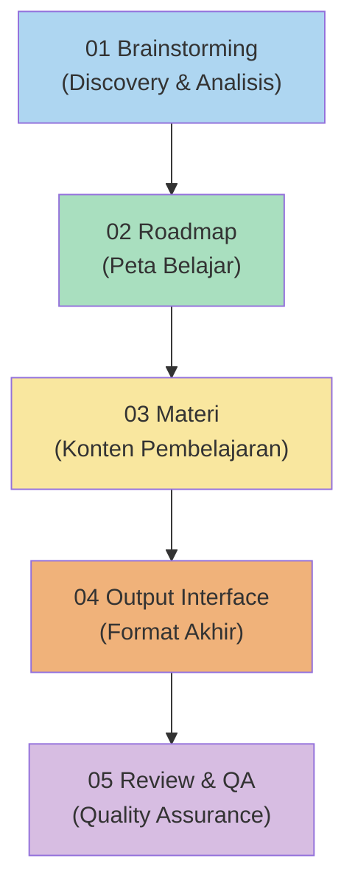

# Learning Material Maker Workflows

Workflows untuk membuat materi pembelajaran lengkap berdasarkan request pengguna. Setiap workflow menghasilkan deliverables yang siap digunakan sebagai panduan belajar mandiri.

## Quick Start

1. Berikan prompt: `"Jalankan workflow learning-material-maker untuk <topik>"`
2. Jawab 8-15 pertanyaan discovery
3. Review roadmap → Approve
4. Tunggu materi dibuatkan per fase
5. Pilih format output → Selesai! 🎉

## System Requirements

- Skill: `brainstorming-pro` (fase discovery)
- Skill: `senior-programming-mentor`, `mit-cs-professor` (opsional, untuk konten teknis)
- Skill: `senior-technical-writer` (opsional, untuk kualitas penulisan)
- Skill: `mermaid-diagram-expert` (opsional, untuk diagram visual)
- Skill: `project-estimator` (opsional, untuk timeline akurat)
- Skill: `web-developer`, `pwa-developer`, `senior-ui-ux-designer` (opsional, jika output = website)
- Skill: `accessibility-specialist` (opsional, untuk website accessible)
- Skill: `senior-code-reviewer` (opsional, untuk fase review & QA)
- Markdown editor / VS Code

## Struktur Workflows

```
workflows/learning-material-maker/
├── 01_brainstorming.md           # Discovery & analisis kebutuhan learner
├── 02_roadmap.md                 # Pembuatan roadmap terstruktur
├── 03_materi.md                  # Pembuatan konten materi per fase
├── 04_output_interface.md        # Format output (website/PDF/markdown)
├── 05_review_qa.md               # Review & quality assurance
└── README.md                     # Dokumentasi ini
```

## Output Folder Structure

```
learning-materials/<topik>/
├── discovery/
│   └── brainstorming-summary.md       # Hasil discovery
│
├── roadmap/
│   └── roadmap.md                     # Roadmap lengkap
│
├── materi/
│   ├── fase-01-<nama>/
│   │   ├── README.md                  # Overview fase
│   │   ├── 01-<sub-topik>.md          # Materi teori + contoh
│   │   ├── 02-<sub-topik>.md
│   │   ├── latihan/
│   │   │   ├── soal-01.md
│   │   │   └── jawaban-01.md
│   │   └── mini-project/
│   │       ├── brief.md
│   │       └── solution/              # (opsional)
│   ├── fase-02-<nama>/
│   └── ...
│
└── output/
    ├── website/                       # Jika format = website
    │   ├── index.html
    │   ├── style.css
    │   └── script.js
    ├── pdf/                           # Jika format = PDF
    └── markdown/                      # Jika format = markdown bundle
```

## Urutan Penggunaan



### Sequential Flow (Proyek Baru)

```
01 Brainstorming (Discovery)
    ↓
02 Roadmap (Peta Belajar + Spaced Repetition)
    ↓
03 Materi (Konten per Fase + Diagram + Gamification)
    ↓
04 Output Interface (Website/PWA / PDF / Markdown)
    ↓
05 Review & QA (Code Review + Accessibility + QA)
```

> **Catatan:** Fase harus dijalankan secara berurut. Hasil dari setiap fase menjadi input untuk fase berikutnya.

### Independent (Per Kebutuhan)

| Workflow | Kapan Digunakan |
|----------|----------------|
| 01 | Memulai project materi baru, validasi kebutuhan learner |
| 02 | Perlu roadmap untuk topik baru tanpa materi lengkap |
| 03 | Sudah punya roadmap, tinggal buat materinya |
| 04 | Sudah punya materi, tinggal konversi ke format output |
| 05 | Sudah punya output, perlu review & QA |

## Skills Quick-Reference

| Fase | Agent Skills |
|------|--------------|
| Brainstorming | `brainstorming-pro` |
| Roadmap | `senior-programming-mentor`, `mit-cs-professor`, `project-estimator` |
| Materi | `senior-technical-writer`, `mermaid-diagram-expert`, teknologi-spesifik skill |
| Output Website | `web-developer`, `pwa-developer`, `senior-ui-ux-designer`, `accessibility-specialist` |
| Output PDF | `pdf-document-specialist`, `document-generator` |
| Review & QA | `senior-code-reviewer`, `debugging-specialist` |

## Example Agent Prompts

### Full Workflow
```
"Jalankan workflow learning-material-maker untuk membuat materi 
belajar Flutter dari nol. Target: pemula tanpa background 
programming. Bahasa: Indonesia. Format output: website interaktif."
```

### Brainstorming Saja
```
"Jalankan workflow 01_brainstorming.md untuk topik belajar 
Machine Learning. Saya fresh graduate Matematika, ingin 
switch career ke Data Scientist."
```

### Roadmap Saja
```
"Jalankan workflow 02_roadmap.md untuk belajar Web Development 
full-stack. Waktu belajar 4 jam/hari, target 6 bulan. 
Resource harus gratis dan non-YouTube."
```

### Materi Saja
```
"Jalankan workflow 03_materi.md untuk fase Python Dasar dari 
roadmap yang sudah ada. Gaya penulisan: casual, banyak analogi, 
bahasa Indonesia. Sertakan latihan interaktif."
```

### Output Saja
```
"Jalankan workflow 04_output_interface.md untuk mengkonversi 
folder materi yang sudah ada menjadi website static dengan 
navigasi sidebar dan dark mode."
```

## Troubleshooting

| Problem | Solution |
|---------|----------|
| Brainstorming terlalu lama | Skip pertanyaan kondisional, fokus ke 8 pertanyaan wajib |
| User ingin langsung mulai | Boleh skip ke fase 2/3/4 jika sudah punya input yang cukup |
| Resource URL mati | Gunakan `read_url_content` untuk verifikasi sebelum include |
| Materi terlalu panjang | Pecah sub-topik menjadi 2 file terpisah |
| Topik bukan programming | Adaptasi semua opsi pertanyaan sesuai domain topik |
| Website tidak responsif | Test di browser DevTools mobile mode |
| PDF styling berantakan | Gunakan `pandoc` dengan custom CSS template |
