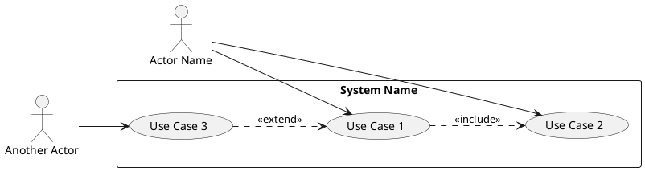
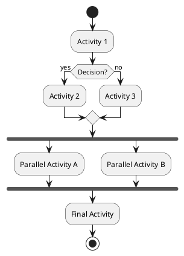
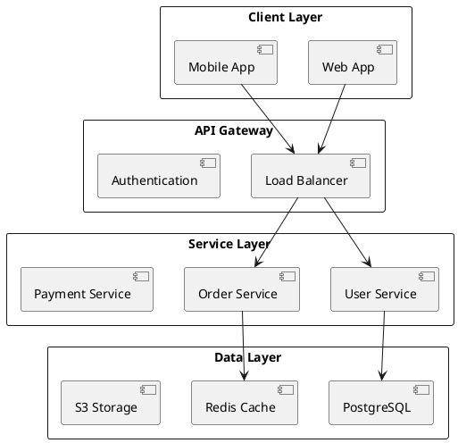
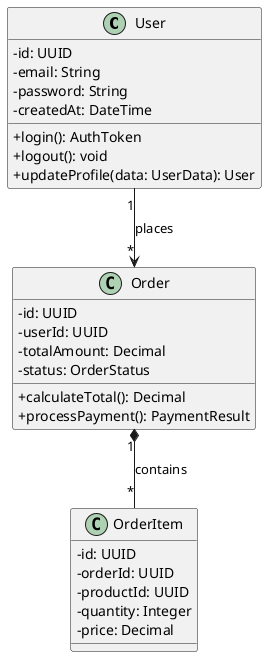
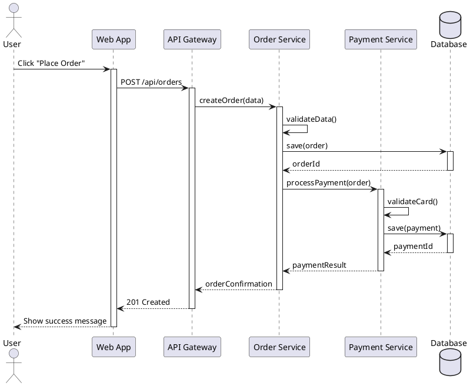

# Workflow: System & Detailed Design

## Overview
This workflow covers the System Design and Detailed Design phases. The goal is to visualize system behavior, high-level structure, and define low-level technical specifications for implementation.

**IMPORTANT: All UML diagrams MUST use PlantUML syntax (.puml format). DO NOT use Mermaid diagrams.**

## Output Location
**Base Folder:** `sdlc/03-system-detailed-design/`

**Output Files:**
- `use-case-diagram.puml` - Use Case Diagram (PlantUML)
- `activity-diagram.puml` - Activity Diagram (PlantUML)
- `system-architecture.md` - System Architecture Documentation
- `class-diagram.puml` - Class Diagram (PlantUML)
- `sequence-diagram.puml` - Sequence Diagram (PlantUML)
- `api-specification.yaml` - OpenAPI 3.0 Specification

## Prerequisites
- Completed UI/UX Design
- Technical requirements defined
- Technology stack selected
- Architecture patterns decided

## Deliverables

### Phase 1: System Design

#### 1. Use Case Diagram

**Description:** Representation of user interactions with system components.

**Recommended Skills:** `uml-specialist`, `senior-system-analyst`

**Instructions:**
1. Identify all actors (users, external systems)
2. Define use cases for each actor
3. Map relationships:
   - Association (actor-use case)
   - Include (mandatory sub-behavior)
   - Extend (optional behavior)
   - Generalization
4. Group use cases by subsystems

**Output Format (PlantUML ONLY):**


---

#### 2. Activity Diagram

**Description:** Flow of business logic or system processes.

**Recommended Skills:** `senior-system-analyst`, `uml-specialist`

**Instructions:**
1. Identify the process to model
2. Define start and end points
3. Map activities (actions/steps)
4. Add decision points (diamonds)
5. Show parallel activities (fork/join)
6. Include swimlanes for different actors/systems

**Output Format (PlantUML ONLY):**


---

#### 3. System Architecture Diagram

**Description:** Structural layout of the tech stack and component communication.

**Recommended Skills:** `senior-software-architect`, `software-architecture-patterns`

**Instructions:**
1. Identify architectural layers:
   - Presentation layer
   - Application/Business logic layer
   - Data access layer
   - Infrastructure layer
2. Define component interactions
3. Show external integrations
4. Document data flow
5. Include technology choices per component

**Output Format:**
```markdown
## System Architecture

### Architecture Style: [Microservices/Monolithic/Serverless/etc.]

### Component Diagram
[PlantUML or text description]



### Technology Stack
- **Frontend:** React.js, TypeScript, TailwindCSS
- **Backend:** Node.js, Express, TypeScript
- **Database:** PostgreSQL 15
- **Cache:** Redis
- **Message Queue:** RabbitMQ
- **Infrastructure:** Docker, Kubernetes
```

---

### Phase 2: Detailed Design

#### 4. Class Diagram

**Description:** Static structure showing classes, attributes, methods, and relationships.

**Recommended Skills:** `senior-software-engineer`, `uml-specialist`

**Instructions:**
1. Identify main domain entities
2. Define class attributes with types
3. Define methods with signatures
4. Map relationships:
   - Association (has-a)
   - Aggregation (whole-part)
   - Composition (strong ownership)
   - Inheritance (is-a)
5. Add visibility modifiers (+, -, #)
6. Include stereotypes where appropriate

**Output Format (PlantUML ONLY):**


---

#### 5. Sequence Diagram

**Description:** Time-ordered interaction between objects/components.

**Recommended Skills:** `uml-specialist`, `senior-software-architect`

**Instructions:**
1. Identify the scenario to model
2. List participating objects/actors
3. Define lifelines for each participant
4. Map message flow (synchronous/asynchronous)
5. Show activation bars
6. Include return messages
7. Add alt/opt/loop fragments for conditions

**Output Format (PlantUML ONLY):**


---

#### 6. API Specification (OpenAPI)

**Description:** The contract between frontend and backend services.

**Recommended Skills:** `api-design-specialist`, `senior-backend-developer`

**Instructions:**
1. Define API versioning strategy
2. Design RESTful endpoints:
   - HTTP methods (GET, POST, PUT, DELETE, PATCH)
   - Resource URLs
   - Path parameters
   - Query parameters
3. Define request/response schemas
4. Document error responses
5. Include authentication requirements
6. Add examples for all payloads
7. Define rate limiting

**Output Format (OpenAPI 3.0):**
```yaml
openapi: 3.0.0
info:
  title: API Title
  version: 1.0.0
  description: API description

servers:
  - url: https://api.example.com/v1

paths:
  /users:
    get:
      summary: List users
      parameters:
        - name: page
          in: query
          schema:
            type: integer
            default: 1
      responses:
        '200':
          description: Success
          content:
            application/json:
              schema:
                type: object
                properties:
                  data:
                    type: array
                    items:
                      $ref: '#/components/schemas/User'
    post:
      summary: Create user
      requestBody:
        required: true
        content:
          application/json:
            schema:
              $ref: '#/components/schemas/UserInput'
      responses:
        '201':
          description: Created
        '400':
          description: Bad Request

components:
  schemas:
    User:
      type: object
      properties:
        id:
          type: string
          format: uuid
        email:
          type: string
          format: email
        name:
          type: string
    UserInput:
      type: object
      required:
        - email
        - name
      properties:
        email:
          type: string
          format: email
        name:
          type: string
          minLength: 2
```

## Workflow Steps

1. **Architecture Planning** (Senior Software Architect)
   - Select architecture pattern
   - Define technology stack
   - Design high-level structure

2. **Use Case Analysis** (UML Specialist, Senior System Analyst)
   - Identify actors
   - Document use cases
   - **Create Use Case Diagram (PlantUML ONLY)**

3. **Process Modeling** (Senior System Analyst, UML Specialist)
   - Map business processes
   - **Create Activity Diagrams (PlantUML ONLY)**

4. **Component Design** (Senior Software Architect)
   - Design system components
   - Define interfaces
   - Create architecture diagram

5. **Class Design** (Senior Software Engineer, UML Specialist)
   - Design domain model
   - **Create Class Diagram (PlantUML ONLY)**
   - Define relationships

6. **Interaction Design** (UML Specialist, Senior Software Architect)
   - Map key scenarios
   - **Create Sequence Diagrams (PlantUML ONLY)**

7. **API Design** (API Design Specialist, Senior Backend Developer)
   - Design REST endpoints
   - Create OpenAPI specification
   - Review with frontend team

## UML Standards & Guidelines

### MANDATORY: Use PlantUML ONLY

**DO NOT use Mermaid syntax.** All UML diagrams must be created using PlantUML.

### PlantUML Best Practices:
1. Use `skinparam` for consistent styling
2. Include `@startuml` and `@enduml` tags
3. Use meaningful names for actors and components
4. Add comments for complex logic
5. Use stereotypes for clarity
6. Keep diagrams focused (one concept per diagram)

### Example PlantUML Setup:
```plantuml
@startuml
!theme plain
skinparam backgroundColor #FEFEFE
skinparam componentStyle rectangle

' Your diagram here

@enduml
```

## Success Criteria
- Use cases cover all functional requirements
- Activity diagrams show complete business logic
- Architecture diagram shows clear component separation
- Class diagram accurately models domain entities
- Sequence diagrams cover critical interaction paths
- API specification is complete and versioned
- All UML diagrams use PlantUML syntax (NOT Mermaid)
- Design is review-ready for development team

## Tools & Resources
- PlantUML online editor: plantuml.com/plantuml
- PlantUML VS Code extension
- OpenAPI Specification (Swagger)
- ArchUnit for architecture testing
