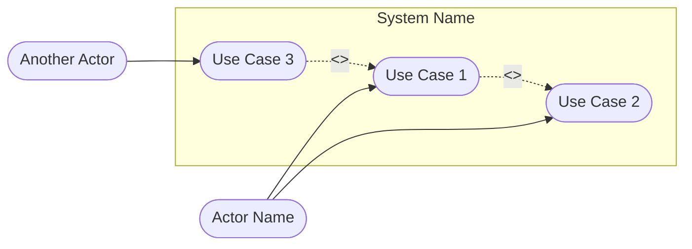
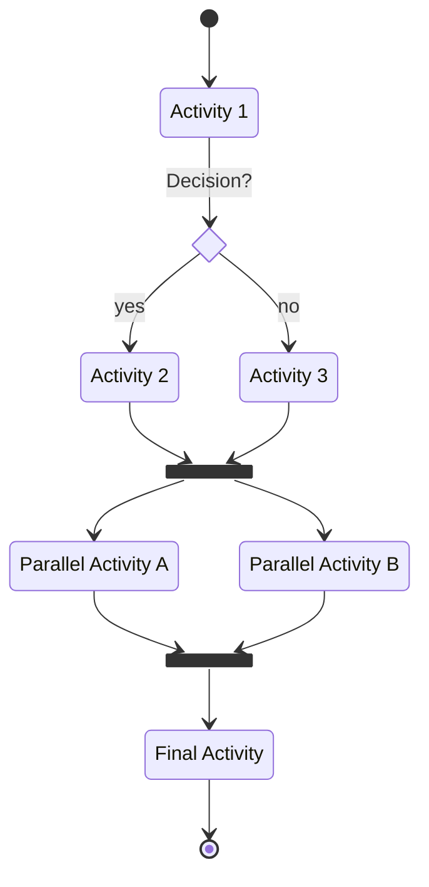
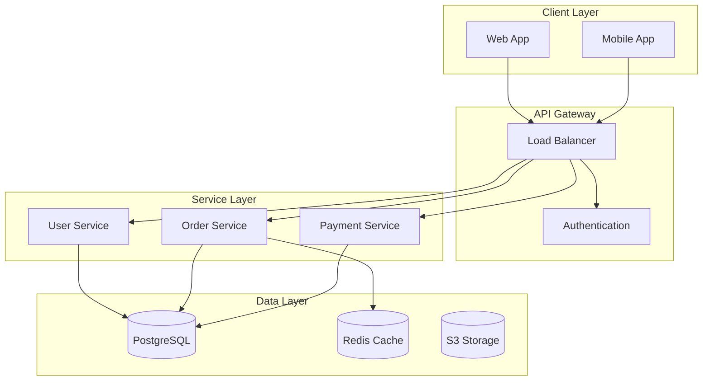
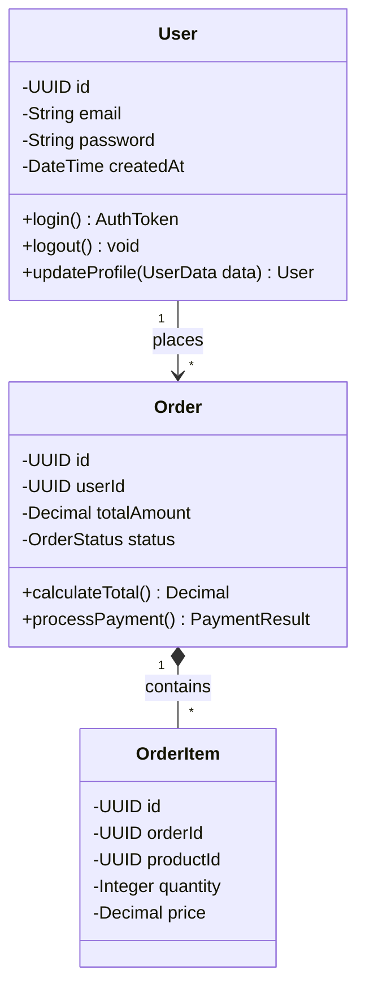
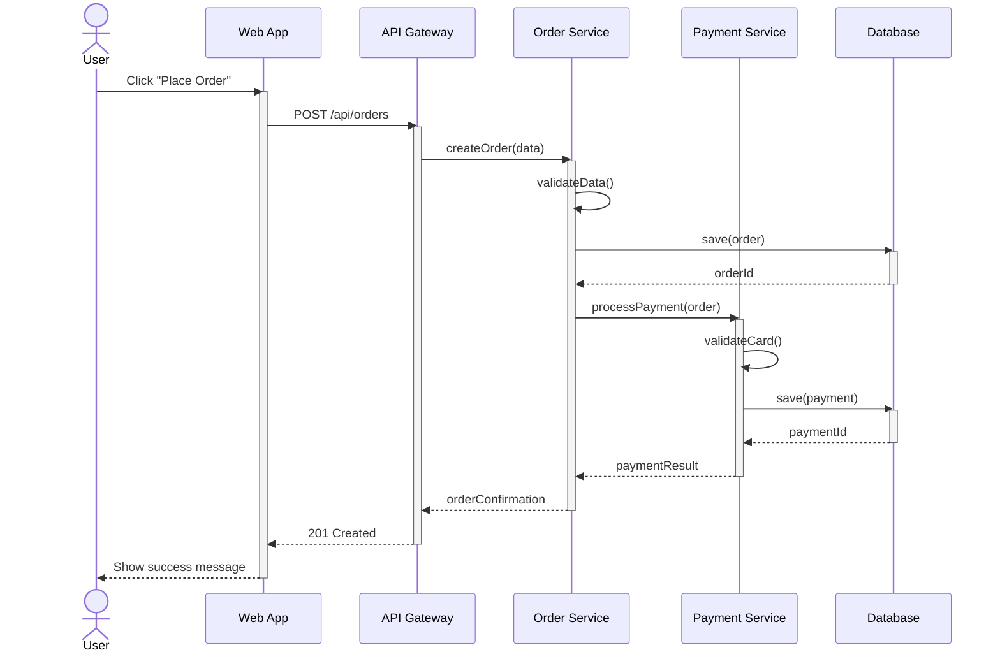
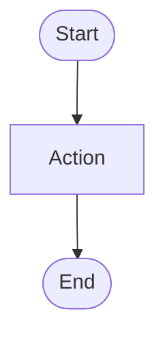

# Workflow: System & Detailed Design

## Overview
This workflow covers the System Design and Detailed Design phases. The goal is to visualize system behavior, high-level structure, and define low-level technical specifications for implementation.

**IMPORTANT: All diagrams MUST use Mermaid syntax natively supported by Markdown.**

## Output Location
**Base Folder:** `sdlc/03-system-detailed-design/`

**Output Files:**
- `use-case-diagram.md` - Use Case Diagram (Mermaid)
- `activity-diagram.md` - Activity Diagram (Mermaid)
- `system-architecture.md` - System Architecture Documentation
- `class-diagram.md` - Class Diagram (Mermaid)
- `sequence-diagram.md` - Sequence Diagram (Mermaid)
- `api-specification.yaml` - OpenAPI 3.0 Specification

## Prerequisites
- Completed UI/UX Design
- Technical requirements defined
- Technology stack selected
- Architecture patterns decided

## Deliverables

### Phase 1: System Design

#### 1. Use Case Diagram

**Description:** Representation of user interactions with system components.

**Recommended Skills:** `uml-specialist`, `senior-system-analyst`

**Instructions:**
1. Identify all actors (users, external systems)
2. Define use cases for each actor
3. Map relationships:
   - Association (actor-use case)
   - Include (mandatory sub-behavior)
   - Extend (optional behavior)
   - Generalization
4. Group use cases by subsystems

**Output Format (Mermaid):**


---

#### 2. Activity Diagram

**Description:** Flow of business logic or system processes.

**Recommended Skills:** `senior-system-analyst`, `uml-specialist`

**Instructions:**
1. Identify the process to model
2. Define start and end points
3. Map activities (actions/steps)
4. Add decision points (diamonds)
5. Show parallel activities (fork/join)
6. Include swimlanes for different actors/systems

**Output Format (Mermaid):**


---

#### 3. System Architecture Diagram

**Description:** Structural layout of the tech stack and component communication.

**Recommended Skills:** `senior-software-architect`, `software-architecture-patterns`

**Instructions:**
1. Identify architectural layers:
   - Presentation layer
   - Application/Business logic layer
   - Data access layer
   - Infrastructure layer
2. Define component interactions
3. Show external integrations
4. Document data flow
5. Include technology choices per component

**Output Format:**
```markdown
## System Architecture

### Architecture Style: [Microservices/Monolithic/Serverless/etc.]

### Component Diagram
[Mermaid architecture diagram or flowchart]



### Technology Stack
- **Frontend:** React.js, TypeScript, TailwindCSS
- **Backend:** Node.js, Express, TypeScript
- **Database:** PostgreSQL 15
- **Cache:** Redis
- **Message Queue:** RabbitMQ
- **Infrastructure:** Docker, Kubernetes
```

---

### Phase 2: Detailed Design

#### 4. Class Diagram

**Description:** Static structure showing classes, attributes, methods, and relationships.

**Recommended Skills:** `senior-software-engineer`, `uml-specialist`

**Instructions:**
1. Identify main domain entities
2. Define class attributes with types
3. Define methods with signatures
4. Map relationships:
   - Association (has-a)
   - Aggregation (whole-part)
   - Composition (strong ownership)
   - Inheritance (is-a)
5. Add visibility modifiers (+, -, #)
6. Include stereotypes where appropriate

**Output Format (Mermaid):**


---

#### 5. Sequence Diagram

**Description:** Time-ordered interaction between objects/components.

**Recommended Skills:** `uml-specialist`, `senior-software-architect`

**Instructions:**
1. Identify the scenario to model
2. List participating objects/actors
3. Define lifelines for each participant
4. Map message flow (synchronous/asynchronous)
5. Show activation bars
6. Include return messages
7. Add alt/opt/loop fragments for conditions

**Output Format (Mermaid):**


---

#### 6. API Specification (OpenAPI)

**Description:** The contract between frontend and backend services.

**Recommended Skills:** `api-design-specialist`, `senior-backend-developer`

**Instructions:**
1. Define API versioning strategy
2. Design RESTful endpoints:
   - HTTP methods (GET, POST, PUT, DELETE, PATCH)
   - Resource URLs
   - Path parameters
   - Query parameters
3. Define request/response schemas
4. Document error responses
5. Include authentication requirements
6. Add examples for all payloads
7. Define rate limiting

**Output Format (OpenAPI 3.0):**
```yaml
openapi: 3.0.0
info:
  title: API Title
  version: 1.0.0
  description: API description

servers:
  - url: https://api.example.com/v1

paths:
  /users:
    get:
      summary: List users
      parameters:
        - name: page
          in: query
          schema:
            type: integer
            default: 1
      responses:
        '200':
          description: Success
          content:
            application/json:
              schema:
                type: object
                properties:
                  data:
                    type: array
                    items:
                      $ref: '#/components/schemas/User'
    post:
      summary: Create user
      requestBody:
        required: true
        content:
          application/json:
            schema:
              $ref: '#/components/schemas/UserInput'
      responses:
        '201':
          description: Created
        '400':
          description: Bad Request

components:
  schemas:
    User:
      type: object
      properties:
        id:
          type: string
          format: uuid
        email:
          type: string
          format: email
        name:
          type: string
    UserInput:
      type: object
      required:
        - email
        - name
      properties:
        email:
          type: string
          format: email
        name:
          type: string
          minLength: 2
```

---

#### 7. API Versioning Strategy

**Description:** Guidelines for evolving the API without breaking existing consumers.

**Recommended Skills:** `api-design-specialist`, `senior-backend-developer`

**Instructions:**
1. Select versioning approach
2. Define version lifecycle (active, deprecated, sunset)
3. Document breaking vs non-breaking changes
4. Create deprecation policy with timeline
5. Plan migration support for consumers

**Output Format:**
```markdown
# API Versioning Strategy

## Versioning Approach

### Comparison

| Approach | Format | Pros | Cons |
|----------|--------|------|------|
| URL Path | `/api/v1/users` | Simple, explicit, cacheable | URL changes per version |
| Header | `Accept: application/vnd.api.v1+json` | Clean URLs | Hidden, harder to test |
| Query Param | `/api/users?version=1` | Easy to test | Pollutes query string |

### Selected: **URL Path Versioning**
**Rationale:** [Why this approach was chosen]

**Base URL Pattern:**
- Production: `https://api.example.com/v{major}`
- Staging: `https://api-staging.example.com/v{major}`

## Version Lifecycle

| Phase | Duration | Description |
|-------|----------|-------------|
| **Active** | Current + 1 prev | Full support, bug fixes, new features |
| **Deprecated** | 6 months after new version | Bug fixes only, deprecation warnings |
| **Sunset** | After deprecation period | Read-only, then removed |

## Breaking vs Non-Breaking Changes

### Non-Breaking (no version bump)
- Adding new endpoints
- Adding optional request fields
- Adding response fields
- Adding new enum values
- Relaxing validation rules

### Breaking (requires version bump)
- Removing endpoints
- Removing/renaming response fields
- Changing field types
- Making optional fields required
- Changing error response format
- Changing authentication mechanism

## Deprecation Policy

### Deprecation Notice Template
```json
{
  "deprecation": {
    "endpoint": "/api/v1/users",
    "deprecated_at": "2024-06-01",
    "sunset_at": "2024-12-01",
    "migration_guide": "https://docs.example.com/migration/v2",
    "replacement": "/api/v2/users"
  }
}
```

### Deprecation Headers
```
Deprecation: true
Sunset: Sat, 01 Dec 2024 00:00:00 GMT
Link: <https://docs.example.com/migration/v2>; rel="successor-version"
```

### Migration Timeline
1. **T+0:** New version released, old version marked deprecated
2. **T+30d:** Deprecation warnings in API responses
3. **T+90d:** Email notifications to active consumers
4. **T+150d:** Rate limiting on deprecated endpoints
5. **T+180d:** Sunset — deprecated endpoints return 410 Gone

## Active Versions

| Version | Status | Released | Sunset Date | Notes |
|---------|--------|----------|-------------|-------|
| v2 | ✅ Active | 2024-06-01 | - | Current |
| v1 | ⚠️ Deprecated | 2024-01-01 | 2024-12-01 | Migration guide available |
```

---

## Workflow Steps

1. **Architecture Planning** (Senior Software Architect)
   - Select architecture pattern
   - Define technology stack
   - Design high-level structure

2. **Use Case Analysis** (UML Specialist, Senior System Analyst)
   - Identify actors
   - Document use cases
   - **Create Use Case Diagram (Mermaid ONLY)**

3. **Process Modeling** (Senior System Analyst, UML Specialist)
   - Map business processes
   - **Create Activity Diagrams (Mermaid ONLY)**

4. **Component Design** (Senior Software Architect)
   - Design system components
   - Define interfaces
   - Create architecture diagram

5. **Class Design** (Senior Software Engineer, UML Specialist)
   - Design domain model
   - **Create Class Diagram (Mermaid ONLY)**
   - Define relationships

6. **Interaction Design** (UML Specialist, Senior Software Architect)
   - Map key scenarios
   - **Create Sequence Diagrams (Mermaid ONLY)**

7. **API Design** (API Design Specialist, Senior Backend Developer)
   - Design REST endpoints
   - Create OpenAPI specification
   - Review with frontend team

## Diagram Standards & Guidelines

### MANDATORY: Use Mermaid ONLY

**Use Mermaid syntax.** All diagrams must be created using native Mermaid Markdown blocks. Mermaid is widely supported by modern markdown viewers (GitHub, Notion, VS Code) and doesn't require external rendering servers.

### Mermaid Best Practices:
1. Always specify the diagram type first (e.g., `flowchart TD`, `sequenceDiagram`, `classDiagram`)
2. Use descriptive IDs for nodes
3. Apply subgraphs to organize components logically
4. Add comments using `%%` syntax for complex logic
5. Keep diagrams focused (one concept per diagram, avoid overly massive diagrams)

### Example Mermaid Setup:


## Workflow Validation Checklist

### Pre-Execution
- [ ] UI/UX Design completed (`02_ui_ux_design.md`)
- [ ] Technical requirements defined
- [ ] Technology stack selected
- [ ] Architecture patterns decided
- [ ] Output folder structure created: `sdlc/03-system-detailed-design/`

### During Execution
- [ ] Use Case Diagram created (Mermaid)
- [ ] Activity Diagram created (Mermaid)
- [ ] System Architecture documented
- [ ] Class Diagram created (Mermaid)
- [ ] Sequence Diagrams created for critical flows (Mermaid)
- [ ] API Specification written (OpenAPI 3.0)
- [ ] All diagrams use native Mermaid Markdown syntax
- [ ] Diagrams reviewed with development team

### Post-Execution
- [ ] All diagrams render successfully in Markdown viewer
- [ ] API specification is complete and versioned
- [ ] Design review conducted with stakeholders
- [ ] Documents committed to version control

---

## Success Criteria
- Use cases cover all functional requirements
- Activity diagrams show complete business logic
- Architecture diagram shows clear component separation
- Class diagram accurately models domain entities
- Sequence diagrams cover critical interaction paths
- API specification is complete and versioned
- All diagrams use native Mermaid Markdown syntax
- Design is review-ready for development team

## Tools & Resources
- Mermaid Live Editor: mermaid.live
- GitHub/GitLab native markdown viewer
- OpenAPI Specification (Swagger)
- ArchUnit for architecture testing
