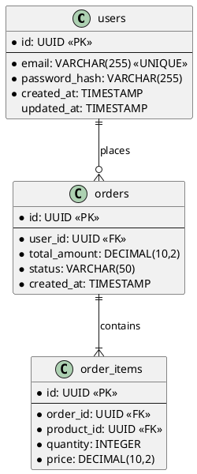
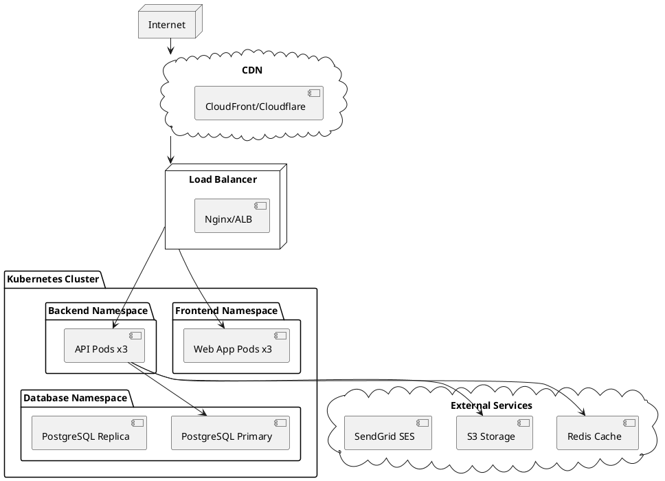
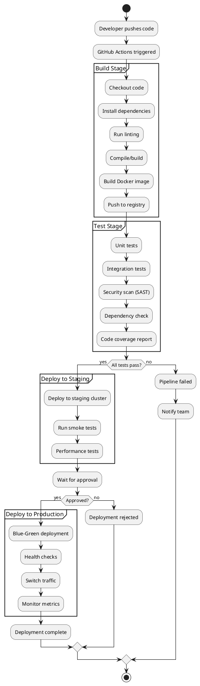

# Workflow: Quality, Security & Deployment

## Overview
This workflow covers the Quality & Security phase and Data & Deployment phase. The goal is to ensure reliability and protection of the system, and plan data storage and physical environment.

## Output Location
**Base Folder:** `sdlc/04-quality-security-deployment/`

**Output Files:**
- `test-plan.md` - Test Plan and Automation Strategy
- `threat-model.md` - Security Threat Model Document
- `database-schema.md` - Database Schema with ERD (PlantUML)
- `deployment-architecture.md` - Deployment Architecture and Infrastructure
- `cicd-pipeline.md` - CI/CD Pipeline Configuration

## Prerequisites
- Completed System & Detailed Design
- Technology stack confirmed
- Infrastructure requirements known
- Security compliance requirements identified

## Deliverables

### Phase 1: Quality & Security

#### 1. Test Plan & Automation Strategy

**Description:** Defining how the system will be verified and validated.

**Recommended Skills:** `api-testing-specialist`, `playwright-specialist`

**Instructions:**
1. Define test pyramid:
   - Unit tests (70%)
   - Integration tests (20%)
   - E2E tests (10%)
2. Create test plan with:
   - Test scope and objectives
   - Testing types (functional, performance, security, usability)
   - Test environments
   - Entry/exit criteria
   - Resource requirements
   - Schedule and milestones
3. Design automation framework:
   - Test runner selection
   - CI/CD integration
   - Reporting and metrics
   - Test data management
4. Define test case structure

**Output Format:**
```markdown
# Test Plan

## 1. Test Strategy
### Scope
- In Scope: [Features to test]
- Out of Scope: [Features not tested]

### Testing Types
- Unit Testing: Jest/Vitest
- Integration Testing: Supertest
- E2E Testing: Playwright/Cypress
- Performance Testing: k6/Artillery
- Security Testing: OWASP ZAP

### Test Environments
- Development: [URL]
- Staging: [URL]
- Production: [URL]

## 2. Test Cases

### TC-001: [Test Case Name]
**Objective:** [What is being tested]
**Preconditions:** [Setup required]
**Steps:**
1. [Step 1]
2. [Step 2]
**Expected Result:** [Expected outcome]
**Priority:** High/Medium/Low
**Automation:** Yes/No

## 3. Automation Framework
### Tools
- **Unit:** Jest with 80% coverage target
- **API:** Postman/Newman or custom framework
- **E2E:** Playwright with parallel execution
- **Visual:** Chromatic/Storybook

### CI/CD Integration
- Pre-commit hooks
- PR checks (lint, test, build)
- Nightly regression suite
- Production smoke tests

## 4. Success Criteria
- Unit test coverage ≥ 80%
- All critical paths have E2E coverage
- Zero high/critical defects in production
- Performance benchmarks met
```

---

#### 2. Security Threat Modeling

**Description:** Identifying potential security risks and mitigation plans.

**Recommended Skills:** `senior-cybersecurity-engineer`, `senior-api-security-specialist`

**Instructions:**
1. Create data flow diagram (DFD)
2. Identify trust boundaries
3. Apply STRIDE methodology:
   - Spoofing
   - Tampering
   - Repudiation
   - Information Disclosure
   - Denial of Service
   - Elevation of Privilege
4. Document threats with:
   - Threat description
   - Risk rating (DREAD model)
   - Mitigation strategy
   - Implementation status
5. Define security controls:
   - Authentication & authorization
   - Input validation
   - Output encoding
   - Cryptography
   - Session management
   - Error handling

**Output Format:**
```markdown
# Threat Model Document

## 1. System Overview
[Description of system and data flows]

## 2. Data Flow Diagram
[PlantUML or textual representation of data flow]

## 3. Threat Inventory

### Threat 1: SQL Injection
**Category:** Tampering
**Description:** Attacker injects malicious SQL through input fields
**DREAD Score:** 8/10
- Damage: 3
- Reproducibility: 3
- Exploitability: 2
- Affected Users: 3
- Discoverability: 3

**Mitigation:**
- Use parameterized queries
- Input validation
- ORM framework
- WAF rules

**Status:** Mitigated

## 4. Security Controls

### Authentication
- OAuth 2.0 / OpenID Connect
- JWT tokens with short expiry
- MFA for admin users

### Authorization
- RBAC (Role-Based Access Control)
- Principle of least privilege
- API scope validation

### Data Protection
- Encryption at rest (AES-256)
- Encryption in transit (TLS 1.3)
- Sensitive data masking in logs

### Input Validation
- Whitelist validation
- Content Security Policy
- Anti-CSRF tokens

## 5. Security Testing Plan
- SAST tools (SonarQube, CodeQL)
- DAST scans (OWASP ZAP)
- Dependency scanning (Snyk, Dependabot)
- Penetration testing schedule
```

---

### Phase 2: Data & Deployment

#### 3. Database Schema (ERD)

**Description:** Logical and physical database structure and relationships.

**Recommended Skills:** `database-modeling-specialist`, `senior-database-engineer-sql`

**Instructions:**
1. Design logical ERD:
   - Entities and attributes
   - Primary and foreign keys
   - Relationships (1:1, 1:N, M:N)
   - Cardinality and optionality
2. Design physical schema:
   - Data types and constraints
   - Indexes for performance
   - Partitioning strategy
   - Normalization level
3. Document tables:
   - Table purpose
   - Column definitions
   - Constraints and defaults
   - Indexes
4. Create migration strategy

**Output Format:**
```markdown
# Database Schema Design

## Entity Relationship Diagram



## Table Definitions

### users
**Purpose:** Store user account information

| Column | Type | Constraints | Description |
|--------|------|-------------|-------------|
| id | UUID | PRIMARY KEY | Unique identifier |
| email | VARCHAR(255) | NOT NULL, UNIQUE | User email address |
| password_hash | VARCHAR(255) | NOT NULL | Bcrypt hashed password |
| created_at | TIMESTAMP | DEFAULT NOW() | Account creation time |
| updated_at | TIMESTAMP | - | Last update time |

**Indexes:**
- PRIMARY KEY (id)
- UNIQUE INDEX (email)

## Migration Strategy
1. Create baseline migration
2. Use version control for schema changes
3. Implement backward-compatible migrations
4. Test migrations on staging environment
```

---

#### 4. Deployment Diagram

**Description:** Physical hosting infrastructure and network configuration.

**Recommended Skills:** `senior-devops-engineer`, `senior-cloud-architect`

**Instructions:**
1. Design infrastructure architecture:
   - Compute resources
   - Storage solutions
   - Network topology
   - Load balancing
2. Define deployment model:
   - Containerization strategy
   - Orchestration platform
   - Service mesh (if applicable)
3. Document environment separation:
   - Development
   - Staging
   - Production
4. Include monitoring and logging infrastructure

**Output Format:**
```markdown
# Deployment Architecture

## Infrastructure Overview



## Infrastructure Components

### Compute
- **Platform:** Kubernetes (EKS/GKE/AKS)
- **Node Pool:** 3 nodes minimum, autoscaling enabled
- **Instance Type:** t3.medium (adjust based on load)

### Storage
- **Database:** PostgreSQL 15 with read replicas
- **Cache:** Redis Cluster
- **Object Storage:** S3-compatible storage
- **Persistent Volumes:** EBS/GCP Persistent Disk

### Networking
- **VPC with private subnets**
- **NAT Gateway for outbound traffic**
- **Security Groups / Firewall rules**
- **PrivateLink / VPC Peering for external services**

### High Availability
- Multi-AZ deployment
- Auto-scaling groups
- Database failover
- Circuit breakers in application

## Environment Configuration

### Production
- Region: [Primary region]
- DR Region: [Secondary region]
- RTO: 4 hours
- RPO: 1 hour

### Staging
- Mirror production configuration
- Reduced resources (50% scale)

### Development
- Single node cluster
- Local development with Docker Compose
```

---

#### 5. CI/CD Pipeline Workflow

**Description:** Automated build, test, and deployment process.

**Recommended Skills:** `github-actions-specialist`, `senior-devops-engineer`

**Instructions:**
1. Define pipeline stages:
   - Source (commit/PR trigger)
   - Build (compile, package)
   - Test (unit, integration, security scans)
   - Staging deployment
   - Production deployment (with approval)
2. Design workflow:
   - Branch protection rules
   - PR validation checks
   - Automated testing
   - Deployment strategies (blue-green, canary)
3. Configure notifications
4. Document rollback procedures

**Output Format:**
```markdown
# CI/CD Pipeline Design

## Pipeline Overview



## GitHub Actions Workflow

### File: `.github/workflows/ci-cd.yml`
```yaml
name: CI/CD Pipeline

on:
  push:
    branches: [main, develop]
  pull_request:
    branches: [main, develop]

jobs:
  build:
    runs-on: ubuntu-latest
    steps:
      - uses: actions/checkout@v4
      
      - name: Setup Node.js
        uses: actions/setup-node@v4
        with:
          node-version: '20'
          cache: 'npm'
      
      - name: Install dependencies
        run: npm ci
      
      - name: Lint
        run: npm run lint
      
      - name: Unit tests
        run: npm run test:unit -- --coverage
      
      - name: Build
        run: npm run build
      
      - name: Build Docker image
        run: docker build -t myapp:${{ github.sha }} .
      
      - name: Push to registry
        run: |
          echo ${{ secrets.DOCKER_PASSWORD }} | docker login -u ${{ secrets.DOCKER_USERNAME }} --password-stdin
          docker push myapp:${{ github.sha }}

  deploy-staging:
    needs: build
    runs-on: ubuntu-latest
    environment: staging
    steps:
      - name: Deploy to Kubernetes
        run: |
          kubectl set image deployment/myapp myapp=myapp:${{ github.sha }}
          kubectl rollout status deployment/myapp

  deploy-production:
    needs: deploy-staging
    runs-on: ubuntu-latest
    environment: production
    steps:
      - name: Deploy to Production
        run: |
          kubectl set image deployment/myapp myapp=myapp:${{ github.sha }}
          kubectl rollout status deployment/myapp
```

## Deployment Strategies

### Blue-Green Deployment
- Maintain two identical production environments
- Route traffic to blue (current) environment
- Deploy new version to green environment
- Run smoke tests on green
- Switch traffic to green
- Keep blue as rollback option

### Canary Deployment
- Deploy new version to small subset of servers
- Route small percentage of traffic (5-10%)
- Monitor error rates and performance
- Gradually increase traffic
- Roll back if issues detected

## Rollback Procedures
1. Automatic rollback on health check failure
2. Manual rollback via GitHub Actions workflow dispatch
3. Database rollback with migration scripts
4. Communication plan for incidents

## Monitoring & Alerts
- Deployment notifications in Slack
- Pipeline status badges
- Build time tracking
- Failed deployment alerts
```

## Workflow Steps

1. **Quality Planning** (API Testing Specialist, Playwright Specialist)
   - Define testing strategy
   - Create test plan document
   - Design automation framework

2. **Security Analysis** (Senior Cybersecurity Engineer, API Security Specialist)
   - Conduct threat modeling
   - Create threat inventory
   - Define security controls

3. **Database Design** (Database Modeling Specialist, Senior Database Engineer)
   - Design logical schema
   - Create physical schema
   - Plan migration strategy

4. **Infrastructure Design** (Senior DevOps Engineer, Cloud Architect)
   - Design deployment architecture
   - Select cloud services
   - Plan scaling strategy

5. **CI/CD Implementation** (GitHub Actions Specialist, Senior DevOps Engineer)
   - Create pipeline workflows
   - Configure environments
   - Set up deployment automation

## Success Criteria
- Test plan covers all critical paths
- Security threats identified and mitigated
- Database schema is normalized and performant
- Deployment architecture supports scalability
- CI/CD pipeline automates full deployment process
- Rollback procedures documented and tested

## Tools & Resources
- Testing: Jest, Playwright, Postman, k6
- Security: OWASP, SonarQube, Snyk
- Database: PostgreSQL, Redis, Prisma/TypeORM
- Infrastructure: Docker, Kubernetes, Terraform
- CI/CD: GitHub Actions, GitLab CI, Jenkins

---

## Additional Testing Sections

### Performance Testing Plan

**Description:** Load and stress testing strategy to validate
non-functional requirements.

**Recommended Skills:** `performance-testing-specialist`,
`api-testing-specialist`

**Template:**
```markdown
# Performance Test Plan

## Objectives
- Validate response time under expected load
- Identify bottlenecks and breaking points
- Determine maximum concurrent users

## Test Scenarios

### Scenario 1: Normal Load
- **VUs (Virtual Users):** 100
- **Duration:** 10 minutes
- **Ramp-up:** 30 seconds
- **Target:** p95 < 500ms, error rate < 0.1%

### Scenario 2: Peak Load
- **VUs:** 500
- **Duration:** 5 minutes
- **Ramp-up:** 1 minute
- **Target:** p95 < 2s, error rate < 1%

### Scenario 3: Stress Test
- **VUs:** Ramp from 100 → 1000 → 100
- **Duration:** 15 minutes
- **Target:** System recovers gracefully

## k6 Script Example
```javascript
import http from 'k6/http';
import { check, sleep } from 'k6';

export const options = {
  stages: [
    { duration: '30s', target: 100 },  // ramp up
    { duration: '5m', target: 100 },   // steady state
    { duration: '30s', target: 0 },    // ramp down
  ],
  thresholds: {
    http_req_duration: ['p(95)<500'],
    http_req_failed: ['rate<0.01'],
  },
};

export default function () {
  const res = http.get('http://localhost:8080/api/v1/products');
  check(res, {
    'status is 200': (r) => r.status === 200,
    'response time < 500ms': (r) => r.timings.duration < 500,
  });
  sleep(1);
}
```

## Performance Acceptance Criteria
| Metric | Target | Tool |
|--------|--------|------|
| Response time (p50) | < 200ms | k6 |
| Response time (p95) | < 500ms | k6 |
| Response time (p99) | < 2000ms | k6 |
| Error rate | < 0.1% | k6 |
| Throughput | > 500 RPS | k6 |
| CPU usage (peak) | < 80% | Prometheus |
| Memory usage (peak) | < 80% | Prometheus |

## Running Performance Tests
```bash
# Install k6
# macOS: brew install k6
# Linux: snap install k6

# Run test
k6 run tests/performance/load-test.js

# Run with HTML report
k6 run --out json=results.json tests/performance/load-test.js
```
```

---

### Accessibility Testing Checklist

**Description:** WCAG 2.1 AA compliance verification for web
applications.

**Recommended Skills:** `accessibility-specialist`,
`senior-ui-ux-designer`

**Checklist:**
```markdown
# Accessibility Testing Checklist (WCAG 2.1 AA)

## Perceivable
- [ ] All images have meaningful alt text
- [ ] Video has captions and audio descriptions
- [ ] Color is not the only means of conveying information
- [ ] Color contrast ratio ≥ 4.5:1 (text) / 3:1 (large text)
- [ ] Text can be resized to 200% without loss of content
- [ ] Content is readable without CSS

## Operable
- [ ] All functionality accessible via keyboard
- [ ] No keyboard traps
- [ ] Focus order is logical and intuitive
- [ ] Focus indicator is visible
- [ ] Skip navigation link present
- [ ] Page titles are descriptive and unique
- [ ] No content flashes more than 3 times per second
- [ ] Touch targets are minimum 44x44 CSS pixels

## Understandable
- [ ] Language is specified in HTML (lang attribute)
- [ ] Labels are associated with form inputs
- [ ] Error messages are descriptive and helpful
- [ ] Form validation errors are announced to screen readers
- [ ] Navigation is consistent across pages
- [ ] Content appears in a predictable order

## Robust
- [ ] Valid HTML (no parsing errors)
- [ ] ARIA roles and attributes used correctly
- [ ] Custom widgets follow WAI-ARIA design patterns
- [ ] Works with screen readers (NVDA, VoiceOver, JAWS)

## Testing Tools
- **Automated:** axe-core, Lighthouse, WAVE
- **Manual:** Keyboard navigation, screen reader testing
- **Browser:** Chrome DevTools Accessibility panel

## Commands
```bash
# Lighthouse accessibility audit
npx lighthouse http://localhost:3000 --only-categories=accessibility

# axe-core CLI
npx @axe-core/cli http://localhost:3000
```
```

---

## Cross-References

- **Detailed ERD & Data Dictionary** → `06_data_modeling_estimation.md`
- **Project Estimation** → `06_data_modeling_estimation.md` (Sprint Plan)
- **Monitoring Post-Deploy** → `05_maintenance_operations.md`
- **Handoff & Acceptance** → `07_project_handoff.md`
- **SDLC Mapping** → `../../other/sdlc/SDLC_MAPPING.md`

