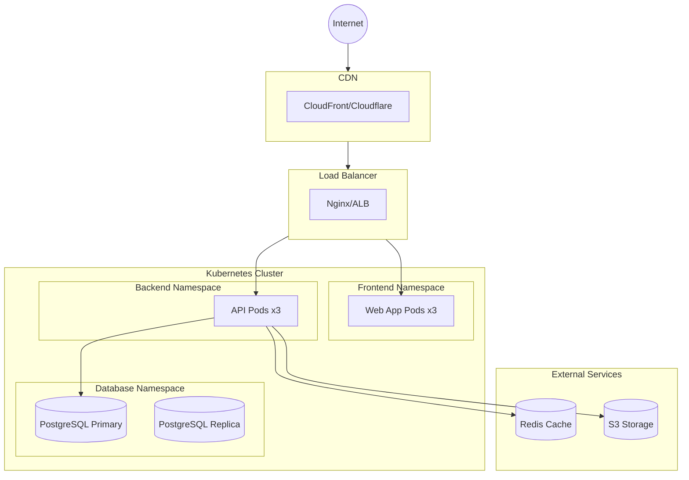
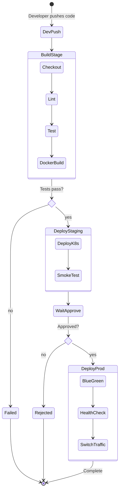

// turbo-all

# Workflow: Quality, Security & Deployment

## Agent Behavior

When executing this workflow, the agent MUST:
- Use `api-testing-specialist` and `playwright-specialist` skills for test planning
- Use `senior-cybersecurity-engineer` for STRIDE threat modeling
- Use `database-modeling-specialist` for ERD using **Mermaid syntax only**
- Use `senior-devops-engineer` and `github-actions-specialist` for CI/CD
- Generate all 6 output files to `sdlc/04-quality-security-deployment/`
- Use Mermaid for ALL diagrams (ERD, pipeline, architecture)
- Never skip the accessibility test plan — WCAG compliance is mandatory

## Overview

This workflow covers the Quality & Security phase and Deployment phase. The goal is to ensure reliability and protection of the system, plan data storage, and define the physical environment.

## Output Location

**Base Folder:** `sdlc/04-quality-security-deployment/`

**Output Files:**
- `test-plan.md` - Test Plan and Automation Strategy
- `threat-model.md` - Security Threat Model Document
- `accessibility-test-plan.md` - Accessibility (WCAG) Compliance Plan
- `database-schema.md` - Database Schema with ERD (Mermaid)
- `deployment-architecture.md` - Deployment Architecture and Infrastructure
- `cicd-pipeline.md` - CI/CD Pipeline Configuration

## Prerequisites

- Completed System & Detailed Design (`03_system_detailed_design.md`)
- Technology stack confirmed
- Infrastructure requirements known
- Security compliance requirements identified

---

## Deliverables

### Phase 1: Quality & Security

#### 1. Test Plan & Automation Strategy

**Description:** Defining how the system will be verified and validated.

**Recommended Skills:** `api-testing-specialist`, `playwright-specialist`

**Instructions:**
1. Define test pyramid:
   - Unit tests (70%)
   - Integration tests (20%)
   - E2E tests (10%)
2. Create test plan with:
   - Test scope and objectives
   - Testing types (functional, performance, security, usability)
   - Test environments
   - Entry/exit criteria
   - Resource requirements
   - Schedule and milestones
3. Design automation framework:
   - Test runner selection
   - CI/CD integration
   - Reporting and metrics
   - Test data management
4. Define test case structure

**Output Format:**
```markdown
# Test Plan

## 1. Test Strategy
### Scope
- In Scope: [Features to test]
- Out of Scope: [Features not tested]

### Testing Types
- Unit Testing: Jest/Vitest
- Integration Testing: Supertest
- E2E Testing: Playwright/Cypress
- Performance Testing: k6/Artillery
- Security Testing: OWASP ZAP

### Test Environments
- Development: [URL]
- Staging: [URL]
- Production: [URL]

## 2. Test Cases

### TC-001: [Test Case Name]
**Objective:** [What is being tested]
**Preconditions:** [Setup required]
**Steps:**
1. [Step 1]
2. [Step 2]
**Expected Result:** [Expected outcome]
**Priority:** High/Medium/Low
**Automation:** Yes/No

## 3. Automation Framework
### Tools
- **Unit:** Jest with 80% coverage target
- **API:** Postman/Newman or custom framework
- **E2E:** Playwright with parallel execution
- **Visual:** Chromatic/Storybook

### CI/CD Integration
- Pre-commit hooks
- PR checks (lint, test, build)
- Nightly regression suite
- Production smoke tests

## 4. Success Criteria
- Unit test coverage ≥ 80%
- All critical paths have E2E coverage
- Zero high/critical defects in production
- Performance benchmarks met
```

---

#### 2. Security Threat Modeling

**Description:** Identifying potential security risks and mitigation plans.

**Recommended Skills:** `senior-cybersecurity-engineer`, `senior-api-security-specialist`

**Instructions:**
1. Create data flow diagram (DFD)
2. Identify trust boundaries
3. Apply STRIDE methodology:
   - Spoofing
   - Tampering
   - Repudiation
   - Information Disclosure
   - Denial of Service
   - Elevation of Privilege
4. Document threats with:
   - Threat description
   - Risk rating (DREAD model)
   - Mitigation strategy
   - Implementation status
5. Define security controls:
   - Authentication & authorization
   - Input validation
   - Output encoding
   - Cryptography
   - Session management
   - Error handling

**Output Format:**
```markdown
# Threat Model Document

## 1. System Overview
[Description of system and data flows]

## 2. Data Flow Diagram
[Mermaid flowchart representation]

## 3. Threat Inventory

### Threat 1: SQL Injection
**Category:** Tampering
**Description:** Attacker injects malicious SQL through input fields
**DREAD Score:** 8/10

**Mitigation:**
- Use parameterized queries
- Input validation
- ORM framework
- WAF rules

**Status:** Mitigated

## 4. Security Controls

### Authentication
- OAuth 2.0 / OpenID Connect
- JWT tokens with short expiry
- MFA for admin users

### Authorization
- RBAC (Role-Based Access Control)
- Principle of least privilege
- API scope validation

### Data Protection
- Encryption at rest (AES-256)
- Encryption in transit (TLS 1.3)
- Sensitive data masking in logs

## 5. Security Testing Plan
- SAST tools (SonarQube, CodeQL)
- DAST scans (OWASP ZAP)
- Dependency scanning (Snyk, Dependabot)
- Penetration testing schedule
```

---

#### 3. Accessibility Testing (WCAG Compliance)

**Description:** Ensuring the application is accessible to all users, including those with disabilities.

**Recommended Skills:** `accessibility-specialist`, `senior-quality-assurance-engineer`

**Instructions:**
1. Define WCAG compliance target (AA or AAA)
2. Create automated accessibility test suite
3. Define manual testing procedures
4. Document assistive technology compatibility
5. Establish accessibility review process for new features

**Output Format:**
```markdown
# Accessibility Test Plan

## 1. Compliance Target
**Standard:** WCAG 2.1 Level AA

## 2. Automated Testing

### Tools
| Tool | Purpose | CI/CD Integration |
|------|---------|-------------------|
| axe-core | DOM analysis | ✅ Jest/Playwright plugin |
| Lighthouse | Audit scoring | ✅ CLI in pipeline |
| pa11y | Page scanning | ✅ CLI / Dashboard |
| ESLint a11y | Static analysis | ✅ Pre-commit hook |

### CI/CD Integration
```bash
npx playwright test --project=accessibility
npx pa11y https://staging.example.com --standard WCAG2AA
```

## 3. Manual Testing Procedures

### Keyboard Navigation
- [ ] All interactive elements reachable via Tab
- [ ] Focus indicator visible on all elements
- [ ] Escape closes modals/dropdowns

### Screen Reader Testing
| Screen Reader | Browser | OS |
|---|---|---|
| NVDA | Chrome/Firefox | Windows |
| VoiceOver | Safari | macOS/iOS |
| TalkBack | Chrome | Android |

## 4. Success Criteria
- Automated scan score ≥ 95% (axe-core)
- Lighthouse accessibility score ≥ 90
- Zero critical/high a11y defects
```

---

### Phase 2: Data & Deployment

#### 4. Database Schema (ERD)

**Description:** Logical and physical database structure and relationships.

**Recommended Skills:** `database-modeling-specialist`, `senior-database-engineer-sql`

**Instructions:**
1. Design logical ERD using Mermaid
2. Define relationships (1:1, 1:N, M:N)
3. Document tables with column definitions
4. Create migration strategy

**Output Format (Mermaid ONLY):**
```mermaid
erDiagram
    users {
        UUID id PK
        VARCHAR(255) email UK
        VARCHAR(255) password_hash
        TIMESTAMP created_at
        TIMESTAMP updated_at
    }

    orders {
        UUID id PK
        UUID user_id FK
        DECIMAL(10,2) total_amount
        VARCHAR(50) status
        TIMESTAMP created_at
    }

    order_items {
        UUID id PK
        UUID order_id FK
        UUID product_id FK
        INTEGER quantity
        DECIMAL(10,2) price
    }

    users ||--o{ orders : "places"
    orders ||--|{ order_items : "contains"
```

---

#### 5. Deployment Architecture

**Description:** Physical hosting infrastructure and network configuration.

**Recommended Skills:** `senior-devops-engineer`, `senior-cloud-architect`

**Instructions:**
1. Design infrastructure architecture using Mermaid
2. Define deployment model (containerization, orchestration)
3. Document environment separation (dev/staging/prod)
4. Include monitoring and logging infrastructure

**Output Format (Mermaid ONLY):**

```mermaid
flowchart TD
    Internet((Internet))

    subgraph CDN [CDN]
        CloudFront[CloudFront/Cloudflare]
    end

    subgraph LB [Load Balancer]
        Nginx[Nginx/ALB]
    end

    subgraph K8s [Kubernetes Cluster]
        subgraph Frontend [Frontend Namespace]
            WebApp[Web App Pods x3]
        end
        subgraph Backend [Backend Namespace]
            API[API Pods x3]
        end
        subgraph DB [Database Namespace]
            PgPrimary[(PostgreSQL Primary)]
            PgReplica[(PostgreSQL Replica)]
        end
    end

    subgraph External [External Services]
        Redis[(Redis Cache)]
        S3[(S3 Storage)]
    end

    Internet --> CDN --> LB
    LB --> WebApp
    LB --> API
    API --> PgPrimary
    API --> Redis
    API --> S3
```

---

#### 6. CI/CD Pipeline

**Description:** Automated build, test, and deployment process.

**Recommended Skills:** `github-actions-specialist`, `senior-devops-engineer`

**Instructions:**
1. Define pipeline stages (build → test → staging → prod)
2. Design workflow with branch protection and PR checks
3. Configure deployment strategies (blue-green, canary)
4. Document rollback procedures

**Pipeline Diagram (Mermaid):**

```mermaid
stateDiagram-v2
    [*] --> DevPush: Developer pushes code
    DevPush --> BuildStage

    state BuildStage {
        Checkout --> Lint
        Lint --> Test
        Test --> DockerBuild
    }

    state ifTests <<choice>>
    BuildStage --> ifTests: Tests pass?
    ifTests --> DeployStaging: yes
    ifTests --> Failed: no

    state DeployStaging {
        DeployK8s --> SmokeTest
    }

    DeployStaging --> WaitApprove
    state ifApprove <<choice>>
    WaitApprove --> ifApprove: Approved?
    ifApprove --> DeployProd: yes
    ifApprove --> Rejected: no

    state DeployProd {
        BlueGreen --> HealthCheck
        HealthCheck --> SwitchTraffic
    }

    DeployProd --> [*]: Complete
    Failed --> [*]
    Rejected --> [*]
```

**GitHub Actions Template:** `.github/workflows/ci-cd.yml`
```yaml
name: CI/CD Pipeline

on:
  push:
    branches: [main, develop]
  pull_request:
    branches: [main, develop]

jobs:
  build-test:
    runs-on: ubuntu-latest
    steps:
      - uses: actions/checkout@v4
      - uses: actions/setup-node@v4
        with:
          node-version: '20'
          cache: 'npm'
      - run: npm ci
      - run: npm run lint
      - run: npm run test:unit -- --coverage
      - run: npm run build
      - run: docker build -t myapp:${{ github.sha }} .

  deploy-staging:
    needs: build-test
    runs-on: ubuntu-latest
    environment: staging
    steps:
      - name: Deploy to Kubernetes
        run: |
          kubectl set image deployment/myapp myapp=myapp:${{ github.sha }}
          kubectl rollout status deployment/myapp

  deploy-production:
    needs: deploy-staging
    runs-on: ubuntu-latest
    environment: production
    steps:
      - name: Deploy to Production
        run: |
          kubectl set image deployment/myapp myapp=myapp:${{ github.sha }}
          kubectl rollout status deployment/myapp
```

**Performance Testing Plan:**
```markdown
# Performance Test Plan

## Test Scenarios

### Normal Load
- VUs: 100 | Duration: 10m | Target: p95 < 500ms, error < 0.1%

### Peak Load
- VUs: 500 | Duration: 5m | Target: p95 < 2s, error < 1%

### Stress Test
- VUs: Ramp 100 → 1000 → 100 | Duration: 15m

## k6 Script
```javascript
import http from 'k6/http';
import { check, sleep } from 'k6';

export const options = {
  stages: [
    { duration: '30s', target: 100 },
    { duration: '5m', target: 100 },
    { duration: '30s', target: 0 },
  ],
  thresholds: {
    http_req_duration: ['p(95)<500'],
    http_req_failed: ['rate<0.01'],
  },
};

export default function () {
  const res = http.get('http://localhost:8080/api/v1/products');
  check(res, { 'status is 200': (r) => r.status === 200 });
  sleep(1);
}
```

## Acceptance Criteria
| Metric | Target |
|--------|--------|
| Response time (p95) | < 500ms |
| Error rate | < 0.1% |
| Throughput | > 500 RPS |
```

---

## Workflow Steps

1. **Quality Planning** (API Testing Specialist, Playwright Specialist)
   - Define testing strategy
   - Create test plan document
   - Design automation framework

2. **Security Analysis** (Senior Cybersecurity Engineer, API Security Specialist)
   - Conduct threat modeling (STRIDE)
   - Create threat inventory
   - Define security controls

3. **Accessibility Planning** (Accessibility Specialist)
   - Set WCAG compliance target
   - Create automated + manual test procedures
   - Integrate axe-core in CI/CD

4. **Database Design** (Database Modeling Specialist)
   - Design Mermaid ERD
   - Document table definitions
   - Plan migration strategy

5. **Infrastructure Design** (Senior DevOps Engineer, Cloud Architect)
   - Design deployment architecture (Mermaid)
   - Select cloud services
   - Plan scaling strategy

6. **CI/CD Implementation** (GitHub Actions Specialist)
   - Create pipeline workflows
   - Configure environments
   - Set up deployment automation

---

## Workflow Validation Checklist

### Pre-Execution
- [ ] System & Detailed Design completed (`03_system_detailed_design.md`)
- [ ] Technology stack confirmed
- [ ] Infrastructure requirements known
- [ ] Security compliance requirements identified
- [ ] Output folder structure created: `sdlc/04-quality-security-deployment/`

### During Execution
- [ ] Test Plan created with automation strategy
- [ ] Test pyramid defined (Unit 70%, Integration 20%, E2E 10%)
- [ ] Threat Model created using STRIDE methodology
- [ ] Security controls documented
- [ ] Accessibility Test Plan created (WCAG 2.1 AA)
- [ ] Automated a11y testing integrated in CI/CD
- [ ] Database Schema designed (ERD in Mermaid)
- [ ] Table definitions documented
- [ ] Migration strategy planned
- [ ] Performance Testing Plan created
- [ ] CI/CD Pipeline workflow created
- [ ] Deployment strategies documented (Blue-Green, Canary)
- [ ] Rollback procedures defined

### Post-Execution
- [ ] All tests passing in pipeline
- [ ] Accessibility audit completed (axe-core ≥ 95%, Lighthouse ≥ 90)
- [ ] CI/CD pipeline tested end-to-end
- [ ] Deployment to staging successful
- [ ] Rollback procedure tested
- [ ] Documents reviewed with QA and Security teams

---

## Success Criteria
- Test plan covers all critical paths
- Security threats identified with STRIDE and mitigated
- WCAG 2.1 AA compliance verified
- Database schema is normalized and performant
- Deployment architecture supports scalability
- CI/CD pipeline automates full deployment process
- Rollback procedures documented and tested

## Tools & Resources
- Testing: Jest, Playwright, Postman, k6
- Security: OWASP, SonarQube, Snyk
- Accessibility: axe-core, Lighthouse, pa11y
- Database: PostgreSQL, Redis, Prisma/TypeORM
- Infrastructure: Docker, Kubernetes, Terraform
- CI/CD: GitHub Actions, GitLab CI, Jenkins

---

## Cross-References

- **Previous Phase** → `03_system_detailed_design.md`
- **Related (parallel)** → `06_data_modeling_estimation.md` (Detailed ERD)
- **Next Phase** → `05_maintenance_operations.md` (Monitoring post-deploy)
- **Handoff & Acceptance** → `07_project_handoff.md`
- **SDLC Mapping** → `../../other/sdlc/SDLC_MAPPING.md`
