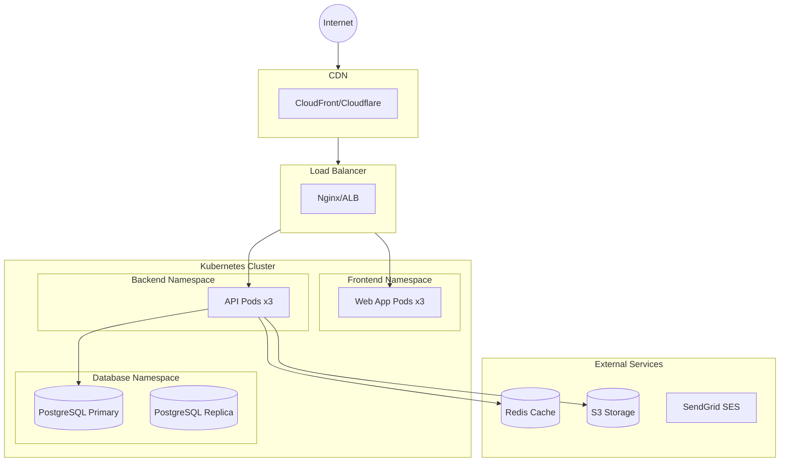

# Workflow: Quality, Security & Deployment (Part 1/2)

> **Navigation:** This workflow is split into 2 parts.

## Overview
This workflow covers the Quality & Security phase and Data & Deployment phase. The goal is to ensure reliability and protection of the system, and plan data storage and physical environment.


## Output Location
**Base Folder:** `sdlc/04-quality-security-deployment/`

**Output Files:**
- `test-plan.md` - Test Plan and Automation Strategy
- `threat-model.md` - Security Threat Model Document
- `accessibility-test-plan.md` - Accessibility (WCAG) Compliance Plan
- `database-schema.md` - Database Schema with ERD (Mermaid)
- `deployment-architecture.md` - Deployment Architecture and Infrastructure
- `cicd-pipeline.md` - CI/CD Pipeline Configuration


## Prerequisites
- Completed System & Detailed Design
- Technology stack confirmed
- Infrastructure requirements known
- Security compliance requirements identified


## Deliverables

### Phase 1: Quality & Security

#### 1. Test Plan & Automation Strategy

**Description:** Defining how the system will be verified and validated.

**Recommended Skills:** `api-testing-specialist`, `playwright-specialist`

**Instructions:**
1. Define test pyramid:
   - Unit tests (70%)
   - Integration tests (20%)
   - E2E tests (10%)
2. Create test plan with:
   - Test scope and objectives
   - Testing types (functional, performance, security, usability)
   - Test environments
   - Entry/exit criteria
   - Resource requirements
   - Schedule and milestones
3. Design automation framework:
   - Test runner selection
   - CI/CD integration
   - Reporting and metrics
   - Test data management
4. Define test case structure

**Output Format:**
```markdown
# Test Plan


## 1. Test Strategy
### Scope
- In Scope: [Features to test]
- Out of Scope: [Features not tested]

### Testing Types
- Unit Testing: Jest/Vitest
- Integration Testing: Supertest
- E2E Testing: Playwright/Cypress
- Performance Testing: k6/Artillery
- Security Testing: OWASP ZAP

### Test Environments
- Development: [URL]
- Staging: [URL]
- Production: [URL]


## 2. Test Cases

### TC-001: [Test Case Name]
**Objective:** [What is being tested]
**Preconditions:** [Setup required]
**Steps:**
1. [Step 1]
2. [Step 2]
**Expected Result:** [Expected outcome]
**Priority:** High/Medium/Low
**Automation:** Yes/No


## 3. Automation Framework
### Tools
- **Unit:** Jest with 80% coverage target
- **API:** Postman/Newman or custom framework
- **E2E:** Playwright with parallel execution
- **Visual:** Chromatic/Storybook

### CI/CD Integration
- Pre-commit hooks
- PR checks (lint, test, build)
- Nightly regression suite
- Production smoke tests


## 4. Success Criteria
- Unit test coverage ≥ 80%
- All critical paths have E2E coverage
- Zero high/critical defects in production
- Performance benchmarks met
```

---

#### 2. Security Threat Modeling

**Description:** Identifying potential security risks and mitigation plans.

**Recommended Skills:** `senior-cybersecurity-engineer`, `senior-api-security-specialist`

**Instructions:**
1. Create data flow diagram (DFD)
2. Identify trust boundaries
3. Apply STRIDE methodology:
   - Spoofing
   - Tampering
   - Repudiation
   - Information Disclosure
   - Denial of Service
   - Elevation of Privilege
4. Document threats with:
   - Threat description
   - Risk rating (DREAD model)
   - Mitigation strategy
   - Implementation status
5. Define security controls:
   - Authentication & authorization
   - Input validation
   - Output encoding
   - Cryptography
   - Session management
   - Error handling

**Output Format:**
```markdown
# Threat Model Document


## 1. System Overview
[Description of system and data flows]


## 2. Data Flow Diagram
[Mermaid or textual representation of data flow]


## 3. Threat Inventory

### Threat 1: SQL Injection
**Category:** Tampering
**Description:** Attacker injects malicious SQL through input fields
**DREAD Score:** 8/10
- Damage: 3
- Reproducibility: 3
- Exploitability: 2
- Affected Users: 3
- Discoverability: 3

**Mitigation:**
- Use parameterized queries
- Input validation
- ORM framework
- WAF rules

**Status:** Mitigated


## 4. Security Controls

### Authentication
- OAuth 2.0 / OpenID Connect
- JWT tokens with short expiry
- MFA for admin users

### Authorization
- RBAC (Role-Based Access Control)
- Principle of least privilege
- API scope validation

### Data Protection
- Encryption at rest (AES-256)
- Encryption in transit (TLS 1.3)
- Sensitive data masking in logs

### Input Validation
- Whitelist validation
- Content Security Policy
- Anti-CSRF tokens


## 5. Security Testing Plan
- SAST tools (SonarQube, CodeQL)
- DAST scans (OWASP ZAP)
- Dependency scanning (Snyk, Dependabot)
- Penetration testing schedule
```

---

#### 3. Accessibility Testing (WCAG Compliance)

**Description:** Ensuring the application is accessible to all users, including those with disabilities.

**Recommended Skills:** `accessibility-specialist`, `senior-quality-assurance-engineer`

**Instructions:**
1. Define WCAG compliance target (AA or AAA)
2. Create automated accessibility test suite
3. Define manual testing procedures
4. Document assistive technology compatibility
5. Establish accessibility review process for new features

**Output Format:**
```markdown
# Accessibility Test Plan

## 1. Compliance Target
**Standard:** WCAG 2.1 Level AA
**Legal Requirements:** [ADA, Section 508, EN 301 549, etc.]

## 2. Automated Testing

### Tools
| Tool | Purpose | CI/CD Integration |
|------|---------|-------------------|
| axe-core | DOM analysis | ✅ Jest/Playwright plugin |
| Lighthouse | Audit scoring | ✅ CLI in pipeline |
| pa11y | Page scanning | ✅ CLI / Dashboard |
| ESLint a11y | Static analysis | ✅ Pre-commit hook |

### Automated Checks
- [ ] All images have alt text (1.1.1)
- [ ] Color contrast ratio ≥ 4.5:1 for text (1.4.3)
- [ ] Color contrast ratio ≥ 3:1 for large text (1.4.3)
- [ ] Form inputs have associated labels (1.3.1)
- [ ] Focus order is logical (2.4.3)
- [ ] ARIA roles are correct (4.1.2)
- [ ] No keyboard traps (2.1.2)
- [ ] Page has lang attribute (3.1.1)
- [ ] Skip navigation link present (2.4.1)

### CI/CD Integration
```bash
# Example: Playwright + axe-core
npx playwright test --project=accessibility
# Example: pa11y in pipeline
npx pa11y https://staging.example.com --standard WCAG2AA
```

## 3. Manual Testing Procedures

### Keyboard Navigation
- [ ] All interactive elements reachable via Tab
- [ ] Tab order follows visual layout
- [ ] Focus indicator visible on all elements
- [ ] Escape closes modals/dropdowns
- [ ] Enter/Space activates buttons and links

### Screen Reader Testing
| Screen Reader | Browser | OS | Tester |
|---------------|---------|-----|--------|
| NVDA | Chrome/Firefox | Windows | [Name] |
| VoiceOver | Safari | macOS/iOS | [Name] |
| TalkBack | Chrome | Android | [Name] |

### Visual Testing
- [ ] Content readable at 200% zoom
- [ ] No horizontal scrolling at 320px viewport
- [ ] Animations respect prefers-reduced-motion
- [ ] Information not conveyed by color alone
- [ ] Text spacing adjustable without content loss

## 4. Accessibility Checklist per Component

| Component | Keyboard | Screen Reader | Contrast | Focus | Status |
|-----------|:--------:|:-------------:|:--------:|:-----:|:------:|
| Navigation | ✅ | ✅ | ✅ | ✅ | ✅ Pass |
| Forms | ✅ | ⚠️ | ✅ | ✅ | 🔄 WIP |
| Modals | ❌ | ❌ | ✅ | ❌ | ❌ Fail |
| Data Tables | ✅ | ✅ | ✅ | ✅ | ✅ Pass |

## 5. Remediation Process
1. Log accessibility issue with WCAG criterion reference
2. Assign severity (Critical/High/Medium/Low)
3. Fix and verify with automated + manual testing
4. Document in accessibility compliance report

## 6. Success Criteria
- Automated scan score ≥ 95% (axe-core)
- Lighthouse accessibility score ≥ 90
- Zero critical/high a11y defects
- All key flows usable with keyboard only
- All key flows usable with screen reader
```

---

### Phase 2: Data & Deployment

#### 4. Database Schema (ERD)

**Description:** Logical and physical database structure and relationships.

**Recommended Skills:** `database-modeling-specialist`, `senior-database-engineer-sql`

**Instructions:**
1. Design logical ERD:
   - Entities and attributes
   - Primary and foreign keys
   - Relationships (1:1, 1:N, M:N)
   - Cardinality and optionality
2. Design physical schema:
   - Data types and constraints
   - Indexes for performance
   - Partitioning strategy
   - Normalization level
3. Document tables:
   - Table purpose
   - Column definitions
   - Constraints and defaults
   - Indexes
4. Create migration strategy

**Output Format:**
```markdown
# Database Schema Design


## Entity Relationship Diagram

```mermaid
erDiagram
    users {
        UUID id PK
        VARCHAR(255) email UK
        VARCHAR(255) password_hash
        TIMESTAMP created_at
        TIMESTAMP updated_at
    }

    orders {
        UUID id PK
        UUID user_id FK
        DECIMAL(10,2) total_amount
        VARCHAR(50) status
        TIMESTAMP created_at
    }

    order_items {
        UUID id PK
        UUID order_id FK
        UUID product_id FK
        INTEGER quantity
        DECIMAL(10,2) price
    }

    users ||--o{ orders : "places"
    orders ||--|{ order_items : "contains"
```


## Table Definitions

### users
**Purpose:** Store user account information

| Column | Type | Constraints | Description |
|--------|------|-------------|-------------|
| id | UUID | PRIMARY KEY | Unique identifier |
| email | VARCHAR(255) | NOT NULL, UNIQUE | User email address |
| password_hash | VARCHAR(255) | NOT NULL | Bcrypt hashed password |
| created_at | TIMESTAMP | DEFAULT NOW() | Account creation time |
| updated_at | TIMESTAMP | - | Last update time |

**Indexes:**
- PRIMARY KEY (id)
- UNIQUE INDEX (email)


## Migration Strategy
1. Create baseline migration
2. Use version control for schema changes
3. Implement backward-compatible migrations
4. Test migrations on staging environment
```

---

#### 5. Deployment Diagram

**Description:** Physical hosting infrastructure and network configuration.

**Recommended Skills:** `senior-devops-engineer`, `senior-cloud-architect`

**Instructions:**
1. Design infrastructure architecture:
   - Compute resources
   - Storage solutions
   - Network topology
   - Load balancing
2. Define deployment model:
   - Containerization strategy
   - Orchestration platform
   - Service mesh (if applicable)
3. Document environment separation:
   - Development
   - Staging
   - Production
4. Include monitoring and logging infrastructure

**Output Format:**
```markdown
# Deployment Architecture


## Infrastructure Overview




## Infrastructure Components

### Compute
- **Platform:** Kubernetes (EKS/GKE/AKS)
- **Node Pool:** 3 nodes minimum, autoscaling enabled
- **Instance Type:** t3.medium (adjust based on load)

### Storage
- **Database:** PostgreSQL 15 with read replicas
- **Cache:** Redis Cluster
- **Object Storage:** S3-compatible storage
- **Persistent Volumes:** EBS/GCP Persistent Disk

### Networking
- **VPC with private subnets**
- **NAT Gateway for outbound traffic**
- **Security Groups / Firewall rules**
- **PrivateLink / VPC Peering for external services**

### High Availability
- Multi-AZ deployment
- Auto-scaling groups
- Database failover
- Circuit breakers in application


## Environment Configuration

### Production
- Region: [Primary region]
- DR Region: [Secondary region]
- RTO: 4 hours
- RPO: 1 hour

### Staging
- Mirror production configuration
- Reduced resources (50% scale)

### Development
- Single node cluster
- Local development with Docker Compose
```

---

#### 6. CI/CD Pipeline Workflow

**Description:** Automated build, test, and deployment process.

**Recommended Skills:** `github-actions-specialist`, `senior-devops-engineer`

**Instructions:**
1. Define pipeline stages:
   - Source (commit/PR trigger)
   - Build (compile, package)
   - Test (unit, integration, security scans)
   - Staging deployment
   - Production deployment (with approval)
2. Design workflow:
   - Branch protection rules
   - PR validation checks
   - Automated testing
   - Deployment strategies (blue-green, canary)
3. Configure notifications
4. Document rollback procedures

**Output Format:**
```markdown
# CI/CD Pipeline Design


## Pipeline Overview

```mermaid
stateDiagram-v2
    [*] --> DevPush: Developer pushes code
    DevPush --> GithubActions: GitHub Actions triggered
    
    state BuildStage {
        Checkout --> InstallDeps: Checkout code
        InstallDeps --> Lint: Install dependencies
        Lint --> Compile: Run linting
        Compile --> Docker: Compile/build
        Docker --> PushRegistry: Build Docker image
    }
    
    GithubActions --> BuildStage
    
    state TestStage {
        UnitTests --> Integration: Unit tests
        Integration --> Sast: Integration tests
        Sast --> DepCheck: Security scan (SAST)
        DepCheck --> CodeCov: Dependency check
    }
    
    BuildStage --> TestStage
    
    state if_tests <<choice>>
    TestStage --> if_tests: All tests pass?
    
    if_tests --> DeployStaging: yes
    if_tests --> Failed: no
    
    state DeployStaging {
        DeployK8s --> SmokeTest: Deploy to staging cluster
        SmokeTest --> PerfTest: Run smoke tests
    }
    
    DeployStaging --> WaitApprove: Wait for approval
    
    state if_approve <<choice>>
    WaitApprove --> if_approve: Approved?
    
    if_approve --> DeployProd: yes
    if_approve --> Rejected: no
    
    state DeployProd {
        BlueGreen --> HealthCheck: Blue-Green deployment
        HealthCheck --> SwitchTraf: Health checks
        SwitchTraf --> Metrics: Switch traffic
    }
    
    DeployProd --> Complete: Deployment complete
    Complete --> [*]
    
    Rejected --> [*]: Deployment rejected
    Failed --> Notify: Pipeline failed
    Notify --> [*]: Notify team
```



---

## Workflow Validation Checklist

### Pre-Execution
- [ ] System & Detailed Design completed (`03_system_detailed_design.md`)
- [ ] Technology stack confirmed
- [ ] Infrastructure requirements known
- [ ] Security compliance requirements identified
- [ ] Output folder structure created: `sdlc/04-quality-security-deployment/`

### During Execution
- [ ] Accessibility Test Plan created (WCAG 2.1 AA)
- [ ] Automated a11y testing integrated in CI/CD
- [ ] Test Plan created with automation strategy
- [ ] Test pyramid defined (Unit 70%, Integration 20%, E2E 10%)
- [ ] Threat Model created using STRIDE methodology
- [ ] Security controls documented
- [ ] Database Schema designed (ERD in Mermaid)
- [ ] Table definitions documented
- [ ] Migration strategy planned

### Post-Execution
- [ ] Accessibility compliance verified (axe-core ≥ 95%, Lighthouse ≥ 90)
- [ ] Test plan covers all critical paths
- [ ] Security threats identified with mitigations
- [ ] Database schema is normalized and performant
- [ ] Migration scripts tested on staging
- [ ] Documents reviewed with QA and Security teams

---

## Cross-References

- **Previous Phase** → `03_system_detailed_design.md`
- **Next Phase (Part 2)** → `04_quality_security_deployment_part2.md`
- **Related** → `05_maintenance_operations.md` (Monitoring post-deploy)
- **Data Modeling** → `06_data_modeling_estimation.md` (Detailed ERD)
- **SDLC Mapping** → `../../other/sdlc/SDLC_MAPPING.md`