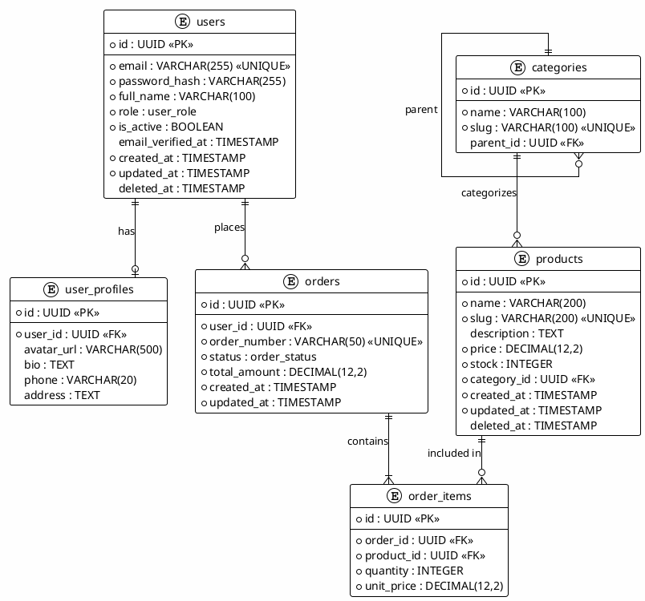

# Workflow: Data Modeling & Estimation (Part 1/2)

> **Navigation:** This workflow is split into 2 parts.

## Overview
This workflow covers comprehensive data modeling and project estimation.
The goal is to design a robust data layer and create realistic project
timelines, ensuring data integrity, performance, and accurate resource
planning.

**IMPORTANT: All ERD diagrams MUST use PlantUML syntax (.puml format).
DO NOT use Mermaid diagrams.**


## Output Location
**Base Folder:** `sdlc/06-data-modeling-estimation/`

**Output Files:**
- `data-dictionary.md` - Complete Data Dictionary
- `erd-diagram.puml` - Entity Relationship Diagram (PlantUML)
- `migration-plan.md` - Migration Strategy & Scripts
- `project-estimation.md` - Project Estimation & Timeline


## Prerequisites
- Completed Requirement Analysis (`01`)
- System architecture decided (`03`)
- Technology stack confirmed
- Business domain understood


## Deliverables

### 1. Data Dictionary

**Description:** Comprehensive reference of all data entities, fields,
types, constraints, and business rules.

**Recommended Skills:** `database-modeling-specialist`,
`senior-database-engineer-sql`

**Instructions:**
1. List all entities from the domain model
2. For each entity, document:
   - Entity name and purpose
   - All fields with data types
   - Constraints (NOT NULL, UNIQUE, CHECK, DEFAULT)
   - Foreign key references
   - Business rules and validation
3. Define enumeration types
4. Document soft-delete vs hard-delete strategy
5. Define audit fields (created_at, updated_at, deleted_at)

**Output Format:**
```markdown
# Data Dictionary


## Entity: users
**Purpose:** Store user account information and authentication data.

| # | Column | Type | Nullable | Default | Constraints | Description |
|---|--------|------|----------|---------|-------------|-------------|
| 1 | id | UUID | NO | gen_random_uuid() | PRIMARY KEY | Unique ID |
| 2 | email | VARCHAR(255) | NO | - | UNIQUE | Login email |
| 3 | password_hash | VARCHAR(255) | NO | - | - | Bcrypt hash |
| 4 | full_name | VARCHAR(100) | NO | - | - | Display name |
| 5 | role | user_role | NO | 'user' | - | User role |
| 6 | is_active | BOOLEAN | NO | true | - | Account status |
| 7 | email_verified_at | TIMESTAMP | YES | NULL | - | Verification time |
| 8 | created_at | TIMESTAMP | NO | NOW() | - | Creation time |
| 9 | updated_at | TIMESTAMP | NO | NOW() | - | Last update |
| 10 | deleted_at | TIMESTAMP | YES | NULL | - | Soft-delete marker |

**Indexes:**
- `idx_users_email` UNIQUE (email)
- `idx_users_role` BTREE (role)
- `idx_users_deleted_at` BTREE (deleted_at) WHERE deleted_at IS NULL

**Business Rules:**
- Email must be unique across active users
- Password minimum 8 characters, hashed with bcrypt (cost ≥ 12)
- Soft-delete: set deleted_at instead of removing record


## Enumeration Types

### user_role
| Value | Description |
|-------|-------------|
| admin | Full system access |
| user | Standard user |
| moderator | Content moderation |


## Audit Fields Convention
All tables include:
- `created_at TIMESTAMP NOT NULL DEFAULT NOW()`
- `updated_at TIMESTAMP NOT NULL DEFAULT NOW()`
- `deleted_at TIMESTAMP NULL` (for soft-delete tables)
```

---

### 2. Entity Relationship Diagram (ERD)

**Description:** Visual representation of all entities and their
relationships.

**Recommended Skills:** `database-modeling-specialist`, `uml-specialist`

**Instructions:**
1. Create logical ERD showing all entities
2. Define relationship types:
   - One-to-One (1:1)
   - One-to-Many (1:N)
   - Many-to-Many (M:N) with junction tables
3. Show primary and foreign keys
4. Include cardinality notation
5. Group related entities by domain/module

**Output Format (PlantUML ONLY):**


---

### 3. Data Migration Plan

**Description:** Strategy for database schema versioning, migration
execution, and rollback procedures.

**Recommended Skills:** `database-modeling-specialist`,
`senior-devops-engineer`

**Instructions:**
1. Define migration tool and conventions
2. Create naming convention for migration files
3. Document migration workflow (create → test → apply → verify)
4. Define rollback procedures
5. Plan data seeding for development and testing
6. Document CI/CD integration for migrations

**Output Format:**
```markdown
# Data Migration Plan


## Migration Tool
- **Tool:** golang-migrate / Prisma Migrate / Flyway
- **Location:** `db/migrations/`


## Naming Convention
```
YYYYMMDDHHMMSS_description.up.sql
YYYYMMDDHHMMSS_description.down.sql
```

Example:
```
20240115100000_create_users_table.up.sql
20240115100000_create_users_table.down.sql
20240115100100_create_products_table.up.sql
20240115100100_create_products_table.down.sql
```


## Migration Workflow

### Creating a New Migration
1. Generate migration file:
   ```bash
   migrate create -ext sql -dir db/migrations -seq <name>
   ```
2. Write UP migration (create/alter)
3. Write corresponding DOWN migration (drop/revert)
4. Test locally against dev database
5. Peer review migration SQL
6. Apply to staging
7. Verify data integrity
8. Apply to production

### Rollback Procedure
1. Identify failed migration version
2. Run DOWN migration:
   ```bash
   migrate -path db/migrations -database "$DATABASE_URL" down 1
   ```
3. Verify rollback success
4. Fix migration script
5. Retry from step 1 of creation flow


## CI/CD Integration
- Migrations run automatically in CI pipeline
- Staging: auto-apply on merge to develop
- Production: manual approval gate
- Always test DOWN migration in staging


## Baseline Migration Example

```sql
-- 20240115100000_create_users_table.up.sql
CREATE TYPE user_role AS ENUM ('admin', 'user', 'moderator');

CREATE TABLE users (
    id UUID PRIMARY KEY DEFAULT gen_random_uuid(),
    email VARCHAR(255) NOT NULL,
    password_hash VARCHAR(255) NOT NULL,
    full_name VARCHAR(100) NOT NULL,
    role user_role NOT NULL DEFAULT 'user',
    is_active BOOLEAN NOT NULL DEFAULT true,
    email_verified_at TIMESTAMP,
    created_at TIMESTAMP NOT NULL DEFAULT NOW(),
    updated_at TIMESTAMP NOT NULL DEFAULT NOW(),
    deleted_at TIMESTAMP,
    CONSTRAINT uq_users_email UNIQUE (email)
);

CREATE INDEX idx_users_email ON users (email);
CREATE INDEX idx_users_role ON users (role);
CREATE INDEX idx_users_active ON users (deleted_at)
    WHERE deleted_at IS NULL;

-- Trigger for updated_at
CREATE OR REPLACE FUNCTION update_modified_column()
RETURNS TRIGGER AS $$
BEGIN
    NEW.updated_at = NOW();
    RETURN NEW;
END;
$$ LANGUAGE plpgsql;

CREATE TRIGGER set_updated_at
    BEFORE UPDATE ON users
    FOR EACH ROW
    EXECUTE FUNCTION update_modified_column();
```

```sql
-- 20240115100000_create_users_table.down.sql
DROP TRIGGER IF EXISTS set_updated_at ON users;
DROP FUNCTION IF EXISTS update_modified_column();
DROP TABLE IF EXISTS users;
DROP TYPE IF EXISTS user_role;
```


## Seed Data

### Development Seeds
```sql
-- db/seeds/dev_seed.sql
INSERT INTO users (email, password_hash, full_name, role) VALUES
('admin@dev.local', '$2a$12$...', 'Admin Dev', 'admin'),
('user@dev.local', '$2a$12$...', 'User Dev', 'user');
```

### Fixture Data (Testing)
```sql
-- db/fixtures/users.sql
-- Deterministic data for reproducible tests
INSERT INTO users (id, email, password_hash, full_name, role) VALUES
('550e8400-e29b-41d4-a716-446655440001',
 'testuser@test.com', '$2a$12$...', 'Test User', 'user'),
('550e8400-e29b-41d4-a716-446655440002',
 'testadmin@test.com', '$2a$12$...', 'Test Admin', 'admin');
```
```

---

### 4. Project Estimation

**Description:** Realistic project timeline, effort estimation, resource
allocation, and risk buffer planning.

**Recommended Skills:** `project-estimator`, `senior-project-manager`

**Instructions:**
1. Break down features into estimable units
2. Apply estimation technique:
   - Story Points (Fibonacci: 1, 2, 3, 5, 8, 13)
   - T-shirt sizing for high-level (S, M, L, XL)
   - Time-based for detailed sprints
3. Calculate velocity assumptions
4. Build timeline with milestones
5. Identify dependencies and critical path
6. Add risk buffer (15-25% of total estimate)
7. Define resource requirements

**Output Format:**
```markdown
# Project Estimation


## Summary
| Item | Value |
|------|-------|
| Total Story Points | 120 SP |
| Team Velocity | 30 SP/sprint |
| Sprint Duration | 2 weeks |
| Estimated Sprints | 4 sprints |
| Risk Buffer | 20% (1 sprint) |
| **Total Duration** | **10 weeks** |


## Feature Breakdown

### Epic 1: User Management (25 SP)
| Story | SP | Priority | Sprint |
|-------|----|---------:|-------:|
| User registration | 5 | Must | 1 |
| Login/logout | 3 | Must | 1 |
| Profile management | 5 | Must | 1 |
| Password reset | 3 | Must | 1 |
| Email verification | 5 | Should | 2 |
| Role management | 3 | Should | 2 |
| Admin user CRUD | 1 | Could | 3 |

### Epic 2: Product Catalog (30 SP)
| Story | SP | Priority | Sprint |
|-------|----|---------:|-------:|
| Product CRUD | 8 | Must | 1 |
| Category management | 5 | Must | 1 |
| Image upload | 5 | Must | 2 |
| Search & filter | 8 | Should | 2 |
| Pagination & sorting | 3 | Must | 2 |
| Product variants | 1 | Could | 3 |

### Epic 3: Order System (35 SP)
| Story | SP | Priority | Sprint |
|-------|----|---------:|-------:|
| Shopping cart | 8 | Must | 2 |
| Checkout flow | 8 | Must | 3 |
| Payment integration | 13 | Must | 3 |
| Order history | 3 | Should | 3 |
| Order status tracking | 3 | Should | 4 |

### Epic 4: Admin & Reporting (30 SP)
| Story | SP | Priority | Sprint |
|-------|----|---------:|-------:|
| Admin dashboard | 8 | Should | 3 |
| Sales reports | 5 | Should | 4 |
| User analytics | 5 | Could | 4 |
| Export to CSV | 3 | Could | 4 |
| Notification system | 5 | Could | 4 |
| Audit logging | 3 | Should | 4 |

