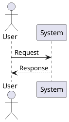

# SDLC-Maker Workflows

Workflows untuk membuat dokumentasi teknis lengkap mengikuti fase **Software Development Life Cycle (SDLC)**. Setiap workflow menghasilkan deliverables yang siap digunakan oleh tim development.

## System Requirements

- Agent dengan skill yang sesuai per fase (lihat tabel di bawah)
- PlantUML renderer untuk diagram (VS Code extension / online editor)
- Markdown editor

## Struktur Workflows

```
workflows/sdlc-maker/
├── 01_requirement_analysis.md          # Analisis kebutuhan & PRD
├── 02_ui_ux_design.md                  # User flow, wireframe, design system
├── 03_system_detailed_design.md        # UML diagrams & API specification
├── 04_quality_security_deployment.md   # Testing, security, CI/CD
├── 05_maintenance_operations.md        # Monitoring, docs, runbooks
├── 06_data_modeling_estimation.md      # Data dictionary, ERD, estimasi
├── 07_project_handoff.md               # Handoff, knowledge transfer, sign-off
└── README.md                           # Dokumentasi ini
```

## Output Folder Structure

```
sdlc/
├── 01-requirement-analysis/
│   ├── functional-requirements.md
│   ├── non-functional-requirements.md
│   └── user-stories-prd.md
│
├── 02-ui-ux-design/
│   ├── user-flow-wireframes.md
│   ├── high-fidelity-mockups.md
│   └── design-system.md
│
├── 03-system-detailed-design/
│   ├── use-case-diagram.puml
│   ├── activity-diagram.puml
│   ├── system-architecture.md
│   ├── class-diagram.puml
│   ├── sequence-diagram.puml
│   └── api-specification.yaml
│
├── 04-quality-security-deployment/
│   ├── test-plan.md
│   ├── threat-model.md
│   ├── database-schema.md
│   ├── deployment-architecture.md
│   └── cicd-pipeline.md
│
├── 05-maintenance-operations/
│   ├── monitoring-setup.md
│   ├── runbooks/
│   └── documentation/
│
├── 06-data-modeling-estimation/
│   ├── data-dictionary.md
│   ├── erd-diagram.puml
│   ├── migration-plan.md
│   └── project-estimation.md
│
└── 07-project-handoff/
    ├── handoff-checklist.md
    ├── knowledge-transfer-plan.md
    └── acceptance-signoff.md
```

## Urutan Penggunaan

### Sequential (Proyek Baru)

```
01 Requirement Analysis
    ↓
02 UI/UX Design
    ↓
03 System & Detailed Design
    ↓
06 Data Modeling & Estimation  ← dapat paralel dengan 03
    ↓
04 Quality, Security & Deployment
    ↓
05 Maintenance & Operations
    ↓
07 Project Handoff
```

### Independent (Per Kebutuhan)

| Workflow | Kapan Digunakan |
|----------|----------------|
| 01 | Memulai proyek baru, validasi scope |
| 02 | Redesign UI, mobile-first project |
| 03 | Arsitektur baru, API contract |
| 04 | Pre-release QA, security audit |
| 05 | Post-launch, scaling |
| 06 | Database redesign, sprint planning |
| 07 | Handoff ke client/tim lain |

## Skills Quick-Reference

| Fase | Agent Skills |
|------|-------------|
| Requirements | `senior-system-analyst`, `senior-project-manager` |
| UI/UX | `senior-ui-ux-designer`, `figma-specialist`, `design-system-architect` |
| System Design | `senior-software-architect`, `uml-specialist`, `api-design-specialist` |
| Detailed Design | `senior-software-engineer`, `senior-backend-developer` |
| Quality & Security | `api-testing-specialist`, `playwright-specialist`, `senior-cybersecurity-engineer` |
| Data & Deployment | `database-modeling-specialist`, `senior-devops-engineer`, `senior-cloud-architect` |
| Maintenance | `senior-site-reliability-engineer`, `senior-technical-writer` |
| Estimation | `project-estimator`, `senior-project-manager` |
| Handoff | `senior-project-manager`, `senior-technical-writer` |

> Lihat juga: [`other/sdlc/SDLC_MAPPING.md`](../../other/sdlc/SDLC_MAPPING.md) untuk mapping lengkap skill → dokumen.

## UML Standards

**PENTING: Semua diagram UML WAJIB menggunakan PlantUML syntax.** Jangan gunakan Mermaid.



## Cara Menggunakan

```
# Contoh prompt ke AI Agent:

"Jalankan workflow 01_requirement_analysis.md untuk aplikasi e-commerce"

"Generate ERD dan data dictionary menggunakan workflow 06_data_modeling_estimation.md
 untuk module: users, products, orders, payments"

"Buat handoff checklist menggunakan workflow 07_project_handoff.md"
```

---

**Note:** Workflows ini technology-agnostic. Untuk implementasi spesifik (Go, Flutter, etc.), gunakan workflows di folder teknologi terkait.
