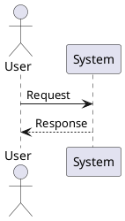

# SDLC-Maker Workflows

Workflows untuk membuat dokumentasi teknis lengkap mengikuti fase **Software Development Life Cycle (SDLC)**. Setiap workflow menghasilkan deliverables yang siap digunakan oleh tim development.

## System Requirements

- Agent dengan skill yang sesuai per fase (lihat tabel di bawah)
- PlantUML renderer untuk diagram (VS Code extension / online editor)
- Markdown editor

## Struktur Workflows

```
workflows/sdlc-maker/
├── 01_requirement_analysis.md          # Analisis kebutuhan & PRD
├── 02_ui_ux_design.md                  # User flow, wireframe, design system, ASCII wireframes
├── 03_system_detailed_design.md        # UML diagrams & API specification
├── 04_quality_security_deployment_part1.md  # Test plan, threat model, database schema
├── 04_quality_security_deployment_part2.md  # Performance testing, CI/CD, deployment
├── 05_maintenance_operations.md        # Monitoring, docs, runbooks
├── 06_data_modeling_estimation_part1.md     # Data dictionary, ERD, migration plan
├── 06_data_modeling_estimation_part2.md     # Sprint plan, estimation, resources
├── 07_project_handoff_part1.md              # Handoff checklist, KT plan, acceptance
├── 07_project_handoff_part2.md              # Post-launch review, retrospective
├── 08_change_request.md                # Change request management (NEW)
└── README.md                           # Dokumentasi ini
```

## Output Folder Structure

```
sdlc/
├── 01-requirement-analysis/
│   ├── functional-requirements.md
│   ├── non-functional-requirements.md
│   └── user-stories-prd.md
│
├── 02-ui-ux-design/
│   ├── user-flow-wireframes.md
│   ├── high-fidelity-mockups.md
│   └── design-system.md
│
├── 03-system-detailed-design/
│   ├── use-case-diagram.puml
│   ├── activity-diagram.puml
│   ├── system-architecture.md
│   ├── class-diagram.puml
│   ├── sequence-diagram.puml
│   └── api-specification.yaml
│
├── 04-quality-security-deployment/
│   ├── test-plan.md
│   ├── threat-model.md
│   ├── database-schema.md
│   ├── deployment-architecture.md
│   └── cicd-pipeline.md
│
├── 05-maintenance-operations/
│   ├── monitoring-setup.md
│   ├── runbooks/
│   └── documentation/
│
├── 06-data-modeling-estimation/
│   ├── data-dictionary.md
│   ├── erd-diagram.puml
│   ├── migration-plan.md
│   └── project-estimation.md
│
└── 07-project-handoff/
    ├── handoff-checklist.md
    ├── knowledge-transfer-plan.md
    └── acceptance-signoff.md
```

## Urutan Penggunaan

### Sequential (Proyek Baru)

```
01 Requirement Analysis
    ↓
02 UI/UX Design
    ↓
03 System & Detailed Design
    ↓
06 Data Modeling & Estimation  ← dapat paralel dengan 03
    ↓
04 Quality, Security & Deployment
    ↓
05 Maintenance & Operations
    ↓
07 Project Handoff
```

### Independent (Per Kebutuhan)

| Workflow | Kapan Digunakan |
|----------|----------------|
| 01 | Memulai proyek baru, validasi scope |
| 02 | Redesign UI, mobile-first project |
| 03 | Arsitektur baru, API contract |
| 04 | Pre-release QA, security audit |
| 05 | Post-launch, scaling |
| 06 | Database redesign, sprint planning |
| 07 | Handoff ke client/tim lain |

## Skills Quick-Reference

| Fase | Agent Skills |
|------|-------------|
| Requirements | `senior-system-analyst`, `senior-project-manager` |
| UI/UX | `senior-ui-ux-designer`, `figma-specialist`, `design-system-architect` |
| System Design | `senior-software-architect`, `uml-specialist`, `api-design-specialist` |
| Detailed Design | `senior-software-engineer`, `senior-backend-developer` |
| Quality & Security | `api-testing-specialist`, `playwright-specialist`, `senior-cybersecurity-engineer` |
| Data & Deployment | `database-modeling-specialist`, `senior-devops-engineer`, `senior-cloud-architect` |
| Maintenance | `senior-site-reliability-engineer`, `senior-technical-writer` |
| Estimation | `project-estimator`, `senior-project-manager` |
| Handoff | `senior-project-manager`, `senior-technical-writer` |

> Lihat juga: [`other/sdlc/SDLC_MAPPING.md`](../../other/sdlc/SDLC_MAPPING.md) untuk mapping lengkap skill → dokumen.

## UML Standards

**PENTING: Semua diagram UML WAJIB menggunakan PlantUML syntax.** Jangan gunakan Mermaid.



## SDLC Workflow Sequence

```plantuml
@startuml
skinparam backgroundColor #FEFEFE
skinparam packageStyle rectangle

title SDLC Workflow Sequence
legend right
  | Phase | Color |
  | Analysis | LightBlue |
  | Design | LightGreen |
  | Data & Estimation | Yellow |
  | QA/Security | Orange |
  | Operations | Pink |
  | Handoff | LightGray |
endlegend

package "Analysis" #LightBlue {
  :01 Requirement Analysis;
}

package "Design" #LightGreen {
  :02 UI/UX Design;
  :03 System Detailed Design;
}

package "Data & Estimation" #Yellow {
  :06 Data Modeling & Estimation;
}

package "QA & Security" #Orange {
  :04 Quality Security Deployment;
}

package "Operations" #Pink {
  :05 Maintenance Operations;
}

package "Handoff" #LightGray {
  :07 Project Handoff;
}

:01 Requirement Analysis --> :02 UI/UX Design
:02 UI/UX Design --> :03 System Detailed Design
:03 System Detailed Design --> :06 Data Modeling
:06 Data Modeling --> :04 Quality Security
:04 Quality Security --> :05 Maintenance
:05 Maintenance --> :07 Project Handoff

note right: 03 dan 06 dapat berjalan paralel

@enduml
```

## Related Technology Workflows

Setelah dokumentasi SDLC lengkap, gunakan workflows spesifik teknologi untuk implementasi:

| Teknologi | Workflow | Use Case |
|-----------|----------|----------|
| Flutter + BLoC | `../flutter-bloc/` | Mobile app dengan BLoC pattern |
| Flutter + GetX | `../flutter-getx/` | Mobile app dengan GetX pattern |
| Flutter + Riverpod | `../flutter-riverpod/` | Mobile app dengan Riverpod pattern |
| Golang Backend | `../golang-backend/` | REST API implementation dengan Go |
| Next.js Frontend | `../nextjs-frontend/` | Web frontend dengan React/Next.js |

## Example Agent Prompts

### Requirement Analysis
```
"Jalankan workflow 01_requirement_analysis.md untuk aplikasi e-commerce 
dengan fitur: user registration, product catalog, shopping cart, payment 
integration. Target user: millennials, platform: mobile-first."
```

### UI/UX Design
```
"Gunakan workflow 02_ui_ux_design.md untuk membuat wireframes dan design 
system aplikasi e-commerce. Brand colors: blue (#1E88E5) dan white. 
Referensi: Shopee/Tokopedia. Include dark mode support."
```

### System Design
```
"Jalankan workflow 03_system_detailed_design.md untuk sistem microservices 
dengan tech stack: React, Node.js, PostgreSQL, Redis. Buat use case diagram, 
sequence diagram untuk checkout flow, dan API specification."
```

### Data Modeling & Estimation
```
"Gunakan workflow 06_data_modeling_estimation.md untuk membuat ERD dan 
data dictionary modules: users, products, orders, payments. Include 
project estimation untuk tim 4 developer dengan sprint 2 minggu."
```

### Quality & Security
```
"Jalankan workflow 04_quality_security_deployment.md untuk membuat test plan 
dengan coverage target 80%, threat modeling dengan STRIDE, dan CI/CD pipeline 
menggunakan GitHub Actions dengan deployment ke Kubernetes."
```

### Maintenance & Operations
```
"Gunakan workflow 05_maintenance_operations.md untuk setup monitoring 
dengan Prometheus/Grafana, alerting rules, dan operational runbooks 
untuk e-commerce application."
```

### Project Handoff
```
"Jalankan workflow 07_project_handoff.md untuk handoff project e-commerce 
ke client. Include handoff checklist, knowledge transfer plan, dan 
acceptance sign-off document."
```

### ASCII Wireframes
```
"Generate ASCII wireframes menggunakan workflow 02_ui_ux_design.md untuk 
halaman: homepage, product detail, cart, checkout, user profile. 
Include mobile responsive layouts."
```

---

**Note:** Workflows ini technology-agnostic. Untuk implementasi spesifik (Go, Flutter, etc.), gunakan workflows di folder teknologi terkait.
