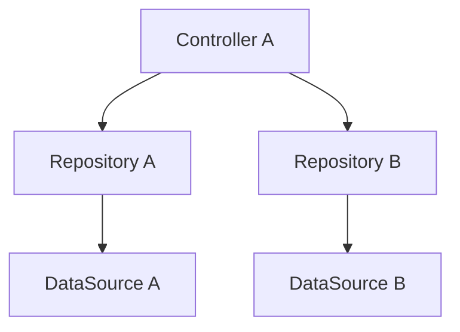

// turbo-all

# Workflow: Generate ARCHITECTURE_CHEATSHEET.md

## Agent Behavior

When executing this workflow, the agent MUST:
- Read PRD, RULE.md, dan DESIGN.md untuk mendapatkan full context
- Generate this file as the LAST file karena ia merangkum semua yang lain
- Include complete code patterns untuk SETIAP layer (Entity, Model, Repository, Controller, Screen, Form)
- Include Mermaid diagrams untuk provider/dependency graph
- Include tables untuk registries (TypeId, routes, categories, etc.)
- Include Common Mistakes table (❌ Wrong vs ✅ Correct)
- Be CONCISE — ini cheat sheet, bukan tutorial

## Overview

Generate file `ARCHITECTURE_CHEATSHEET.md` dari sebuah PRD. File ini berfungsi sebagai quick reference — AI bisa lihat pattern yang benar dalam hitungan detik tanpa membaca seluruh PRD.

## Input

- **PRD file** — Path ke Product Requirements Document
- **RULE.md** — File governance rules (output workflow 01)
- **DESIGN.md** — File design system (output workflow 02)
- **Output directory** — Folder tujuan output

## Output

- `{output_dir}/ARCHITECTURE_CHEATSHEET.md`

## Prerequisites

- PRD lengkap
- RULE.md sudah di-generate (workflow 01)
- DESIGN.md sudah di-generate (workflow 02)
- AI_INSTRUCTIONS.md sudah di-generate (workflow 03) — optional, untuk route/screen list

## Steps

### Step 1: Identify Architecture Components

Dari PRD dan RULE.md, identifikasi:
1. Architecture pattern (Clean Architecture, MVC, MVVM, etc.)
2. Layer names (Data, Domain, Presentation, etc.)
3. Data flow direction
4. State management pattern
5. Key patterns per layer (Entity, Model, Repository, UseCase, Controller, Screen)

### Step 2: Generate Architecture Overview

Buat ASCII diagram sederhana yang menunjukkan layers:

```
┌─────────────────────────────────┐
│          Presentation           │
│  Screens → Widgets → Controllers│
├─────────────────────────────────┤
│             Domain              │
│  Entities → UseCases → Repos    │
├─────────────────────────────────┤
│              Data               │
│  Models → DataSources → Impl   │
└─────────────────────────────────┘
```

### Step 3: Generate Data Flow Diagram

Satu baris yang menunjukkan alur data dari user action sampai kembali ke UI:

```
User Tap → Screen → Controller → UseCase → Repository → DataSource → DB
                                                                  ↓
User sees ← Widget ← Controller ← AsyncValue ← Result ← DataSource ← DB
```

### Step 4: Generate Folder Structure Template

Buat folder structure template PER FEATURE yang menunjukkan convention:

```
features/[feature_name]/
├── data/
│   ├── datasources/[feature]_local_ds.dart
│   ├── models/[feature]_model.dart
│   └── repositories/[feature]_repository_impl.dart
├── domain/
│   ├── entities/[feature]_entity.dart
│   ├── repositories/[feature]_repository.dart
│   └── usecases/
└── presentation/
    ├── controllers/[feature]_controller.dart
    ├── screens/
    └── widgets/
```

### Step 5: Generate Code Patterns

Buat COMPLETE code example untuk setiap layer. Ini adalah bagian terpenting:

1. **Entity** (Domain layer) — immutable data class
2. **Model** (Data layer) — annotated DB model dengan toEntity/fromEntity
3. **Repository Contract** (Domain) — abstract interface
4. **Repository Implementation** (Data) — wraps DataSource dengan error handling
5. **Controller** (Presentation) — state management
6. **Screen - List** (Presentation) — standard list screen
7. **Screen - Form** (Presentation) — form with validation

Setiap pattern HARUS:
- Complete dan tidak truncated
- Menggunakan naming convention dari RULE.md
- Menggunakan error handling dari RULE.md
- Menggunakan design tokens dari DESIGN.md

### Step 6: Generate Registry Tables

Buat reference tables:

1. **Database TypeId / Schema Registry**
   - TypeId → Model → Collection/Box name → Status

2. **Route Registry**
   - Number → Screen name → Route path → Feature

3. **Default Data Registry** (jika applicable)
   - Categories, tags, atau seed data yang harus di-hardcode

4. **Localization Key Convention**
   - Pattern dan contoh

### Step 7: Generate Dependency Graph

Buat Mermaid diagram yang menunjukkan provider/dependency relationships:



Include invalidation chain: apa yang harus di-refresh ketika data berubah.

### Step 8: Generate Common Mistakes Table

Buat table ❌ vs ✅:

```markdown
| ❌ Wrong | ✅ Correct | Why |
|----------|-----------|-----|
| setState({}) | ref.read(ctrl).method() | Use [state management] |
| hardcoded color | AppColors.primary | Use design tokens |
| hardcoded string | l10n.keyName | Use localization |
```

Ambil anti-patterns dari RULE.md dan convert jadi table format.

### Step 9: Generate Quick Commands

List common development commands:

```bash
# Create project
# Get dependencies
# Run code generation
# Analyze
# Format
# Test
# Build
```

### Step 10: Generate ARCHITECTURE_CHEATSHEET.md

Compile semua sections menjadi satu file:

```markdown
# 📎 ARCHITECTURE_CHEATSHEET.md — Quick Reference
# {Nama Project}

> **Cheat sheet untuk AI dan developer.**

---

## 🏛️ Architecture at a Glance
[ASCII diagram]

## 🔄 Data Flow
[One-line data flow]

## 📁 Folder Structure per Feature
[Template]

## 🧩 Common Patterns
### 1. Entity
### 2. Model
### 3. Repository Contract
### 4. Repository Implementation
### 5. Controller
### 6. Screen (List)
### 7. Screen (Form)

## 🗂️ Database Registry
[TypeId / Schema table]

## 🌐 Localization Convention
[Key naming pattern]

## 🎨 Defaults Quick Reference
[Category/seed data tables]

## 📱 Screen & Route Registry
[All screens with routes]

## ⚡ Provider Dependencies Graph
[Mermaid diagram]
[Invalidation chain]

## 🏃 Quick Commands
[bash commands]

## 🚫 Common Mistakes to Avoid
[❌ vs ✅ table]

---
```

### Step 11: Validasi

Sebelum menyimpan, validasi:
- [ ] Architecture diagram akurat sesuai PRD
- [ ] Semua code patterns valid syntax
- [ ] Registry tables match PRD (TypeIds, routes, etc.)
- [ ] Mermaid diagram renders correctly
- [ ] Common mistakes comprehensive
- [ ] Quick commands sesuai tech stack
- [ ] File concise (cheat sheet, bukan copy PRD!)

### Step 12: Simpan File

Simpan ke `{output_dir}/ARCHITECTURE_CHEATSHEET.md`

## Quality Criteria

- File HARUS concise — ini quick reference, bukan tutorial panjang
- Code patterns HARUS complete dan copy-paste ready
- Tables HARUS exhaustive (semua TypeIds, semua routes, semua defaults)
- Mermaid diagram HARUS valid syntax
- Common mistakes HARUS spesifik ke project ini
- File HARUS useful WITHOUT reading PRD

## Example Prompt

```
Jalankan workflow vibe-coding-toolkit/05_generate_architecture.md

PRD: @agents/docs/plans/my-app-prd.md
RULE.md: @prd/my-app/RULE.md
DESIGN.md: @prd/my-app/DESIGN.md
Output: prd/my-app/ARCHITECTURE_CHEATSHEET.md
```

---

## Cross-References

- **Depends on:** `01_generate_rule.md` (RULE.md), `02_generate_design.md` (DESIGN.md)
- **Output standalone** — bisa dibaca independen
- **Sumber data:** PRD, RULE.md, DESIGN.md, AI_INSTRUCTIONS.md
